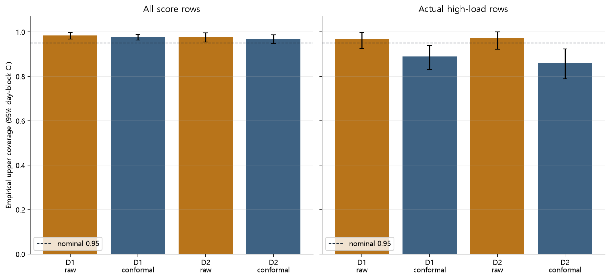

# Phase E GitHub publication

The user separately authorized GitHub publication after the completed Phase E experiment. This publication adds the preserved development-only implementation, tests, report, 13 result tables, eight final figures, original/corrected evidence, and audit logs to `Phase3_experiments`.

The original README, protocol, environment, code seals and artifact manifest are experiment-time records. Their no-commit/no-push statements and original HEAD identify the completed scientific run before this later publication authorization. They have not been rewritten retrospectively. No fitting, model/horizon/threshold selection, final-holdout evaluation or merge is part of publication.

Raw data, row-level prediction parquets and runtime scratch/cache files remain local under the existing exclusion rules. Their hashes in the manifest remain provenance; a fresh GitHub checkout does not contain those private inputs. Original absolute local paths in audit logs are historical provenance. The completed run is sealed and its commands intentionally reject overwriting existing evidence; do not rerun it in place.

The root `.gitattributes` preserves exact Phase E bytes to avoid Git line-ending conversion invalidating the sealed hashes. This publication note is added after the original completion manifest and is not claimed to be part of that earlier manifest.

- [Completed report](phase_e_result.md)
- [Layer summary](tables/phase_e_summary.csv)
- [Technical QA](logs/qa_checklist.json)
- [Source parity](logs/source_parity_audit.json)
- [Artifact manifest](logs/artifact_manifest.json)
- [Recorded F1 correction](logs/f1_correction_audit.json)

