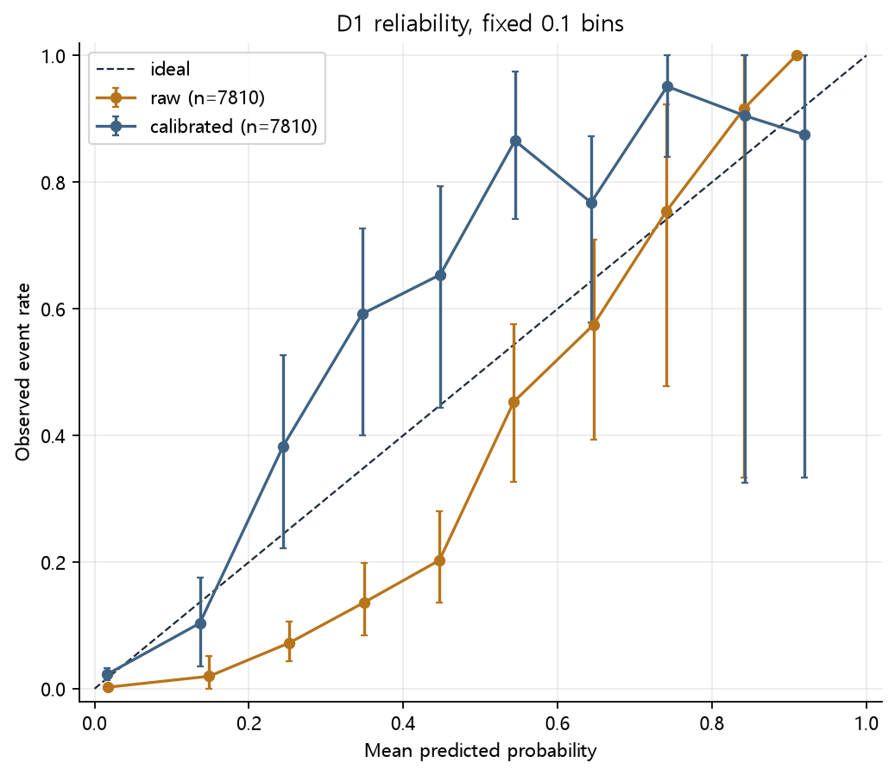
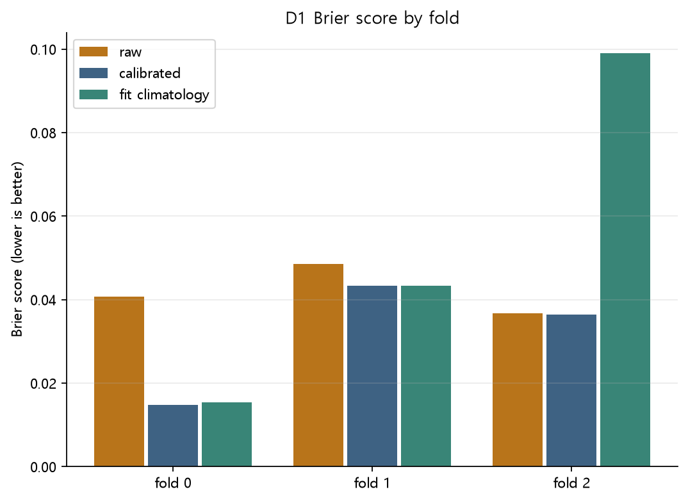
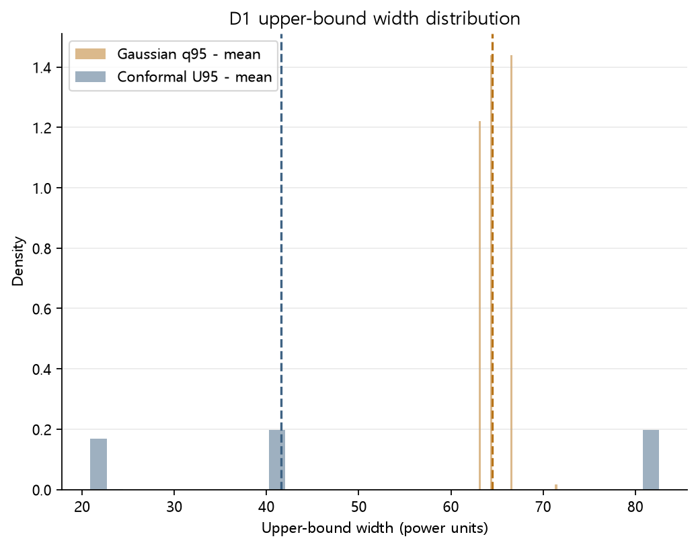
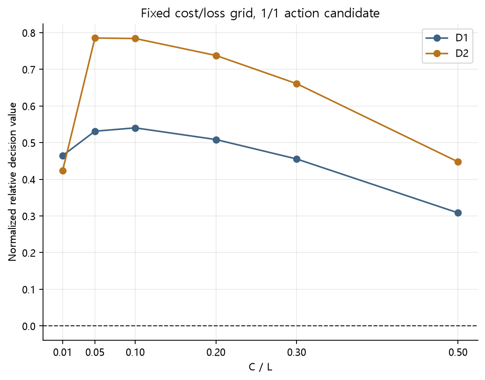
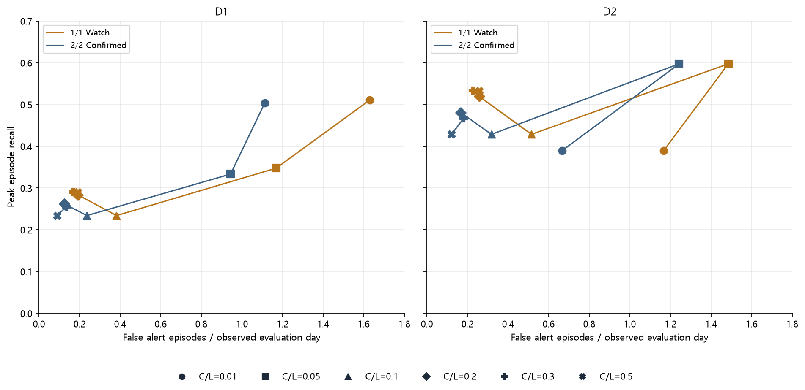
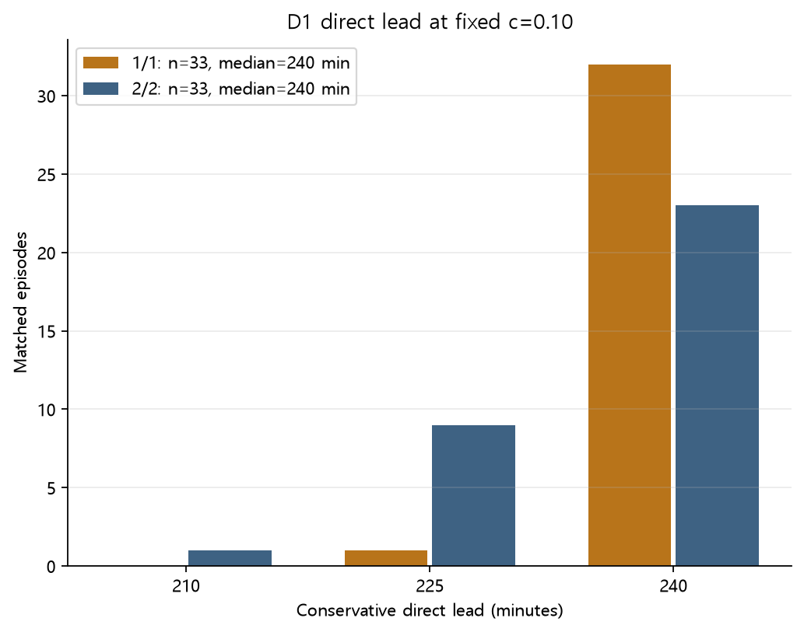
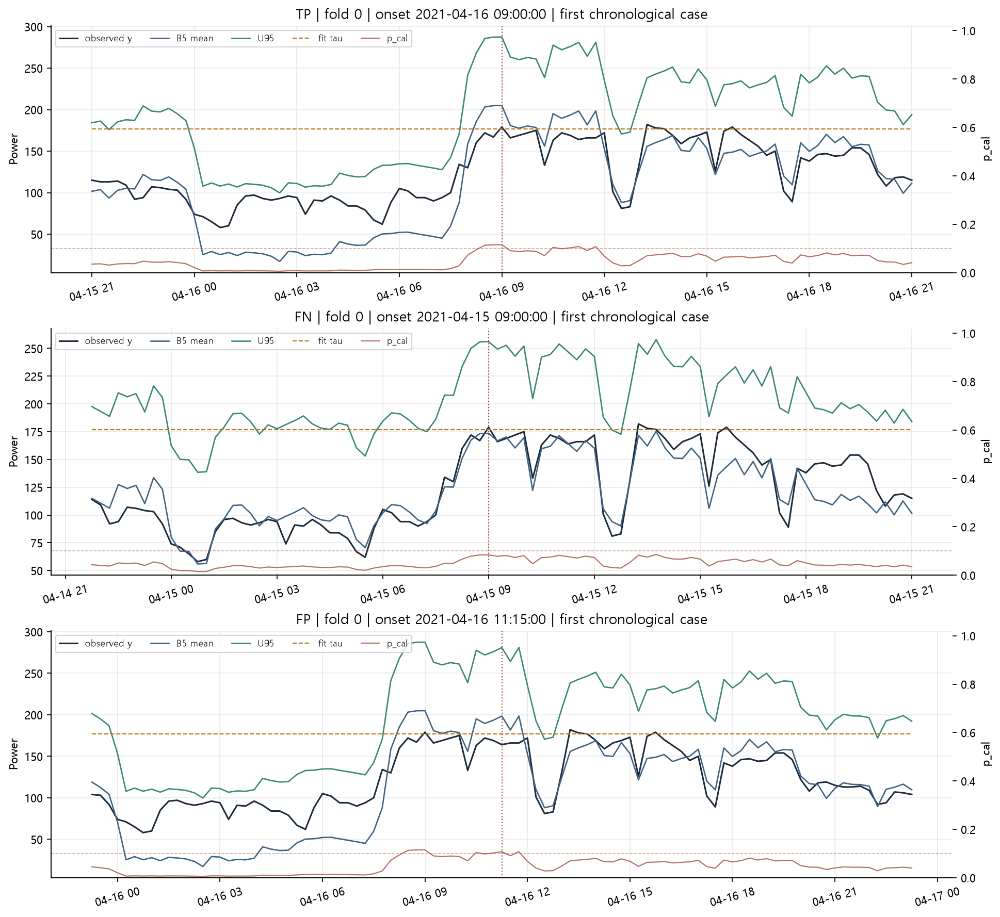

# Phase E — 4시간 고부하 위험·상한·경보 개발구간 결과

## 먼저 확인할 12개 결과

1. **실행:** 개발구간의 parity·calibration·score 평가·보고 단계 완료. 최종 보존 및 파일 봉인은 logs/preservation_audit.json과 logs/artifact_manifest.json에 기록한다.
2. **Phase C B5 parity:** score point prediction 최대 절대 차이 0.0000000000 (허용 1e-8). E 전체 B5 7810행, Phase C MAIN10 공통행 7666행을 구분한다.
3. **D1 Brier:** raw 0.042235, calibrated 0.031235, fit climatology 0.050285.
4. **D1 Brier Skill:** 0.3788 (95% CI [0.2187, 0.4960]).
5. **D1 PR-AUC:** calibrated 0.5766 (95% CI [0.3633, 0.7126]); average precision 정의.
6. **D1 calibration 진단:** intercept 0.4020, slope 0.9751 (상태 ok; 이상적 기준 0/1).
7. **D1 one-sided 상한:** raw q95 coverage 0.9844, U95 coverage 0.9776; 평균 폭 raw 64.743, U95 49.697. 명목값 0.95.
8. **D1 양의 결정가치 C/L grid:** 0.01, 0.05, 0.1, 0.2, 0.3, 0.5; 여섯 고정값 모두 아래 표에 있다.
9. **c=0.10 D1 episode:** 1/1 R/P/F1 0.234/0.493/0.317, FP 34; 2/2 R/P/F1 0.234/0.611/0.338, FP 21. FP 부담 분모는 평가 관측일이다.
10. **c=0.10 D1 2/2 direct lead:** 중앙값 240.0분, 범위 210.0–240.0분 (매칭 33건).
11. **D2:** BSS 0.5529, PR-AUC 0.7707, U95 coverage 0.9696. 세부 경보·가치는 D2 행을 함께 보아야 하므로 단일 '결론 유지'로 합치지 않는다.
12. **final holdout:** 이 보고 단계까지의 명시적 Phase E 접근 기록상 미열람·미파싱 확인. 이전 Phase C의 historical artifact read incident를 소급해 지우는 진술은 아니다.

## 목적과 고정 조건

B5 Weekly-deviation Kalman의 16개 15분 간격(240분) 점예측을 statistical high-load event 확률, 상한, 정규화 결정가치, episode 경보로 변환한 개발구간 평가다. M*=B5와 h*=16은 사용자 고정 조건이다. 현재 checkout의 별도 Phase D 디렉터리는 preflight 당시 없었으며, h16을 새 Phase D 결과로 추정하지 않았다. τ는 fold별 fit power의 Q0.95로 계산한 통계적 상위 5% 사건 경계이며 계약전력·안전한계가 아니다. 기존 fit/stop/cal/score 분할과 D2 novel-profile flag를 그대로 사용한다. D2 재적합은 없다.

## B5 분산·parity 및 E1 확률

원래 점예측 산술을 유지하면서 origin posterior variance P를 계산했다. h=16의 관측 예측분산은 φ^(2h)P + q(1−φ^(2h))/(1−φ²) + r이다. σ는 모든 유효 행에서 유한하고 양수여야 한다. 위 parity의 전체 B5 집합에는 Phase C MAIN10 공통 코호트에서 구조적으로 제외된 행도 있다. 따라서 전체 행 MAE와 공통행 MAE를 직접 동일시하지 않는다.
전체 B5 D1 7810행 MAE 14.70126, Peak-MAE 18.94224, RMSE 28.72669. Phase C MAIN10 공통 7666행 MAE 14.85755, Peak-MAE 18.94224, RMSE 28.97018.

raw 확률은 p_raw = 1−Φ((τ−μ)/σ)이다. fold별 cal label만으로 두 매개변수 Platt logistic p_cal = sigmoid(a+b·logit(clip(p_raw, 1e-6, 1−1e-6)))을 적합하며 b≥0이다. score label은 적합에 사용하지 않는다. score의 intercept/slope는 평가용 진단이며 p_cal을 다시 수정하지 않는다.

| 집합 | n / 사건 | BS raw | BS cal | BS climatology | BSS | PR-AUC raw / cal | score intercept / slope |
| --- | --- | --- | --- | --- | --- | --- | --- |
| D1 | 7810 / 415 | 0.042235 | 0.031235 | 0.050285 | 0.3788 | 0.5453 / 0.5766 | 0.4020 / 0.9751 |
| D2 | 5337 / 286 | 0.036756 | 0.022649 | 0.050655 | 0.5529 | 0.6425 / 0.7707 | 0.9334 / 1.6010 |

D1 paired day-block 차이: BS_raw−BS_cal 0.01100 (95% CI [0.00465, 0.01652]), BS_cal−BS_climatology -0.01905 (95% CI [-0.02999, -0.00805]). 1,000회, seed 42, fold별 target-calendar-day block bootstrap이다.

### Reliability (고정 10개 bin)

**D1 pooled.** 빈 bin도 0행으로 유지한다.

| bin | raw n | raw days | raw mean p | raw events | raw rate | cal mean p | cal n | cal days | cal events | cal rate |
| --- | --- | --- | --- | --- | --- | --- | --- | --- | --- | --- |
| [0.0,0.1) | 5656 | 89 | 0.017 | 13 | 0.002 | 0.017 | 7368 | 89 | 169 | 0.023 |
| [0.1,0.2) | 458 | 56 | 0.149 | 9 | 0.020 | 0.136 | 116 | 20 | 12 | 0.103 |
| [0.2,0.3) | 471 | 54 | 0.252 | 34 | 0.072 | 0.244 | 47 | 14 | 18 | 0.383 |
| [0.3,0.4) | 463 | 53 | 0.349 | 63 | 0.136 | 0.347 | 49 | 10 | 29 | 0.592 |
| [0.4,0.5) | 355 | 50 | 0.447 | 72 | 0.203 | 0.448 | 52 | 10 | 34 | 0.654 |
| [0.5,0.6) | 203 | 38 | 0.543 | 92 | 0.453 | 0.545 | 52 | 10 | 45 | 0.865 |
| [0.6,0.7) | 134 | 27 | 0.646 | 77 | 0.575 | 0.643 | 56 | 10 | 43 | 0.768 |
| [0.7,0.8) | 57 | 15 | 0.741 | 43 | 0.754 | 0.742 | 41 | 8 | 39 | 0.951 |
| [0.8,0.9) | 12 | 5 | 0.842 | 11 | 0.917 | 0.843 | 21 | 5 | 19 | 0.905 |
| [0.9,1.0] | 1 | 1 | 0.909 | 1 | 1.000 | 0.920 | 8 | 5 | 7 | 0.875 |

각 observed rate의 day-block CI는 해당 reliability_bins CSV에 보존된다.

**D2 pooled.** 빈 bin도 0행으로 유지한다.

| bin | raw n | raw days | raw mean p | raw events | raw rate | cal mean p | cal n | cal days | cal events | cal rate |
| --- | --- | --- | --- | --- | --- | --- | --- | --- | --- | --- |
| [0.0,0.1) | 4018 | 66 | 0.015 | 8 | 0.002 | 0.021 | 4895 | 66 | 40 | 0.008 |
| [0.1,0.2) | 291 | 37 | 0.148 | 9 | 0.031 | 0.136 | 116 | 20 | 12 | 0.103 |
| [0.2,0.3) | 268 | 35 | 0.250 | 18 | 0.067 | 0.244 | 47 | 14 | 18 | 0.383 |
| [0.3,0.4) | 267 | 34 | 0.348 | 22 | 0.082 | 0.347 | 49 | 10 | 29 | 0.592 |
| [0.4,0.5) | 196 | 31 | 0.448 | 42 | 0.214 | 0.448 | 52 | 10 | 34 | 0.654 |
| [0.5,0.6) | 125 | 23 | 0.545 | 66 | 0.528 | 0.545 | 52 | 10 | 45 | 0.865 |
| [0.6,0.7) | 106 | 18 | 0.647 | 68 | 0.642 | 0.643 | 56 | 10 | 43 | 0.768 |
| [0.7,0.8) | 53 | 11 | 0.742 | 41 | 0.774 | 0.742 | 41 | 8 | 39 | 0.951 |
| [0.8,0.9) | 12 | 5 | 0.842 | 11 | 0.917 | 0.843 | 21 | 5 | 19 | 0.905 |
| [0.9,1.0] | 1 | 1 | 0.909 | 1 | 1.000 | 0.920 | 8 | 5 | 7 | 0.875 |

각 observed rate의 day-block CI는 해당 reliability_bins CSV에 보존된다.

## E2 상한 불확실성

Gaussian 기준 q95_raw = μ + 1.6448536269514722σ. cal에서 표준화 잔차 (y−μ)/σ를 정렬하고 k=min(n,ceil((n+1)·0.95))번째 q*를 사용하여 U95=μ+q*σ를 만들었다. 이는 chronological calibration의 **경험적** upper coverage다. 시계열 의존성이 있어 iid distribution-free 보장은 주장하지 않는다. U95는 경보 trigger가 아닌 설명용 맥락이다.

| 집합 | 대상 | 방법 | n | coverage (95% CI) | mean width (95% CI) | median | p10 / p25 / p75 / p90 |
| --- | --- | --- | --- | --- | --- | --- | --- |
| D1 | all | raw | 7810 | 0.9844 (95% CI [0.9687, 0.9969]) | 64.74 (95% CI [64.65, 64.84]) | 64.45 | 63.02 / 63.02 / 66.42 / 66.42 |
| D1 | all | conformal | 7810 | 0.9776 (95% CI [0.9640, 0.9890]) | 49.70 (95% CI [48.22, 51.19]) | 41.56 | 20.90 / 20.90 / 82.56 / 82.56 |
| D1 | peak | raw | 415 | 0.9687 (95% CI [0.9248, 0.9974]) | 63.77 (95% CI [63.50, 64.12]) | 63.02 | 63.02 / 63.02 / 64.45 / 64.45 |
| D1 | peak | conformal | 415 | 0.8892 (95% CI [0.8305, 0.9383]) | 33.02 (95% CI [28.52, 38.76]) | 20.90 | 20.90 / 20.90 / 41.56 / 41.56 |
| D1 | nonpeak | raw | 7395 | 0.9853 (95% CI [0.9698, 0.9972]) | 64.80 (95% CI [64.70, 64.91]) | 64.45 | 63.02 / 63.02 / 66.42 / 66.42 |
| D1 | nonpeak | conformal | 7395 | 0.9826 (95% CI [0.9701, 0.9930]) | 50.63 (95% CI [49.09, 52.19]) | 41.56 | 20.90 / 20.90 / 82.56 / 82.56 |
| D2 | all | raw | 5337 | 0.9786 (95% CI [0.9550, 0.9962]) | 64.89 (95% CI [64.74, 65.04]) | 66.42 | 63.02 / 63.02 / 66.42 / 66.42 |
| D2 | all | conformal | 5337 | 0.9696 (95% CI [0.9488, 0.9865]) | 53.62 (95% CI [51.20, 56.45]) | 82.56 | 20.90 / 20.90 / 82.56 / 82.56 |
| D2 | peak | raw | 286 | 0.9720 (95% CI [0.9224, 1.0000]) | 63.49 (95% CI [63.21, 63.96]) | 63.02 | 63.02 / 63.02 / 63.02 / 66.42 |
| D2 | peak | conformal | 286 | 0.8601 (95% CI [0.7899, 0.9243]) | 29.52 (95% CI [24.49, 38.05]) | 20.90 | 20.90 / 20.90 / 20.90 / 82.56 |
| D2 | nonpeak | raw | 5051 | 0.9790 (95% CI [0.9561, 0.9962]) | 64.97 (95% CI [64.80, 65.14]) | 66.42 | 63.02 / 63.02 / 66.42 / 66.42 |
| D2 | nonpeak | conformal | 5051 | 0.9758 (95% CI [0.9562, 0.9917]) | 54.98 (95% CI [52.53, 57.83]) | 82.56 | 20.90 / 20.90 / 82.56 / 82.56 |

Fold별 all/peak/nonpeak coverage와 width는 uncertainty_metrics.csv에 있다. Coverage가 0.95와 가깝더라도 폭과 peak-subset 결과를 함께 평가한다.
해석: D1 U95는 raw보다 평균 폭이 23.2% 줄었지만 전체 coverage는 명목보다 2.76%p 높다. 피크 조건부 coverage는 D1 0.8892, D2 0.8601로 낮다. 전체 coverage만으로 피크 위험에서 95% 보호를 제공한다고 해석할 수 없다.

## E3 정규화 Cost/Loss

C/L=c, L=1, C=c를 가정한 **상대 결정가치**다. 1/1 action candidate만 사용한다. E_model=c·actions+missed positions, E_no=events, E_all=c·N, E_clim=min(E_no,E_all), E_perf=c·events, V=(E_clim−E_model)/(E_clim−E_perf) (분모가 양수일 때)이다. 실제 action cost와 손실액은 없으므로 화폐 절감액이나 단일 최적 임계값을 제시하지 않는다.

| 집합 | C/L | actions | TP/FP/FN/TN | P/R/F1 | E_model | E_no | E_all | E_clim | E_perf | relative V |
| --- | --- | --- | --- | --- | --- | --- | --- | --- | --- | --- |
| D1 | 0.01 | 3374 | 405/2969/10/4426 | 0.120/0.976/0.214 | 43.74 | 415.00 | 78.10 | 78.10 | 4.15 | 0.4646 |
| D1 | 0.05 | 1222 | 282/940/133/6455 | 0.231/0.680/0.345 | 194.10 | 415.00 | 390.50 | 390.50 | 20.75 | 0.5312 |
| D1 | 0.10 | 442 | 246/196/169/7199 | 0.557/0.593/0.574 | 213.20 | 415.00 | 781.00 | 415.00 | 41.50 | 0.5403 |
| D1 | 0.20 | 326 | 234/92/181/7303 | 0.718/0.564/0.632 | 246.20 | 415.00 | 1562.00 | 415.00 | 83.00 | 0.5084 |
| D1 | 0.30 | 279 | 216/63/199/7332 | 0.774/0.520/0.622 | 282.70 | 415.00 | 2343.00 | 415.00 | 124.50 | 0.4554 |
| D1 | 0.50 | 178 | 153/25/262/7370 | 0.860/0.369/0.516 | 351.00 | 415.00 | 3905.00 | 415.00 | 207.50 | 0.3084 |
| D2 | 0.01 | 2696 | 281/2415/5/2636 | 0.104/0.983/0.188 | 31.96 | 286.00 | 53.37 | 53.37 | 2.86 | 0.4239 |
| D2 | 0.05 | 1210 | 278/932/8/4119 | 0.230/0.972/0.372 | 68.50 | 286.00 | 266.85 | 266.85 | 14.30 | 0.7854 |
| D2 | 0.10 | 442 | 246/196/40/4855 | 0.557/0.860/0.676 | 84.20 | 286.00 | 533.70 | 286.00 | 28.60 | 0.7840 |
| D2 | 0.20 | 326 | 234/92/52/4959 | 0.718/0.818/0.765 | 117.20 | 286.00 | 1067.40 | 286.00 | 57.20 | 0.7378 |
| D2 | 0.30 | 279 | 216/63/70/4988 | 0.774/0.755/0.765 | 153.70 | 286.00 | 1601.10 | 286.00 | 85.80 | 0.6608 |
| D2 | 0.50 | 178 | 153/25/133/5026 | 0.860/0.535/0.659 | 222.00 | 286.00 | 2668.50 | 286.00 | 143.00 | 0.4476 |

## E4 Episode alert와 lead

1/1은 p_cal≥c일 때 Watch, 2/2는 같은 fold에서 정확히 15분 간격의 현재·직전 origin 모두 양성일 때 Confirmed Alert다. 고부하 사건과 경보는 target-time 15분 연속 구간으로 묶고 fold와 timestamp gap에서 끊는다. 아래 FP/day의 분모는 평가에 나타난 target-calendar day, 즉 **평가 관측일**이다. 실제 공장 운영일로 검증되지 않았다. Position 지표는 alert_position_metrics.csv에 보조로 둔다.

| 집합 | C/L | 정책 | peak episodes | TP/FP/FN | episode P/R/F1 | FP/평가 관측일 | lead median [min,max] min |
| --- | --- | --- | --- | --- | --- | --- | --- |
| D1 | 0.01 | 1/1 | 141 | 72/145/69 | 0.332/0.511/0.402 | 1.629 | 240.0 [240.0, 240.0] |
| D1 | 0.01 | 2/2 | 141 | 71/99/70 | 0.418/0.504/0.457 | 1.112 | 240.0 [225.0, 240.0] |
| D1 | 0.05 | 1/1 | 141 | 49/104/92 | 0.320/0.348/0.333 | 1.169 | 240.0 [210.0, 240.0] |
| D1 | 0.05 | 2/2 | 141 | 47/84/94 | 0.359/0.333/0.346 | 0.944 | 240.0 [195.0, 240.0] |
| D1 | 0.10 | 1/1 | 141 | 33/34/108 | 0.493/0.234/0.317 | 0.382 | 240.0 [225.0, 240.0] |
| D1 | 0.10 | 2/2 | 141 | 33/21/108 | 0.611/0.234/0.338 | 0.236 | 240.0 [210.0, 240.0] |
| D1 | 0.20 | 1/1 | 141 | 40/17/101 | 0.702/0.284/0.404 | 0.191 | 240.0 [180.0, 240.0] |
| D1 | 0.20 | 2/2 | 141 | 37/11/104 | 0.771/0.262/0.392 | 0.124 | 225.0 [195.0, 240.0] |
| D1 | 0.30 | 1/1 | 141 | 41/15/100 | 0.732/0.291/0.416 | 0.169 | 240.0 [210.0, 240.0] |
| D1 | 0.30 | 2/2 | 141 | 36/12/105 | 0.750/0.255/0.381 | 0.135 | 225.0 [210.0, 240.0] |
| D1 | 0.50 | 1/1 | 141 | 41/17/100 | 0.707/0.291/0.412 | 0.191 | 240.0 [165.0, 240.0] |
| D1 | 0.50 | 2/2 | 141 | 33/8/108 | 0.805/0.234/0.363 | 0.090 | 225.0 [150.0, 240.0] |
| D2 | 0.01 | 1/1 | 77 | 30/77/47 | 0.280/0.390/0.326 | 1.167 | 240.0 [240.0, 240.0] |
| D2 | 0.01 | 2/2 | 77 | 30/44/47 | 0.405/0.390/0.397 | 0.667 | 240.0 [225.0, 240.0] |
| D2 | 0.05 | 1/1 | 77 | 46/98/31 | 0.319/0.597/0.416 | 1.485 | 240.0 [210.0, 240.0] |
| D2 | 0.05 | 2/2 | 77 | 46/82/31 | 0.359/0.597/0.449 | 1.242 | 240.0 [195.0, 240.0] |
| D2 | 0.10 | 1/1 | 77 | 33/34/44 | 0.493/0.429/0.458 | 0.515 | 240.0 [225.0, 240.0] |
| D2 | 0.10 | 2/2 | 77 | 33/21/44 | 0.611/0.429/0.504 | 0.318 | 240.0 [210.0, 240.0] |
| D2 | 0.20 | 1/1 | 77 | 40/17/37 | 0.702/0.519/0.597 | 0.258 | 240.0 [180.0, 240.0] |
| D2 | 0.20 | 2/2 | 77 | 37/11/40 | 0.771/0.481/0.592 | 0.167 | 225.0 [195.0, 240.0] |
| D2 | 0.30 | 1/1 | 77 | 41/15/36 | 0.732/0.532/0.617 | 0.227 | 240.0 [210.0, 240.0] |
| D2 | 0.30 | 2/2 | 77 | 36/12/41 | 0.750/0.468/0.576 | 0.182 | 225.0 [210.0, 240.0] |
| D2 | 0.50 | 1/1 | 77 | 41/17/36 | 0.707/0.532/0.607 | 0.258 | 240.0 [165.0, 240.0] |
| D2 | 0.50 | 2/2 | 77 | 33/8/44 | 0.805/0.429/0.559 | 0.121 | 225.0 [150.0, 240.0] |

Episode precision/recall·FP/day 및 direct lead의 95% CI는 alert_episode_metrics.csv에 있다. Bootstrap은 원래 매칭한 완전한 episode를 onset-day별로 resample하며 매칭 불확실성은 포함하지 않는다. Lead는 매칭된 actual onset에서 겹친 양성 forecast의 첫 발행시각을 뺀 conservative direct 값이다. 음수·0도 숨기지 않는다. 별도의 준비시간 기준은 없으므로 240분보다 큰 continuity를 직접 4시간 예측이라고 해석하지 않는다.

| 집합 | C/L | 정책 | lead mean | median | p10 | p25 | p75 | p90 | 경보 길이 mean/median (분) |
| --- | --- | --- | --- | --- | --- | --- | --- | --- | --- |
| D1 | 0.01 | 1/1 | 240.0 | 240.0 | 240.0 | 240.0 | 240.0 | 240.0 | 233.2 / 105.0 |
| D1 | 0.01 | 2/2 | 238.1 | 240.0 | 225.0 | 240.0 | 240.0 | 240.0 | 278.6 / 90.0 |
| D2 | 0.01 | 1/1 | 240.0 | 240.0 | 240.0 | 240.0 | 240.0 | 240.0 | 377.9 / 90.0 |
| D2 | 0.01 | 2/2 | 239.0 | 240.0 | 240.0 | 240.0 | 240.0 | 240.0 | 524.8 / 157.5 |
| D1 | 0.05 | 1/1 | 238.5 | 240.0 | 240.0 | 240.0 | 240.0 | 240.0 | 119.8 / 105.0 |
| D1 | 0.05 | 2/2 | 235.2 | 240.0 | 225.0 | 232.5 | 240.0 | 240.0 | 122.4 / 105.0 |
| D2 | 0.05 | 1/1 | 239.3 | 240.0 | 240.0 | 240.0 | 240.0 | 240.0 | 126.0 / 120.0 |
| D2 | 0.05 | 2/2 | 235.8 | 240.0 | 225.0 | 240.0 | 240.0 | 240.0 | 124.9 / 105.0 |
| D1 | 0.10 | 1/1 | 239.5 | 240.0 | 240.0 | 240.0 | 240.0 | 240.0 | 99.0 / 90.0 |
| D1 | 0.10 | 2/2 | 235.0 | 240.0 | 225.0 | 225.0 | 240.0 | 240.0 | 104.2 / 90.0 |
| D2 | 0.10 | 1/1 | 239.5 | 240.0 | 240.0 | 240.0 | 240.0 | 240.0 | 99.0 / 90.0 |
| D2 | 0.10 | 2/2 | 235.0 | 240.0 | 225.0 | 225.0 | 240.0 | 240.0 | 104.2 / 90.0 |
| D1 | 0.20 | 1/1 | 237.4 | 240.0 | 240.0 | 240.0 | 240.0 | 240.0 | 85.8 / 90.0 |
| D1 | 0.20 | 2/2 | 228.6 | 225.0 | 225.0 | 225.0 | 240.0 | 240.0 | 84.1 / 90.0 |
| D2 | 0.20 | 1/1 | 237.4 | 240.0 | 240.0 | 240.0 | 240.0 | 240.0 | 85.8 / 90.0 |
| D2 | 0.20 | 2/2 | 228.6 | 225.0 | 225.0 | 225.0 | 240.0 | 240.0 | 84.1 / 90.0 |
| D1 | 0.30 | 1/1 | 237.4 | 240.0 | 225.0 | 240.0 | 240.0 | 240.0 | 74.7 / 75.0 |
| D1 | 0.30 | 2/2 | 227.5 | 225.0 | 225.0 | 225.0 | 228.8 | 240.0 | 69.7 / 75.0 |
| D2 | 0.30 | 1/1 | 237.4 | 240.0 | 225.0 | 240.0 | 240.0 | 240.0 | 74.7 / 75.0 |
| D2 | 0.30 | 2/2 | 227.5 | 225.0 | 225.0 | 225.0 | 228.8 | 240.0 | 69.7 / 75.0 |
| D1 | 0.50 | 1/1 | 226.1 | 240.0 | 195.0 | 225.0 | 240.0 | 240.0 | 46.0 / 30.0 |
| D1 | 0.50 | 2/2 | 210.0 | 225.0 | 168.0 | 210.0 | 225.0 | 225.0 | 43.9 / 30.0 |
| D2 | 0.50 | 1/1 | 226.1 | 240.0 | 195.0 | 225.0 | 240.0 | 240.0 | 46.0 / 30.0 |
| D2 | 0.50 | 2/2 | 210.0 | 225.0 | 168.0 | 210.0 | 225.0 | 225.0 | 43.9 / 30.0 |

### Miss decomposition: 고정 c=0.10, 2/2 예시

| 집합 | hit | late_hit | decision_miss | forecast_miss |
| --- | --- | --- | --- | --- |
| D1 | 33 | 0 | 104 | 4 |
| D2 | 33 | 0 | 41 | 3 |

hit은 양의 direct lead로 매칭, late_hit은 lead≤0으로 매칭, forecast_miss는 unmatched actual episode의 최대 p_cal이 고정 grid 최솟값 0.01 미만, 나머지 unmatched는 decision_miss다. 이는 원인 진단을 위한 조작적 분류이며 실제 실패 원인을 증명하지 않는다. 모든 임계값·정책의 분해와 event별 matching_reason은 CSV에 있다.

## D2 견고성과 네 layer의 판단

D2는 원래 D1의 7810행 중 5337행이며 동일 fit/cal parameter와 확률·상한·정책을 평가했다. D1과 D2의 값·CI·episode burden 차이를 위 표에서 별도로 확인해야 한다. D2만 보고 재보정하거나 임계값을 재선택하지 않았다.

- **E1 Probability:** D1 BSS 0.3788 (95% CI [0.2187, 0.4960]), D2 BSS 0.5529. Reliability와 intercept/slope의 편차를 함께 본다. 좋은 Brier가 곧 경보 타당성을 뜻하지 않는다.
  판단: 보정 확률은 climatology보다 Brier가 낮다. 다만 D1 intercept 0.402 및 D2 intercept/slope 0.933/1.601의 편차가 남아 완전한 calibration이라고 판정하지 않는다.
- **E2 Uncertainty:** D1 upper coverage raw 0.9844, conformal 0.9776, 평균 폭 49.70. Peak subset 및 D2와 함께 명목 0.95와 폭의 tradeoff를 평가한다.
  판단: raw 대비 상한 폭은 줄었으나 전체 과대 coverage와 피크 조건부 과소 coverage가 공존한다. 상한의 신뢰성은 조건부로 제한된다.
- **E3 Decision Value:** D1 양수 grid 0.01, 0.05, 0.1, 0.2, 0.3, 0.5; D2 곡선과 차이를 병기한다. 실제 C/L은 알려져 있지 않아 운영값 선정은 판정불가다.
  판단: 고정 grid에서 관측된 정규화 가치는 유용성 근거다. 이 양수 여부는 point estimate이며 현장 비용·실행 효과의 입증이 아니다.
- **E4 Alert:** c=0.10 D1 2/2 episode recall 0.234, FP/day 0.236, direct lead median 240.0분. 1/1 및 여섯 임계값의 경보부담과 D2를 함께 판단한다. 이 한 점은 대표 표시일 뿐 선택된 정책이 아니다.
  판단: 고정 c=0.10에서는 2/2가 동일 33개 사건을 탐지하면서 FP를 34→21로 줄였다. 그러나 전체 141개 중 탐지 비율이 낮다. 긴 lead는 탐지된 사건에 한정되므로 운영 가능한 피크 예방을 입증하지 않는다.

D2의 Brier skill과 ranking 개선 방향은 유지되지만 calibration 편차 및 피크 조건부 coverage 한계도 유지된다. D2 fold 1에는 고부하 사건이 없어 해당 fold의 PR-AUC·calibration slope는 미정의로 남긴다. 이는 계절·상태별 일반화의 공백이며 전체 D2 지표로 덮지 않는다.

## 제한, 출처, 다음 결정 경계

Expected Exceedance 회귀는 과거 탐색에서 systematic underprediction 문제가 있어 이번 고정 protocol의 Main decision input에서 제외했다. 과거 p OR q95 / p OR U95 결합은 확률 비용규칙과 상한 표시를 섞어 경보 근거를 바꾸므로 사용하지 않았다. 현재 경보 입력은 p_cal≥c뿐이다. 실제 생산계획, 날씨, 인력, tariff, action execution은 평가 입력이 아니다.

이 결과는 development 구간의 statistical high-load event 평가다. 실제 행동비용, 준비시간, 현장 경보절차, 안전·계약한계와 연결할 증거가 없다. Final holdout은 이번 실행에서 사용하지 않았고, 최종 평가로 넘어가려면 코드·파라미터·정책·보고 기준과 보존 감사가 모두 동결된 뒤 별도 승인 단계가 필요하다. 이 보고서 자체는 final 평가 승인 또는 수행 기록이 아니다.

검증 기록: 독립 재계산 결과는 {'risk_rows': 8, 'uncertainty_rows': 46, 'position_rows': 96, 'decision_rows': 48, 'episode_rows': 96, 'reliability_bins': 160}이다. 독립 검토의 실행 전 코드 잠금/최종 manifest 기록 문제를 수정했고 원래 parity seal은 보존했다. F1은 TP=0, FP+FN>0인 행의 빈값을 count formula 2TP/(2TP+FP+FN)=0으로 정정했다. 원본 CSV와 수정 해시, 나머지 모든 셀 불변 검사는 logs/f1_correction_audit.json과 logs/metric_correction_v1/에 있다. 확률·예측·정책·매칭·비용·coverage는 바뀌지 않았다. D2 단일 클래스 PR-AUC 검증기의 잘못된 기대값도 기록하고 바로잡았다.

## Figures and machine-readable evidence

모든 원시 수치는 `tables/*.csv`, `predictions/phase_e_h16_oof.parquet`, `logs/source_parity_audit.json`, `logs/calibration_fit.json`, `logs/conformal_fit.json`에 있다. 최종 `logs/leakage_audit.json`과 `logs/artifact_manifest.json`은 report 이후 finalize 단계에서 생성된다.
