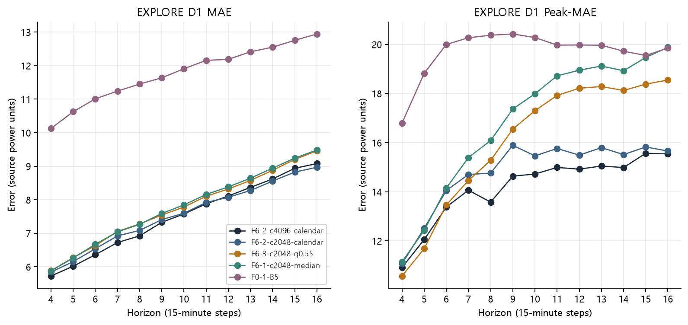
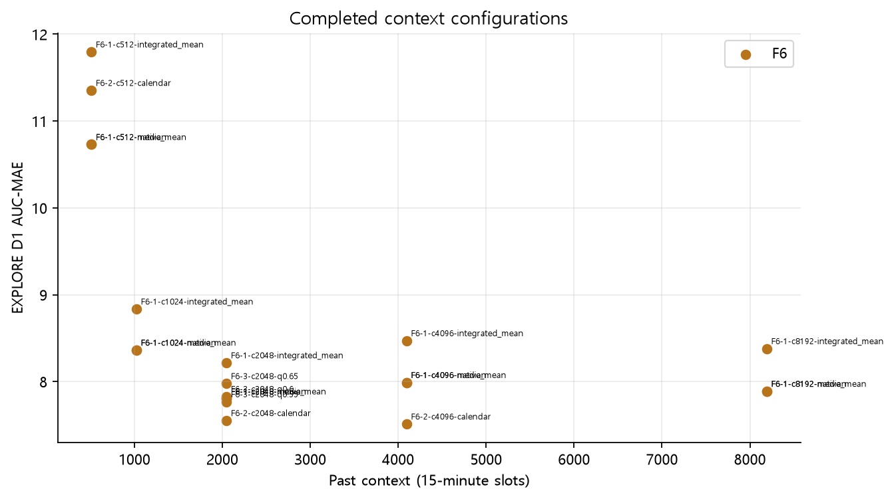
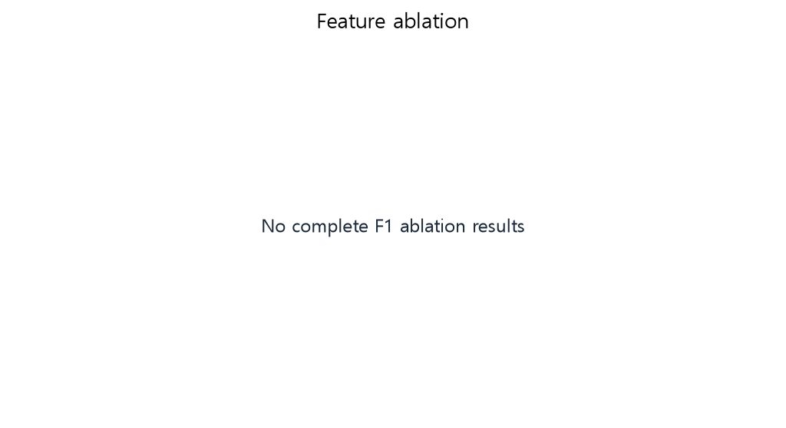
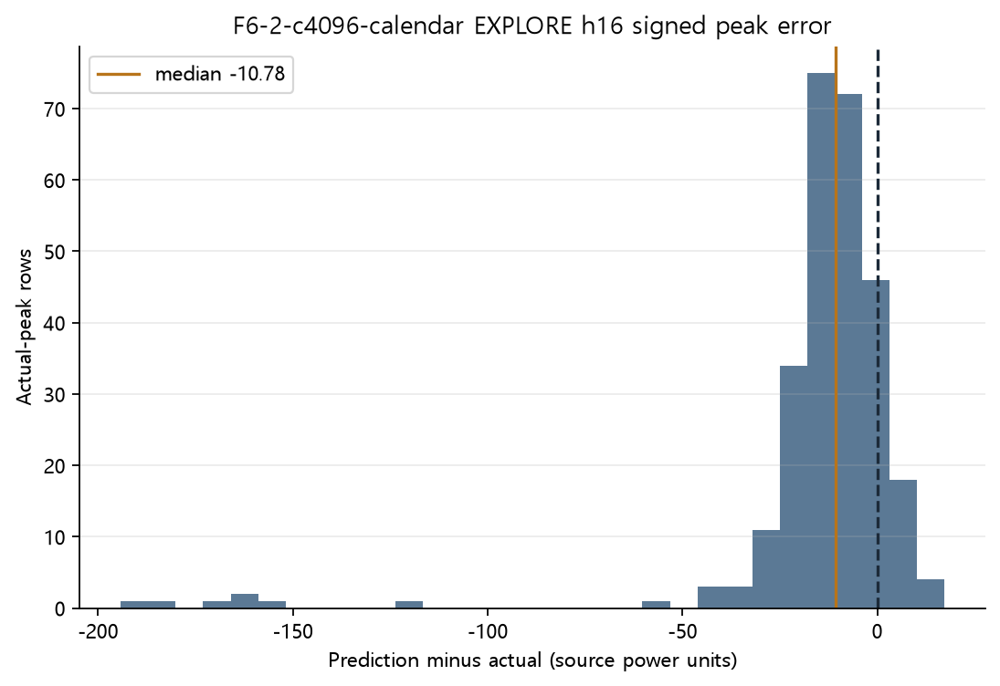
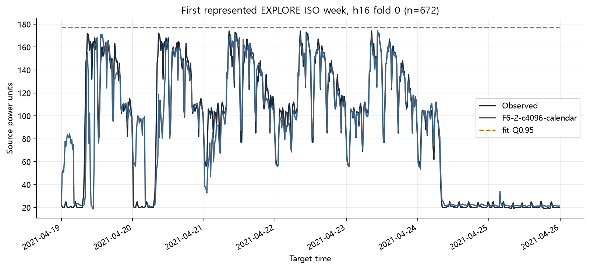

# Phase F 개발 탐색 진행 보고

**상태: 진행 중. full_phase_complete=false.** EXPLORE 수치는 반복 탐색으로 선택 편향이 있으며 후보 확정이나 CONFIRM 결과가 아니다.

## 우선 확인할 10가지

1. 등록 37건, 완료 36건, 실패 0건, 미지원 0건.
2. 비교 가능한 EXPLORE D1/D2, 13 horizon, 3 fold 표 36건. 완료 표기가 있으나 표가 불완전한 항목 0건.
3. 현재 EXPLORE D1 AUC-MAE 최소 표시값: F6-2-c4096-calendar / 7.5110. 확증 모델 선정이 아니다.
4. B5 대비 paired 95% CI, 피크 악화 부재, D2 보호, 2/3 fold 개선을 함께 확인해야 한다.
5. h16 MAE와 Peak-MAE는 별도로 보고한다. 평균 오차 개선만으로 피크 보호를 선언하지 않는다.
6. 13 horizon × 3 fold의 Phase C MAIN10 공통 100,010 score 키를 재사용한다.
7. F10의 시간대, 요일, 휴일 인접, 생산량 구간은 사후 진단이며 모델 선정 특징이나 기준이 아니다.
8. 2021-07-26~08-01은 EXPLORE, 08-02~08-08은 CONFIRM이다. 완료 잠금 전에는 두 기간을 합산하지 않는다.
9. 데이터 단위와 현장 허용 오차가 확인되지 않아 상용 적합성은 판정불가다. ASHRAE는 인증 기준으로 사용하지 않는다.
10. 다음 단계는 남은 계열과 실패·미지원 사유 기록, primary 사전 동결, CONFIRM 1회, F9/F10/F11 후속 진단이다.

## 완료된 EXPLORE 비교: D1 AUC-MAE 상위 10

| 실험 ID | D1 AUC-MAE | D1 AUC-PeakMAE | D2 AUC-MAE | D2 AUC-PeakMAE | h16 MAE | h16 Peak-MAE |
| --- | --- | --- | --- | --- | --- | --- |
| F6-2-c4096-calendar | 7.5110 | 14.1846 | 8.1834 | 12.2794 | 9.0787 | 15.5424 |
| F6-2-c2048-calendar | 7.5509 | 14.8067 | 8.0682 | 11.7730 | 8.9666 | 15.6582 |
| F6-3-c2048-q0.55 | 7.7678 | 16.0595 | 8.4948 | 14.8596 | 9.4579 | 18.5487 |
| F6-1-c2048-median | 7.8004 | 16.8927 | 8.5134 | 15.5586 | 9.4820 | 19.8797 |
| F6-1-c2048-native_mean | 7.8004 | 16.8927 | 8.5134 | 15.5586 | 9.4820 | 19.8797 |
| F0-1-R1 | 7.8004 | 16.8927 | 8.5134 | 15.5586 | 9.4820 | 19.8797 |
| F6-3-c2048-q0.6 | 7.8290 | 15.3241 | 8.5848 | 14.3151 | 9.4906 | 17.5334 |
| F6-1-c8192-median | 7.8882 | 16.8332 | 8.1475 | 14.5156 | 9.6739 | 21.0048 |
| F6-1-c8192-native_mean | 7.8882 | 16.8332 | 8.1475 | 14.5156 | 9.6739 | 21.0048 |
| F6-3-c2048-q0.65 | 7.9769 | 14.7047 | 8.7771 | 13.9511 | 9.6480 | 16.6001 |

AUC는 13개 pooled horizon metric의 동일 가중 평균이다. 탐색 최저값과 최종 동결 후보는 구분한다.

## 계열 범위와 실패

| 계열 | 등록 | 완료 | 실패 | 미지원/제외 | 상태 |
| --- | --- | --- | --- | --- | --- |
| F0 | 8 | 7 | 0 | 0 | 등록 항목 종료, 범위 검증 별도 |
| F1 | 0 | 0 | 0 | 0 | 미해결 |
| F2 | 0 | 0 | 0 | 0 | 미해결 |
| F3 | 0 | 0 | 0 | 0 | 미해결 |
| F4 | 0 | 0 | 0 | 0 | 미해결 |
| F5 | 0 | 0 | 0 | 0 | 미해결 |
| F6 | 21 | 21 | 0 | 0 | 등록 항목 종료, 범위 검증 별도 |
| F7 | 0 | 0 | 0 | 0 | 미해결 |
| F8 | 0 | 0 | 0 | 0 | 미해결 |
| F9 | 0 | 0 | 0 | 0 | 미해결 |
| F10 | 0 | 0 | 0 | 0 | 미해결 |
| F11 | 0 | 0 | 0 | 0 | 미해결 |

## Paired 근거와 F10 오류 진단

### F9-3 완전 프로필 중복 민감도 (EXPLORE)

| 프로필 중복 처리 | 집합 | EXPLORE 상태 | AUC-MAE | AUC-PeakMAE |
| --- | --- | --- | --- | --- |
| F9-3-keep | D1/D2 | 미완/미지원 | 판정불가 | 판정불가 |
| F9-3-drop | D1/D2 | 미완/미지원 | 판정불가 | 판정불가 |
| F9-3-weight | D1/D2 | 미완/미지원 | 판정불가 | 판정불가 |

keep/drop/weight는 동일 개발 구간의 데이터 구성 민감도다. D2는 신규 프로필 부분집합이며 이 비교로 독립 일반화나 최종 적격성을 선언하지 않는다.

진단 대상: F6-2-c4096-calendar. EXPLORE score만 parquet predicate filter로 읽었다. 이 표시는 primary 선정이 아니다.

| 기준 | 집합 | 차이 지표 | 점추정 | CI 하한 | CI 상한 | CI 상태 |
| --- | --- | --- | --- | --- | --- | --- |
| B5 | D1 | AUC_MAE_improvement | 4.2568 | 2.7302 | 5.8274 | available |
| B5 | D1 | AUC_PeakMAE_degradation | -5.5049 | -9.9564 | -2.4638 | available |
| B5 | D2 | AUC_MAE_improvement | 4.9401 | 2.8519 | 7.3690 | available |
| B5 | D2 | AUC_PeakMAE_degradation | -5.1564 | -8.5951 | -2.9077 | available |
| M1 | D1 | AUC_MAE_improvement | 5.3757 | 3.7559 | 7.0223 | available |
| M1 | D1 | AUC_PeakMAE_degradation | -5.5708 | -9.2714 | -0.6668 | available |
| M1 | D2 | AUC_MAE_improvement | 6.9483 | 5.0553 | 9.2245 | available |
| M1 | D2 | AUC_PeakMAE_degradation | -7.4450 | -11.2358 | -1.2122 | available |
| R1 | D1 | AUC_MAE_improvement | 0.2893 | -0.4640 | 1.0084 | available |
| R1 | D1 | AUC_PeakMAE_degradation | -2.7081 | -9.4116 | 0.6814 | available |
| R1 | D2 | AUC_MAE_improvement | 0.3300 | -0.7044 | 1.4975 | available |
| R1 | D2 | AUC_PeakMAE_degradation | -3.2792 | -14.4942 | 0.5884 | available |

### ISO-week 블록 bootstrap 민감도 (EXPLORE)

| arm | 기준 | 집합 | paired 차이 | 유효 ISO 주 수 | 점추정 | 95% CI 하한 | 95% CI 상한 | 상태·CI 미정의 사유 |
| --- | --- | --- | --- | --- | --- | --- | --- | --- |
| EXPLORE | B5 | D1 | AUC_MAE_improvement | 7 | 4.2568 | 2.2584 | 7.1368 | available |
| EXPLORE | B5 | D1 | AUC_PeakMAE_degradation | 7 | -5.5049 | -15.3166 | -2.3141 | available |
| EXPLORE | B5 | D2 | AUC_MAE_improvement | 7 | 4.9401 | 1.5624 | 8.4077 | available |
| EXPLORE | B5 | D2 | AUC_PeakMAE_degradation | 7 | -5.1564 | 판정불가 | 판정불가 | unavailable: nonfinite_bootstrap_draws |
| EXPLORE | M1 | D1 | AUC_MAE_improvement | 7 | 5.3757 | 3.2263 | 7.8248 | available |
| EXPLORE | M1 | D1 | AUC_PeakMAE_degradation | 7 | -5.5708 | -10.3997 | 2.1535 | available |
| EXPLORE | M1 | D2 | AUC_MAE_improvement | 7 | 6.9483 | 4.7909 | 8.3927 | available |
| EXPLORE | M1 | D2 | AUC_PeakMAE_degradation | 7 | -7.4450 | 판정불가 | 판정불가 | unavailable: nonfinite_bootstrap_draws |
| EXPLORE | R1 | D1 | AUC_MAE_improvement | 7 | 0.2893 | -0.0215 | 0.8331 | available |
| EXPLORE | R1 | D1 | AUC_PeakMAE_degradation | 7 | -2.7081 | -18.0282 | 0.8271 | available |
| EXPLORE | R1 | D2 | AUC_MAE_improvement | 7 | 0.3300 | -0.0719 | 0.9069 | available |
| EXPLORE | R1 | D2 | AUC_PeakMAE_degradation | 7 | -3.2792 | 판정불가 | 판정불가 | unavailable: nonfinite_bootstrap_draws |

주간 CI는 날짜 블록 CI와 D2/프로필 중복에 대한 민감도 확인용이며 후보 적격성 또는 정지 기준을 바꾸지 않는다.

### 시간대 EXPLORE 오류

| 구간 | n | MAE | bias pred−actual | peak n | Peak-MAE | FP/FN |
| --- | --- | --- | --- | --- | --- | --- |
| 0 | 1989 | 6.646 | 2.206 | 0 | 판정불가 | 0/0 |
| 1 | 1916 | 11.032 | 1.852 | 0 | 판정불가 | 0/0 |
| 2 | 1820 | 11.475 | 1.711 | 0 | 판정불가 | 0/0 |
| 3 | 1734 | 8.246 | 0.499 | 0 | 판정불가 | 0/0 |
| 4 | 1734 | 5.214 | 0.156 | 0 | 판정불가 | 0/0 |
| 5 | 1846 | 3.793 | 1.375 | 0 | 판정불가 | 0/0 |
| 6 | 1958 | 3.729 | 0.738 | 0 | 판정불가 | 0/0 |
| 7 | 2028 | 7.240 | -0.160 | 0 | 판정불가 | 0/0 |
| 8 | 2028 | 19.191 | -9.334 | 455 | 27.678 | 13/257 |
| 9 | 2015 | 16.064 | -6.986 | 598 | 20.189 | 54/305 |
| 10 | 1976 | 9.995 | -3.715 | 429 | 9.433 | 32/169 |
| 11 | 1976 | 7.259 | -2.536 | 520 | 10.980 | 67/177 |
| 12 | 1976 | 5.395 | 0.095 | 104 | 9.554 | 8/23 |
| 13 | 1976 | 5.815 | 1.452 | 273 | 9.962 | 72/125 |
| 14 | 1976 | 4.775 | -1.021 | 377 | 8.397 | 60/131 |
| 15 | 1976 | 5.561 | -0.206 | 260 | 10.163 | 2/127 |
| 16 | 1976 | 5.705 | -0.659 | 247 | 10.421 | 87/79 |
| 17 | 1976 | 5.734 | -1.168 | 26 | 12.810 | 25/19 |
| 18 | 1976 | 7.793 | -2.142 | 195 | 12.458 | 14/148 |
| 19 | 1976 | 8.178 | -2.025 | 78 | 15.962 | 0/73 |
| 20 | 1976 | 6.614 | 0.930 | 0 | 판정불가 | 0/0 |
| 21 | 1976 | 5.504 | 0.374 | 0 | 판정불가 | 0/0 |
| 22 | 1976 | 4.679 | -1.175 | 0 | 판정불가 | 0/0 |
| 23 | 1976 | 4.085 | -1.032 | 0 | 판정불가 | 0/0 |

### 요일: 0=월 EXPLORE 오류

| 구간 | n | MAE | bias pred−actual | peak n | Peak-MAE | FP/FN |
| --- | --- | --- | --- | --- | --- | --- |
| 0 | 7839 | 9.594 | -2.619 | 1066 | 17.641 | 84/620 |
| 1 | 6097 | 8.809 | -2.865 | 650 | 11.349 | 124/260 |
| 2 | 6084 | 11.682 | 0.290 | 663 | 9.409 | 53/248 |
| 3 | 6084 | 7.809 | -2.471 | 637 | 13.628 | 141/319 |
| 4 | 6094 | 6.033 | 0.912 | 507 | 6.978 | 32/147 |
| 5 | 7202 | 4.519 | 2.821 | 0 | 판정불가 | 0/0 |
| 6 | 7332 | 4.658 | -2.335 | 39 | 150.914 | 0/39 |

### 휴일 인접 EXPLORE 오류

| 구간 | n | MAE | bias pred−actual | peak n | Peak-MAE | FP/FN |
| --- | --- | --- | --- | --- | --- | --- |
| holiday | 2496 | 12.980 | 3.707 | 0 | 판정불가 | 0/0 |
| other | 40492 | 7.150 | -1.048 | 3419 | 13.627 | 389/1496 |
| post_holiday | 1248 | 12.548 | -0.490 | 104 | 33.002 | 45/98 |
| pre_holiday | 2496 | 5.362 | -3.493 | 39 | 12.917 | 0/39 |

생산량 사후구간: 증거 없음 또는 진단 열 없음; 판정불가.

### 7월 말~8월 초 shift

EXPLORE 2021-07-26~08-01: n=7966, MAE=7.873, peak n=1859, Peak-MAE=7.798, signed peak error=-4.746. 2021-08-02~08-08 CONFIRM 값은 candidate/config hash 잠금 및 1회 평가 완료 전까지 미열람이다.

진단 표본: fold 1 17472행, D2 2483행. augmented flag UNKNOWN, quality flag UNKNOWN.

## 그림

## 해석과 다음 결정 경계

동일 키 B5/M1/R1과 paired 비교하되 EXPLORE의 수백 회 조회에 따른 선택 편향을 보정한 확증 CI로 해석하지 않는다. 증강 profile의 반복과 짧은 기간도 CI 한계다. 시간별 ASHRAE CV(RMSE) 참고값은 15분 공장 미래예측의 상용 인증 기준이 아니다. 전력 단위·집계 의미, 새로운 비증강 현장자료, 허용오차·경보 부담·행동비용이 확인되기 전 상용 적합성은 판정불가다.

계열 F0–F11의 요구 coverage, 500회 이상 LightGBM 탐색, 확장 정지 기준, 실패·미지원 이유를 남긴다. EXPLORE에서 primary와 최대 4개 보조 후보를 봉인한 뒤 기존 개발자료의 CONFIRM을 한 번만 연다. F9/F10/F11 후속 진단과 보존 감사를 확인하기 전 full Phase F 완료라고 쓰지 않는다.

이 보고 경로는 final holdout이나 historical final 결과 내용을 읽지 않는다. 이전 Phase C/E 평가 및 과거 boundary incident를 지우는 의미가 아니다.
