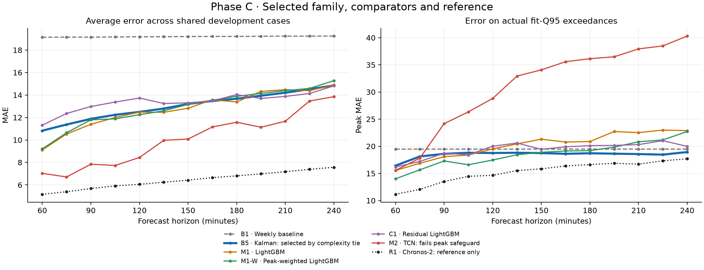

# Phase C development experiment

This isolated implementation selects one model family across direct horizons 4 through 16 (60–240 minutes). It does not select an operating horizon or run final evaluation. The numerical reader stops before 2021-08-09 09:45. The complete experiment contract is in `outputs/phase_c/logs/preregistration_phase_c.md` and `configs/phase_c.json`.

The exact supplied Phase B script is preserved in `scripts/phase_b_reference/run_phase_b_temp_probe.py`. **Do not run that reference script:** its full-data reader and old D2 procedure are outside this experiment's boundary. Phase C reuses its core feature formulas and Ridge alpha only.

## Code and evidence

- `data.py`: sealed source, original chronological folds and purge, exact Phase B features, sequence history, novel-profile D2 and provenance.
- `statistical.py`: fixed fit-only MSTL and weekly-deviation AR(1) Kalman.
- `tcn.py`: fixed causal direct TCN, fit-only normalization and stop-only epoch selection.
- `training.py`: six baselines, anchor tuning, global configuration lock and 13-horizon MAIN10 predictions.
- `chronos_reference.py`: pinned Chronos-2 download, historical-cache schema check and fresh reference inference.
- `evaluation.py`: paired D1/D2 metrics, joint date bootstrap, safeguards and mechanical family selection.
- `run.py`: preregistration/code/input seals and stage orchestration.
- `report.py`: result document generated from this experiment's own evidence.
- `../scripts/verify_phase_c_artifacts.py`: independent strict output-cohort, truth, configuration and artifact-integrity validation.

Python/package/GPU versions are recorded in the run environment and requirements files under the new output namespace. The supplied run uses `.venv-phase-c`. No source changes, commits, pushes or merges are needed to execute it.

Large fitted models, pretrained weights, raw prediction parquets and synthetic temporary directories remain on disk and are excluded from Git by the Phase C namespace's `.gitignore`, consistent with the repository's existing model/prediction policy. Tables, reports, code and audit metadata remain visible to Git. The experiment was completed without committing; the user separately authorized GitHub publication on 2026-10-02.

## GitHub publication

Publication targets `Phase3_experiments` and includes this implementation, the unchanged supplied Phase B reference, synthetic tests, result tables, figures and audit records. The original preregistration and completion manifest are preserved as experiment-time snapshots: their no-commit/no-push statements describe the state before the later publication request. No new fitting, selection, holdout evaluation or merge is part of publication.

The scoped `.gitattributes` preserves exact Phase C file bytes so Git line-ending conversion does not invalidate the sealed hashes. Local absolute paths in original audit records are retained as provenance; they are not portable execution paths. The original result report also contains a local image path; the portable image below is provided for GitHub readers.

- [Completed experiment report](../outputs/phase_c/phase_c_result.md)
- [AUC results](../outputs/phase_c/tables/model_auc_summary.csv)
- [Selection decision](../outputs/phase_c/tables/model_selection_decision.csv)
- [Completion manifest](../outputs/phase_c/logs/phase_c_completion_manifest.json)



## Commands

From the repository root in PowerShell:

```powershell
$env:PYTHONIOENCODING = 'utf-8'
$env:PYTHONWARNINGS = 'ignore::DeprecationWarning,ignore::FutureWarning'
.venv-phase-c\Scripts\python.exe -m phase_c.run --stage prepare
.venv-phase-c\Scripts\python.exe -u -m phase_c.run --stage all
.venv-phase-c\Scripts\python.exe scripts/verify_phase_c_artifacts.py
.venv-phase-c\Scripts\python.exe scripts/verify_phase_c_metrics.py
.venv-phase-c\Scripts\python.exe scripts/finalize_phase_c_report.py
```

After a completed run, inspect and verify its saved evidence rather than rerunning it. Model caches are reused by the training entry point, whose internal cache identity checks are limited; verify the independent manifest before any later reuse. A new scientific run needs a separate preserved workspace/output namespace and a new preregistration. Changing a sealed implementation or configuration causes the current runner to reject execution.

The finalizer also requires the documented synthetic QA logs, appends the independent validation qualifications, and writes a completion manifest binding the report and required artifacts. It refuses to overwrite an existing completion manifest.

Do not manually replace existing model caches, historical metrics, final artifacts or preregistration files. Do not run legacy full-data entry points. No final evaluation or approval file is part of these commands.

## Interpretation limits

R1 is reference only and cannot be M*. AUC is the equally weighted mean of 13 pooled horizon errors. Peaks are actual values exceeding the fit-label 95th percentile, not verified contract-demand exceedances. D2 only subsets score cases; lag and sequence history stays intact. Cal labels are not used for selection.

The historical-artifact access incident, independent-review qualifications and additional legacy-test dependency failure are disclosed in the new logs and result report. Raw holdout non-parsing must not be generalized into a claim that no historical final artifact was opened.
