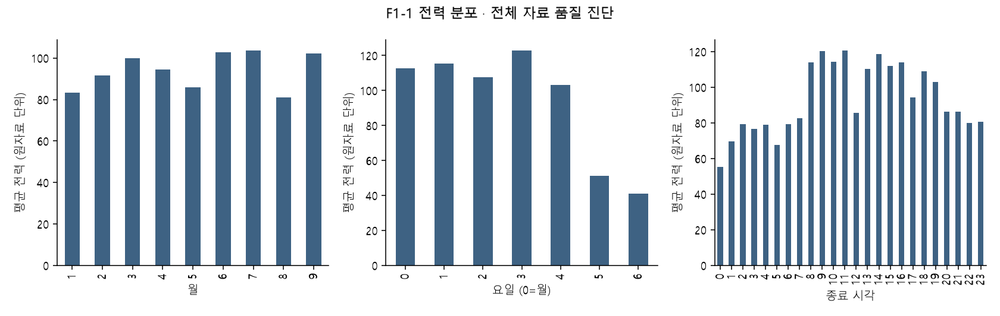
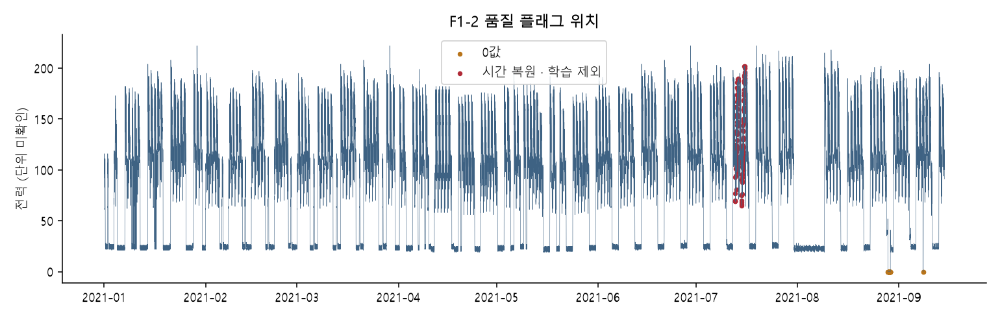
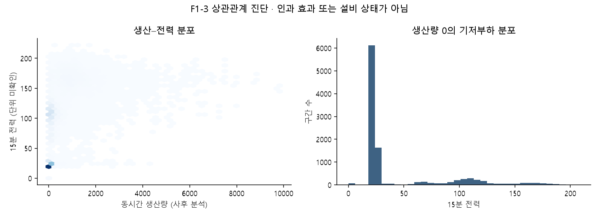
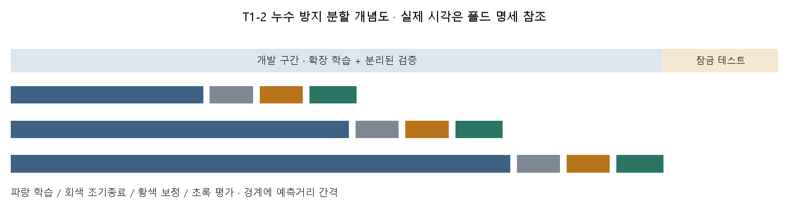

# 1 데이터 이해 및 진단

이 초안의 새 모델 수치는 **개발 교차검증** 결과다. 2026-10-01 18:00 KST 전에는 최종 테스트를 실행하지 않는다. 사전 검증에서 고정 설정으로 테스트를 한 번 본 이력이 있으며 verification/의 성능은 신규 모델의 성능으로 재사용하지 않는다.

## 생산단위와 측정 구조

원자료 한 행은 한 시간이며 전력 네 열은 15분 종료 구간으로 해석한다(A4). 설비 ID·제품·실제 교대 정보가 없어 시간대·요일·생산량을 대리변수로 사용한다.

정규화된 관측 24,672개, 시간 복원 구간 192개, 0값 74개. 범위는 2021-01-01 00:15:00부터 2021-09-15 00:00:00까지다.

## 단위·품질 및 전처리

원본 해시와 원자료는 보존한다. 시간 복원 행과 그 관측에 의존하는 특징·목표를 제외한다. 0값은 비가동 가능성이 있으나 확인된 비가동 라벨이 아니므로 제거하지 않는다. IQR 이상치는 진단이며 자동 삭제하지 않는다. 이 장의 원자료 품질·분포 진단은 전체 자료를 대상으로 하며, 모델 적합·튜닝·채택 평가는 개발 구간만 사용한다. 평균 열의 네 값 평균 일치 여부는 수요전력 단서이며 kW 확정 증거가 아니다.

```json
{
  "source": "data\\raw\\task05_power\\okm_augumented_2021.csv",
  "sha256": "8f7af2e49366c93e1d6f5fdef4b5e350066c1792ac463c2c2886e370f4674830",
  "source_rows": 6168,
  "source_columns": [
    "날짜",
    "시간",
    "15분",
    "30분",
    "45분",
    "60분",
    "평균",
    "생산량",
    "기온",
    "풍속",
    "습도",
    "강수량",
    "전기요금(계절)",
    "day",
    "d",
    "m",
    "공장인원",
    "인건비"
  ],
  "rows_15min": 24672,
  "start": "2021-01-01 00:15:00",
  "end": "2021-09-15 00:00:00",
  "time_repaired_hour_rows": 48,
  "time_repaired_15min_rows": 192,
  "time_repaired_dates": [
    "2021-07-13",
    "2021-07-15"
  ],
  "missing_power": 0,
  "negative_source_power": 0,
  "zero_power": 74,
  "zero_run_count": 2,
  "max_zero_run_intervals": 72,
  "zero_by_hour": {
    "0": 4,
    "1": 4,
    "2": 4,
    "3": 4,
    "4": 4,
    "5": 4,
    "6": 4,
    "7": 4,
    "8": 4,
    "9": 4,
    "10": 4,
    "11": 3,
    "12": 2,
    "17": 1,
    "18": 4,
    "19": 4,
    "20": 4,
    "21": 4,
    "22": 4,
    "23": 4
  },
  "zero_by_weekday": {
    "2": 2,
    "5": 25,
    "6": 47
  },
  "iqr_outlier": 0,
  "average_column_mean_match_fraction": 1.0,
  "average_column_sum_match_fraction": 0.0027561608300907914,
  "unit_inference_only": true
}
```

## 변수 사전과 가용 시점

| variable | dtype | missing |
| --- | --- | --- |
| power | float64 | 0 |
| time_repaired | bool | 0 |
| production_target | int64 | 0 |
| temperature | float64 | 0 |
| wind_speed | float64 | 12 |
| humidity | int64 | 0 |
| precipitation | float64 | 4 |
| headcount | float64 | 68 |
| labor_cost | float64 | 0 |
| tariff_2021_raw | float64 | 0 |
| missing_power | bool | 0 |
| zero_power | bool | 0 |
| iqr_outlier | bool | 0 |
| production_completed | float64 | 18504 |
| production_completed_bad | bool | 0 |
| production_known | float64 | 3 |
| production_known_bad | bool | 0 |
| production_hour_date | datetime64[ns] | 0 |
| missing_production_target | bool | 0 |
| missing_temperature | bool | 0 |
| missing_wind_speed | bool | 0 |
| missing_humidity | bool | 0 |
| missing_precipitation | bool | 0 |
| missing_headcount | bool | 0 |
| missing_labor_cost | bool | 0 |
| missing_tariff_2021_raw | bool | 0 |
| zero_run_length | int64 | 0 |

전력은 구간 종료 직후, 생산은 해당 시간 종료 후만 입력한다. 실측 기상·인원·인건비는 사후 분석 전용이다. 동시간 평균 전력은 입력하지 않는다. 상세 가용 표는 PROJECT_DESIGN.md 3절이다.

## 검증 전략

고정 테스트 첫 원점 2021-08-09 09:45:00. 개발은 그 이전만 사용한다. 3개 확장 폴드에서 적합·조기종료·보정·평가를 분리하고 예측거리만큼 간격을 둔다. 특징의 관측 최대 시각≤원점을 검사한다. 12월 부재와 9월 중순까지만 관측한 한계 때문에 계절 일반화를 주장하지 않는다.

원자료 분포와 품질 그림은 아래 생성 그림에 제시한다.


## 생성 그림







