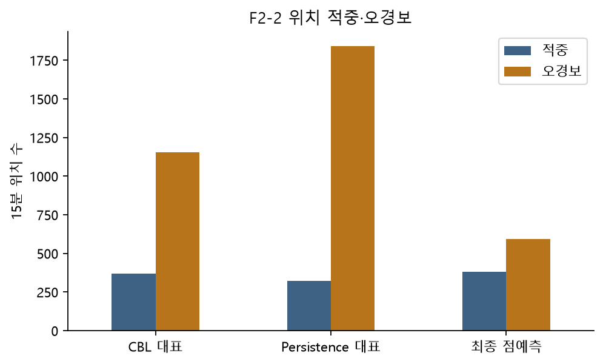
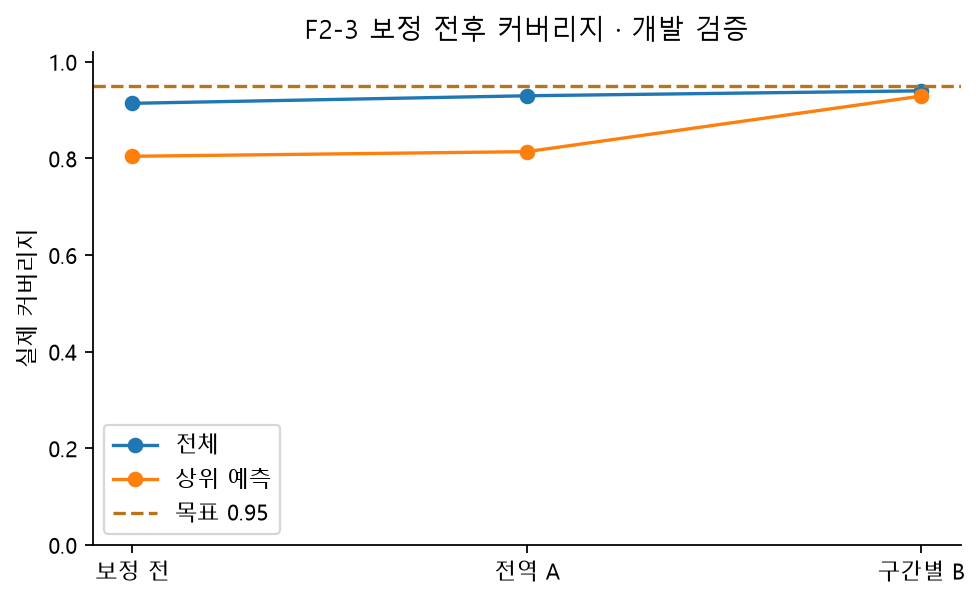
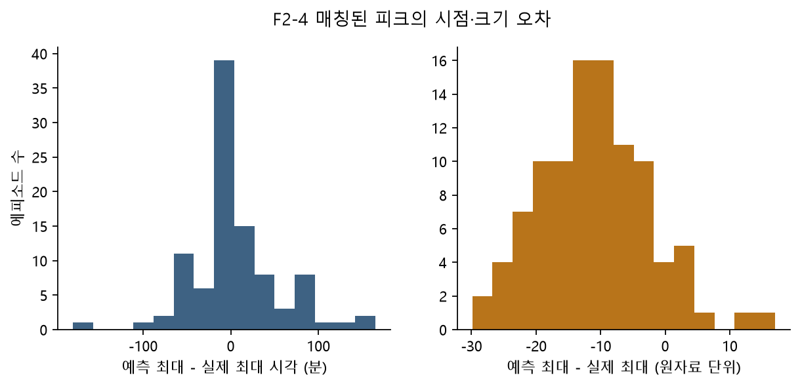
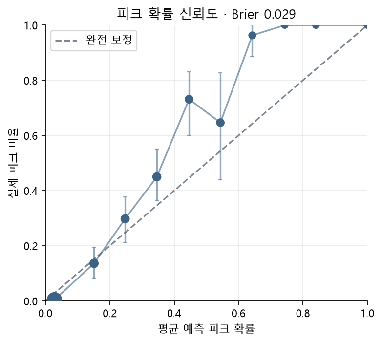
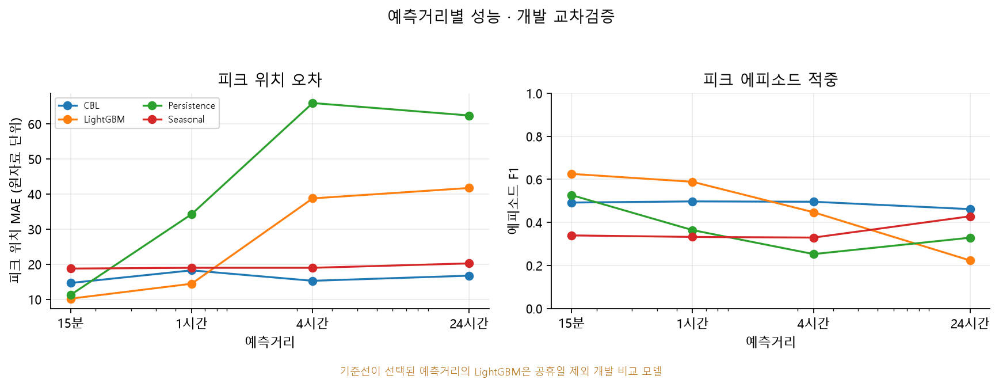

# 2 AI 예측모델 개발

이 초안의 새 모델 수치는 **개발 교차검증** 결과다. 2026-10-01 18:00 KST 전에는 최종 테스트를 실행하지 않는다. 사전 검증에서 고정 설정으로 테스트를 한 번 본 이력이 있으며 verification/의 성능은 신규 모델의 성능으로 재사용하지 않는다.

T1은 한 시간 뒤15분, 보조 곡선은15분·4시간·24시간이다. T2는 익일 최대15분이다. 비교 모델은 persistence3종·계절 나이브3종·CBL5종·LightGBM 점예측·분위수다. CBL은 정산용 규칙을15분 자료에 준용하며 실제 DR 제외일 정보가 없어 공식 정산과 동일하지 않다.

## 폴드별 성능

| fold | model | n | mae | peak_mae | episode_f1 | false_alarms_positions | top_coverage_0.95 |
| --- | --- | --- | --- | --- | --- | --- | --- |
| 0 | c1_mid_6_10 | 2746 | 35.1842 | 14.7800 | 0.2949 | 1092 | — |
| 1 | c1_mid_6_10 | 2746 | 35.5558 | 17.7440 | 0.4427 | 144 | — |
| 2 | c1_mid_6_10 | 2059 | 64.1545 | 12.0170 | 0.5286 | 284 | — |
| 0 | c1a_mid_6_10_adjusted | 2746 | 15.7414 | 37.8531 | 0.3140 | 458 | — |
| 1 | c1a_mid_6_10_adjusted | 2746 | 14.2883 | 16.4563 | 0.5157 | 368 | — |
| 2 | c1a_mid_6_10_adjusted | 2059 | 19.8933 | 16.5614 | 0.7216 | 107 | — |
| 0 | c2_max_4_5 | 2746 | 35.6046 | 10.3200 | 0.2803 | 1088 | — |
| 1 | c2_max_4_5 | 2746 | 36.2249 | 12.9232 | 0.3308 | 128 | — |
| 2 | c2_max_4_5 | 2059 | 56.3323 | 11.3926 | 0.5039 | 471 | — |
| 0 | c2a_max_4_5_adjusted | 2746 | 16.2096 | 32.3217 | 0.3226 | 642 | — |
| 1 | c2a_max_4_5_adjusted | 2746 | 14.7015 | 15.9012 | 0.4819 | 417 | — |
| 2 | c2a_max_4_5_adjusted | 2059 | 17.4724 | 16.6664 | 0.7400 | 97 | — |
| 0 | c3_holiday_hybrid | 2746 | 16.3455 | 23.7600 | 0.3697 | 712 | — |
| 1 | c3_holiday_hybrid | 2746 | 14.2119 | 17.7440 | 0.4427 | 128 | — |
| 2 | c3_holiday_hybrid | 2059 | 33.0988 | 12.0170 | 0.6609 | 129 | — |
| 0 | c3_holiday_mid_4_6 | 2746 | 16.3455 | 23.7600 | 0.3697 | 712 | — |
| 1 | c3_holiday_mid_4_6 | 2746 | 14.2119 | 17.7440 | 0.4427 | 128 | — |
| 2 | c3_holiday_mid_4_6 | 2059 | 33.0988 | 12.0170 | 0.6609 | 129 | — |
| 0 | lgbm | 2746 | 10.3806 | 20.3395 | 0.3520 | 485 | — |
| 1 | lgbm | 2746 | 6.0693 | 12.4745 | 0.6418 | 178 | — |
| 2 | lgbm | 2059 | 9.5530 | 21.8514 | 0.7525 | 99 | — |
| 0 | lgbm_no_holiday | 2746 | 10.4596 | 20.6022 | 0.3308 | 457 | — |
| 1 | lgbm_no_holiday | 2746 | 6.1367 | 13.3882 | 0.5862 | 132 | — |
| 2 | lgbm_no_holiday | 2059 | 9.6557 | 22.3250 | 0.7475 | 98 | — |
| 0 | lgbm_no_holiday_weight_2 | 2746 | 10.6766 | 19.3277 | 0.3898 | 349 | — |
| 1 | lgbm_no_holiday_weight_2 | 2746 | 6.1244 | 10.2271 | 0.6387 | 135 | — |
| 2 | lgbm_no_holiday_weight_2 | 2059 | 7.6094 | 15.9155 | 0.7708 | 109 | — |
| 0 | lgbm_no_holiday_weight_4 | 2746 | 10.5311 | 20.8102 | 0.3729 | 296 | — |
| 1 | lgbm_no_holiday_weight_4 | 2746 | 6.1536 | 7.3455 | 0.6338 | 217 | — |
| 2 | lgbm_no_holiday_weight_4 | 2059 | 9.9398 | 20.9352 | 0.7400 | 93 | — |
| 0 | lgbm_quantile_a | 2746 | 9.3347 | 27.2374 | 0.2963 | 390 | 0.9942 |
| 1 | lgbm_quantile_a | 2746 | 5.7891 | 14.0052 | 0.7059 | 148 | 0.8365 |
| 2 | lgbm_quantile_a | 2059 | 6.3702 | 18.3478 | 0.7000 | 131 | 0.5892 |
| 0 | lgbm_quantile_b | 2746 | 9.3347 | 27.2374 | 0.4127 | 89 | 0.9942 |
| 1 | lgbm_quantile_b | 2746 | 5.7891 | 14.0052 | 0.6667 | 167 | 0.9623 |
| 2 | lgbm_quantile_b | 2059 | 6.3702 | 18.3478 | 0.6939 | 127 | 0.7838 |
| 0 | lgbm_quantile_raw | 2746 | 9.3347 | 27.2374 | 0.3423 | 257 | 0.9709 |
| 1 | lgbm_quantile_raw | 2746 | 5.7891 | 14.0052 | 0.7059 | 122 | 0.8742 |
| 2 | lgbm_quantile_raw | 2059 | 6.3702 | 18.3478 | 0.7400 | 78 | 0.4703 |
| 0 | lgbm_weight_2 | 2746 | 10.5924 | 19.0008 | 0.3577 | 360 | — |
| 1 | lgbm_weight_2 | 2746 | 5.9966 | 9.5930 | 0.6519 | 174 | — |
| 2 | lgbm_weight_2 | 2059 | 10.1761 | 21.7046 | 0.7379 | 87 | — |
| 0 | lgbm_weight_4 | 2746 | 10.7488 | 20.6544 | 0.3520 | 333 | — |
| 1 | lgbm_weight_4 | 2746 | 6.1536 | 7.3455 | 0.6338 | 217 | — |
| 2 | lgbm_weight_4 | 2059 | 9.9312 | 21.2155 | 0.7723 | 103 | — |
| 0 | p1_latest | 2746 | 18.4355 | 62.0800 | 0.2540 | 806 | — |
| 1 | p1_latest | 2746 | 17.3722 | 31.6429 | 0.2857 | 840 | — |
| 2 | p1_latest | 2059 | 11.8927 | 29.8979 | 0.6522 | 197 | — |
| 0 | p2_hour_slot | 2746 | 21.1209 | 74.9000 | 0.1967 | 818 | — |
| 1 | p2_hour_slot | 2746 | 20.1886 | 42.7714 | 0.3188 | 119 | — |
| 2 | p2_hour_slot | 2059 | 14.1088 | 42.1957 | 0.6071 | 147 | — |
| 0 | p3_recent_mean | 2746 | 18.5149 | 68.5400 | 0.2619 | 940 | — |
| 1 | p3_recent_mean | 2746 | 17.3699 | 36.5125 | 0.3182 | 566 | — |
| 2 | p3_recent_mean | 2059 | 12.3326 | 33.3734 | 0.5195 | 241 | — |
| 0 | s1_day | 2746 | 38.4213 | 74.5800 | 0.2443 | 781 | — |
| 1 | s1_day | 2746 | 35.6861 | 63.7857 | 0.3733 | 156 | — |
| 2 | s1_day | 2059 | 29.1914 | 46.3064 | 0.5510 | 209 | — |
| 0 | s2_week | 2746 | 20.6537 | 40.0600 | 0.3008 | 653 | — |
| 1 | s2_week | 2746 | 7.7647 | 17.5214 | 0.1609 | 28 | — |
| 2 | s2_week | 2059 | 33.4633 | 15.3745 | 0.5045 | 373 | — |
| 0 | s3_day_week_mean | 2746 | 28.3201 | 56.6000 | 0.2617 | 525 | — |
| 1 | s3_day_week_mean | 2746 | 20.1220 | 39.3464 | 0.2264 | 62 | — |
| 2 | s3_day_week_mean | 2059 | 30.1719 | 28.9511 | 0.6591 | 83 | — |

## 사전 규칙에 따른 선정과 채택

| horizon_minutes | point_model | persistence | seasonal | cbl | conformal |
| --- | --- | --- | --- | --- | --- |
| 15 | p1_latest | p1_latest | s2_week | c2a_max_4_5_adjusted | b |
| 60 | lgbm_no_holiday_weight_2 | p1_latest | s2_week | c2a_max_4_5_adjusted | b |
| 240 | c3_holiday_hybrid | p3_recent_mean | s2_week | c3_holiday_hybrid | b |
| 1440 | c3_holiday_hybrid | p1_latest | s2_week | c3_holiday_hybrid | b |

[전체 채택·비교 CI 기록](../outputs/logs/development_selection.json). 피크 MAE CI, 에피소드 F1, FP, 상위 q95 오차, 단순성 순서로 선정한다. 일 단위 F1은 시간 위치를 놓쳐도 높을 수 있는 느슨한 보조 지표다. 개발 선택 후 CI에는 다중 선택 편향이 남을 수 있으므로 최종 일반화 판정은 잠금 테스트에서 한다. 시계열 표본은 교환가능하지 않아 conformal의 분포무관 보장을 주장하지 않는다.

## 실행 분할 증거

| fold | horizon | tau | n_fit | n_stop | n_cal | n_score | fit_end | stop_end | cal_end | score_start | score_end | chosen_params |
| --- | --- | --- | --- | --- | --- | --- | --- | --- | --- | --- | --- | --- |
| 0 | 1 | 177.0000 | 5617 | 1405 | 1480 | 2750 | 2021-03-15 12:00:00 | 2021-03-30 03:30:00 | 2021-04-14 13:45:00 | 2021-04-14 14:15:00 | 2021-05-13 05:30:00 | {'num_leaves': 31, 'min_child_samples': 80} |
| 1 | 1 | 177.0000 | 9002 | 2251 | 1480 | 2750 | 2021-04-19 18:15:00 | 2021-05-13 05:15:00 | 2021-05-28 15:30:00 | 2021-05-28 16:00:00 | 2021-06-26 07:15:00 | {'num_leaves': 31, 'min_child_samples': 80} |
| 2 | 1 | 175.0000 | 12387 | 3097 | 1111 | 2064 | 2021-05-25 00:30:00 | 2021-06-26 07:00:00 | 2021-07-07 21:00:00 | 2021-07-07 21:30:00 | 2021-08-09 09:15:00 | {'num_leaves': 31, 'min_child_samples': 80} |
| 0 | 4 | 176.5000 | 5612 | 1404 | 1480 | 2746 | 2021-03-15 10:45:00 | 2021-03-30 02:45:00 | 2021-04-14 13:45:00 | 2021-04-14 15:00:00 | 2021-05-13 05:15:00 | {'num_leaves': 31, 'min_child_samples': 80} |
| 1 | 4 | 177.0000 | 8996 | 2250 | 1480 | 2746 | 2021-04-19 16:45:00 | 2021-05-13 04:15:00 | 2021-05-28 15:15:00 | 2021-05-28 16:30:00 | 2021-06-26 06:45:00 | {'num_leaves': 15, 'min_child_samples': 40} |
| 2 | 4 | 175.0000 | 12380 | 3096 | 1110 | 2059 | 2021-05-24 22:45:00 | 2021-06-26 05:45:00 | 2021-07-07 20:15:00 | 2021-07-07 21:30:00 | 2021-08-09 08:30:00 | {'num_leaves': 31, 'min_child_samples': 80} |
| 0 | 16 | 176.0000 | 5590 | 1402 | 1479 | 2731 | 2021-03-15 05:15:00 | 2021-03-29 23:45:00 | 2021-04-14 13:30:00 | 2021-04-14 17:45:00 | 2021-05-13 04:15:00 | {'num_leaves': 15, 'min_child_samples': 40} |
| 1 | 16 | 177.0000 | 8971 | 2247 | 1479 | 2731 | 2021-04-19 10:30:00 | 2021-05-13 00:15:00 | 2021-05-28 14:00:00 | 2021-05-28 18:15:00 | 2021-06-26 04:45:00 | {'num_leaves': 15, 'min_child_samples': 40} |
| 2 | 16 | 175.0000 | 12352 | 3092 | 1104 | 2036 | 2021-05-24 15:45:00 | 2021-06-26 00:45:00 | 2021-07-07 16:45:00 | 2021-07-07 21:00:00 | 2021-08-09 05:30:00 | {'num_leaves': 15, 'min_child_samples': 40} |
| 0 | 96 | 176.0000 | 5446 | 1386 | 1469 | 2634 | 2021-03-13 17:15:00 | 2021-03-29 03:45:00 | 2021-04-14 11:00:00 | 2021-04-15 11:15:00 | 2021-05-12 21:30:00 | {'num_leaves': 15, 'min_child_samples': 40} |
| 1 | 96 | 177.0000 | 8805 | 2226 | 1470 | 2634 | 2021-04-17 17:00:00 | 2021-05-11 21:30:00 | 2021-05-28 05:00:00 | 2021-05-29 05:15:00 | 2021-06-25 15:30:00 | {'num_leaves': 15, 'min_child_samples': 40} |
| 2 | 96 | 175.0000 | 12165 | 3066 | 1067 | 1887 | 2021-05-22 17:00:00 | 2021-06-24 15:30:00 | 2021-07-06 18:15:00 | 2021-07-07 18:30:00 | 2021-08-08 09:30:00 | {'num_leaves': 15, 'min_child_samples': 40} |

## 핵심 결과 해석

주 과제의 선택 후보는 `lgbm_no_holiday_weight_2`이다. 피크 위치 MAE는 14.443, 에피소드 F1은 0.589이다. CBL 대비 피크 MAE 감소량의 날짜 블록 95% CI는 [-0.926, 9.869]로, CBL 대비 유의한 피크 오차 개선을 입증하지 못했다. 개발 선택 후 결과이므로 최종 일반화 성능으로 해석하지 않는다.

위험 출력은 별도의 분위수 모델과 보정 B를 쓴다. 상위 예측 구간 q95 커버리지는 0.9293, 목표 0.95와의 절대 차이는 0.0207이며 유효 구간 수는 834개다. 구간별 불확실성과 보정 전후 차이를 아래 표에 제시한다.

전체 상위 구간의 날짜 블록 95% CI는 [0.8917, 0.9638]이며 관측 날짜는 48일이다. 가장 낮은 폴드 3의 상위 커버리지는 0.7838 (상위 표본 185개, 9일, 95% CI [0.6968, 0.9053])이다. 합친 구간의 CI와 특정 시기의 국소 실패를 구분한다. 시기별 고부하 분포 변화와 적은 날짜 수가 영향을 줄 수 있지만 원인은 확정할 수 없다. 날짜별 미포함 수는 coverage_top_by_day.csv에 제시한다.

## 예측 부가가치와 커버리지

### coverage_by_fold

[전체 표](../outputs/tables/coverage_by_fold.csv)

| model | fold | top_n | n | top_q95_coverage | tau | top_edge | ci_low | ci_high | target_days |
| --- | --- | --- | --- | --- | --- | --- | --- | --- | --- |
| lgbm_quantile_a | 0 | 172 | 2746 | 0.9942 | 176.5000 | 166.0001 | 0.9806 | 1.0000 | 19 |
| lgbm_quantile_a | 1 | 477 | 2746 | 0.8365 | 177.0000 | 163.2952 | 0.8004 | 0.8742 | 20 |
| lgbm_quantile_a | 2 | 185 | 2059 | 0.5892 | 175.0000 | 171.2784 | 0.4554 | 0.7688 | 9 |
| lgbm_quantile_b | 0 | 172 | 2746 | 0.9942 | 176.5000 | 166.0001 | 0.9806 | 1.0000 | 19 |
| lgbm_quantile_b | 1 | 477 | 2746 | 0.9623 | 177.0000 | 163.2952 | 0.9437 | 0.9812 | 20 |
| lgbm_quantile_b | 2 | 185 | 2059 | 0.7838 | 175.0000 | 171.2784 | 0.6968 | 0.9053 | 9 |
| lgbm_quantile_raw | 0 | 172 | 2746 | 0.9709 | 176.5000 | 166.0001 | 0.9378 | 1.0000 | 19 |
| lgbm_quantile_raw | 1 | 477 | 2746 | 0.8742 | 177.0000 | 163.2952 | 0.8379 | 0.9118 | 20 |
| lgbm_quantile_raw | 2 | 185 | 2059 | 0.4703 | 175.0000 | 171.2784 | 0.3551 | 0.6266 | 9 |

### coverage_comparison

[전체 표](../outputs/tables/coverage_comparison.csv)

| model | alpha | segment | coverage | coverage_error | scoring_n | total_n | ci_low | ci_high | target_days |
| --- | --- | --- | --- | --- | --- | --- | --- | --- | --- |
| lgbm_quantile_raw | 0.9000 | 전체 | 0.8400 | 0.0600 | 7551 | 7551 | 0.8188 | 0.8593 | 85 |
| lgbm_quantile_raw | 0.9000 | 상위 예측 | 0.7266 | 0.1734 | 834 | 7551 | 0.6471 | 0.8051 | 48 |
| lgbm_quantile_raw | 0.9500 | 전체 | 0.9142 | 0.0358 | 7551 | 7551 | 0.8972 | 0.9294 | 85 |
| lgbm_quantile_raw | 0.9500 | 상위 예측 | 0.8046 | 0.1454 | 834 | 7551 | 0.7319 | 0.8747 | 48 |
| lgbm_quantile_a | 0.9000 | 전체 | 0.8578 | 0.0422 | 7551 | 7551 | 0.8341 | 0.8789 | 85 |
| lgbm_quantile_a | 0.9000 | 상위 예측 | 0.7218 | 0.1782 | 834 | 7551 | 0.6535 | 0.7925 | 48 |
| lgbm_quantile_a | 0.9500 | 전체 | 0.9298 | 0.0202 | 7551 | 7551 | 0.9160 | 0.9419 | 85 |
| lgbm_quantile_a | 0.9500 | 상위 예측 | 0.8141 | 0.1359 | 834 | 7551 | 0.7522 | 0.8728 | 48 |
| lgbm_quantile_b | 0.9000 | 전체 | 0.8780 | 0.0220 | 7551 | 7551 | 0.8580 | 0.8953 | 85 |
| lgbm_quantile_b | 0.9000 | 상위 예측 | 0.8813 | 0.0187 | 834 | 7551 | 0.8187 | 0.9357 | 48 |
| lgbm_quantile_b | 0.9500 | 전체 | 0.9400 | 0.0100 | 7551 | 7551 | 0.9268 | 0.9509 | 85 |
| lgbm_quantile_b | 0.9500 | 상위 예측 | 0.9293 | 0.0207 | 834 | 7551 | 0.8917 | 0.9638 | 48 |

### coverage_top_by_day

[전체 표](../outputs/tables/coverage_top_by_day.csv)

| fold | date | n | missed_upper | actual_peak |
| --- | --- | --- | --- | --- |
| 0 | 2021-04-14 | 1 | 0 | 0 |
| 0 | 2021-04-15 | 18 | 0 | 4 |
| 0 | 2021-04-16 | 16 | 0 | 4 |
| 0 | 2021-04-19 | 12 | 0 | 0 |
| 0 | 2021-04-20 | 2 | 0 | 0 |
| 0 | 2021-04-21 | 3 | 0 | 0 |
| 0 | 2021-04-22 | 2 | 0 | 0 |
| 0 | 2021-04-23 | 2 | 0 | 0 |
| 0 | 2021-04-26 | 21 | 0 | 0 |
| 0 | 2021-04-27 | 4 | 0 | 0 |
| 0 | 2021-04-28 | 2 | 0 | 0 |
| 0 | 2021-04-30 | 2 | 0 | 0 |
| 0 | 2021-05-03 | 20 | 0 | 4 |
| 0 | 2021-05-04 | 13 | 1 | 3 |
| 0 | 2021-05-06 | 19 | 0 | 4 |

### expected_exceedance_episodes

[전체 표](../outputs/tables/expected_exceedance_episodes.csv)

| fold | target_time | episode_end | intervals | actual_max_excess | predicted_max_pointwise_excess | signed_error | absolute_error | status |
| --- | --- | --- | --- | --- | --- | --- | --- | --- |
| 0 | 2021-04-15 09:00:00 | 2021-04-15 09:00:00 | 1 | 2.5000 | 2.7892 | 0.2892 | 0.2892 | evaluated |
| 0 | 2021-04-15 13:15:00 | 2021-04-15 13:45:00 | 3 | 5.5000 | 2.0411 | -3.4589 | 3.4589 | evaluated |
| 0 | 2021-04-15 15:45:00 | 2021-04-15 15:45:00 | 1 | 2.5000 | 1.1396 | -1.3604 | 1.3604 | evaluated |
| 0 | 2021-04-16 09:00:00 | 2021-04-16 09:00:00 | 1 | 2.5000 | 2.9250 | 0.4250 | 0.4250 | evaluated |
| 0 | 2021-04-16 13:15:00 | 2021-04-16 13:45:00 | 3 | 5.5000 | 1.7978 | -3.7022 | 3.7022 | evaluated |
| 0 | 2021-04-16 15:45:00 | 2021-04-16 15:45:00 | 1 | 2.5000 | 2.3593 | -0.1407 | 0.1407 | evaluated |
| 0 | 2021-05-03 08:30:00 | 2021-05-03 09:30:00 | 5 | 7.5000 | 3.7093 | -3.7907 | 3.7907 | evaluated |
| 0 | 2021-05-03 12:00:00 | 2021-05-03 12:00:00 | 1 | 2.5000 | 3.0571 | 0.5571 | 0.5571 | evaluated |
| 0 | 2021-05-03 13:15:00 | 2021-05-03 14:00:00 | 4 | 5.5000 | 2.6078 | -2.8922 | 2.8922 | evaluated |
| 0 | 2021-05-04 08:30:00 | 2021-05-04 08:30:00 | 1 | 4.5000 | 3.0008 | -1.4992 | 1.4992 | evaluated |
| 0 | 2021-05-04 09:45:00 | 2021-05-04 09:45:00 | 1 | 0.5000 | 3.3237 | 2.8237 | 2.8237 | evaluated |
| 0 | 2021-05-04 11:15:00 | 2021-05-04 11:15:00 | 1 | 1.5000 | 2.6696 | 1.1696 | 1.1696 | evaluated |
| 0 | 2021-05-04 15:00:00 | 2021-05-04 15:00:00 | 1 | 3.5000 | 0.1024 | -3.3976 | 3.3976 | evaluated |
| 0 | 2021-05-04 15:45:00 | 2021-05-04 15:45:00 | 1 | 0.5000 | 0.0116 | -0.4884 | 0.4884 | evaluated |
| 0 | 2021-05-06 08:30:00 | 2021-05-06 10:00:00 | 7 | 22.5000 | 3.6414 | -18.8586 | 18.8586 | evaluated |

### expected_exceedance_summary

[전체 표](../outputs/tables/expected_exceedance_summary.csv)

| status | episodes | evaluated_episodes | mean_signed_error | mean_signed_error_ci95 | mae | mae_ci95 | spearman | interpretation |
| --- | --- | --- | --- | --- | --- | --- | --- | --- |
| ok | 148 | 148 | -7.4908 | [-9.336712334084442, -5.674496756629085] | 7.9628 | [6.118309561800286, 9.770562320521341] | 0.6731 | Observed peak episodes only; maximum pointwise expected excess is a proxy, not calibrated episode-maximum expectation. |

### horizon_advantage

[전체 표](../outputs/tables/horizon_advantage.csv)

| horizon | minutes | model | selected_model | comparison_role | baseline_family | baseline_model | paired_peak_n | peak_mae_gain | ci_low | ci_high | model_beats_baseline_ci |
| --- | --- | --- | --- | --- | --- | --- | --- | --- | --- | --- | --- |
| 1 | 15 | lgbm_no_holiday | p1_latest | development_comparator_not_selected | persistence | p1_latest | 416 | 1.0536 | -0.5151 | 2.8394 | False |
| 1 | 15 | lgbm_no_holiday | p1_latest | development_comparator_not_selected | seasonal | s2_week | 416 | 8.5728 | 3.7894 | 16.0750 | True |
| 1 | 15 | lgbm_no_holiday | p1_latest | development_comparator_not_selected | cbl | c2a_max_4_5_adjusted | 416 | 4.4685 | 0.9717 | 9.3612 | True |
| 4 | 60 | lgbm_no_holiday_weight_2 | lgbm_no_holiday_weight_2 | selected_point_model | persistence | p1_latest | 425 | 19.8157 | 15.6979 | 24.9716 | True |
| 4 | 60 | lgbm_no_holiday_weight_2 | lgbm_no_holiday_weight_2 | selected_point_model | seasonal | s2_week | 425 | 4.5428 | 0.3364 | 10.8742 | True |
| 4 | 60 | lgbm_no_holiday_weight_2 | lgbm_no_holiday_weight_2 | selected_point_model | cbl | c2a_max_4_5_adjusted | 425 | 3.8130 | -0.9260 | 9.8691 | False |
| 16 | 240 | lgbm_no_holiday | c3_holiday_hybrid | development_comparator_not_selected | persistence | p3_recent_mean | 425 | 27.1629 | 10.5730 | 43.2763 | True |
| 16 | 240 | lgbm_no_holiday | c3_holiday_hybrid | development_comparator_not_selected | seasonal | s2_week | 425 | -19.7736 | -30.0836 | -9.4318 | False |
| 16 | 240 | lgbm_no_holiday | c3_holiday_hybrid | development_comparator_not_selected | cbl | c3_holiday_hybrid | 425 | -23.4743 | -33.7912 | -14.1760 | False |
| 96 | 1440 | lgbm_no_holiday | c3_holiday_hybrid | development_comparator_not_selected | persistence | p1_latest | 369 | 20.6558 | -11.9933 | 57.3683 | False |
| 96 | 1440 | lgbm_no_holiday | c3_holiday_hybrid | development_comparator_not_selected | seasonal | s2_week | 369 | -21.4797 | -29.2761 | -11.7848 | False |
| 96 | 1440 | lgbm_no_holiday | c3_holiday_hybrid | development_comparator_not_selected | cbl | c3_holiday_hybrid | 369 | -24.9783 | -33.1659 | -15.4961 | False |

### horizon_curve

[전체 표](../outputs/tables/horizon_curve.csv)

| horizon | minutes | model | selected | n | peak_n | mae | peak_mae | peak_mae_ci_low | peak_mae_ci_high | episode_f1 | tp | fp | fn |
| --- | --- | --- | --- | --- | --- | --- | --- | --- | --- | --- | --- | --- | --- |
| 1 | 15 | c1_mid_6_10 | False | 7564 | 416 | 43.1586 | 14.2796 | 11.8914 | 17.7848 | 0.4151 | 88 | 192 | 56 |
| 1 | 15 | c1a_mid_6_10_adjusted | False | 7564 | 416 | 13.1693 | 15.7087 | 12.5076 | 20.3294 | 0.5064 | 99 | 148 | 45 |
| 1 | 15 | c2_max_4_5 | False | 7564 | 416 | 41.4019 | 11.8341 | 8.7569 | 17.0921 | 0.3713 | 75 | 185 | 69 |
| 1 | 15 | c2a_max_4_5_adjusted | False | 7564 | 416 | 13.0114 | 14.6601 | 11.4731 | 19.1093 | 0.4921 | 94 | 144 | 50 |
| 1 | 15 | c3_holiday_hybrid | False | 7564 | 416 | 20.1272 | 15.3590 | 12.4745 | 20.3203 | 0.4916 | 88 | 126 | 56 |
| 1 | 15 | c3_holiday_mid_4_6 | False | 7564 | 416 | 20.1272 | 15.3590 | 12.4745 | 20.3203 | 0.4916 | 88 | 126 | 56 |
| 1 | 15 | lgbm | False | 7564 | 416 | 4.5847 | 9.8367 | 7.5764 | 11.6574 | 0.6383 | 120 | 112 | 24 |
| 1 | 15 | lgbm_no_holiday | False | 7564 | 416 | 4.8422 | 10.1916 | 8.5340 | 11.5575 | 0.6253 | 116 | 111 | 28 |
| 1 | 15 | lgbm_no_holiday_weight_2 | False | 7564 | 416 | 4.6537 | 9.6242 | 7.1332 | 11.5092 | 0.6167 | 107 | 96 | 37 |
| 1 | 15 | lgbm_no_holiday_weight_4 | False | 7564 | 416 | 4.4717 | 9.1128 | 6.2373 | 11.3347 | 0.6409 | 116 | 102 | 28 |
| 1 | 15 | lgbm_quantile_a | False | 7564 | 416 | 4.3284 | 9.7590 | 8.1498 | 11.0929 | 0.6624 | 104 | 66 | 40 |
| 1 | 15 | lgbm_quantile_b | False | 7564 | 416 | 4.3284 | 9.7590 | 8.1498 | 11.0929 | 0.6481 | 105 | 75 | 39 |
| 1 | 15 | lgbm_quantile_raw | False | 7564 | 416 | 4.3284 | 9.7590 | 8.1498 | 11.0929 | 0.6879 | 108 | 62 | 36 |
| 1 | 15 | lgbm_weight_2 | False | 7564 | 416 | 4.6082 | 9.3269 | 6.8700 | 11.2611 | 0.6087 | 105 | 96 | 39 |
| 1 | 15 | lgbm_weight_4 | False | 7564 | 416 | 4.4716 | 9.1424 | 6.3205 | 11.3580 | 0.6484 | 118 | 102 | 26 |

### probability_reliability

[전체 표](../outputs/tables/probability_reliability.csv)

| bin | bin_left | bin_right | n | mean_predicted | events | observed_rate | observed_rate_ci_low | observed_rate_ci_high | distinct_days |
| --- | --- | --- | --- | --- | --- | --- | --- | --- | --- |
| 0 | 0.0000 | 0.1000 | 6605 | 0.0282 | 28 | 0.0042 | 0.0018 | 0.0071 | 85 |
| 1 | 0.1000 | 0.2000 | 250 | 0.1511 | 34 | 0.1360 | 0.0836 | 0.1949 | 54 |
| 2 | 0.2000 | 0.3000 | 215 | 0.2477 | 64 | 0.2977 | 0.2125 | 0.3776 | 45 |
| 3 | 0.3000 | 0.4000 | 200 | 0.3462 | 90 | 0.4500 | 0.3641 | 0.5502 | 33 |
| 4 | 0.4000 | 0.5000 | 134 | 0.4464 | 98 | 0.7313 | 0.6000 | 0.8302 | 23 |
| 5 | 0.5000 | 0.6000 | 99 | 0.5436 | 64 | 0.6465 | 0.4395 | 0.8273 | 14 |
| 6 | 0.6000 | 0.7000 | 27 | 0.6426 | 26 | 0.9630 | 0.8857 | 1.0000 | 8 |
| 7 | 0.7000 | 0.8000 | 6 | 0.7437 | 6 | 1.0000 | 1.0000 | 1.0000 | 4 |
| 8 | 0.8000 | 0.9000 | 8 | 0.8403 | 8 | 1.0000 | 1.0000 | 1.0000 | 6 |
| 9 | 0.9000 | 1.0000 | 7 | 1.0000 | 7 | 1.0000 | 1.0000 | 1.0000 | 3 |

### T2-1_fva

[전체 표](../outputs/tables/T2-1_fva.csv)

| stage | model | adopted | metric_domain | previous_model | selected_final | is_selected_point_model | n | peak_n | mae | rmse | mape_nonzero | peak_mae | position_tp | position_fp | position_fn | position_f1 | episode_tp | episode_fp | episode_fn | episode_f1 | false_alarms_positions | timing_mae_minutes | magnitude_mae | vs_cbl_gain | vs_cbl_gain_ci_low | vs_cbl_gain_ci_high | vs_cbl_improvement_fraction | vs_cbl_improvement_ci_low | vs_cbl_improvement_ci_high | vs_cbl_paired_peak_n | vs_previous_gain | vs_previous_gain_ci_low | vs_previous_gain_ci_high | vs_previous_improvement_fraction | vs_previous_improvement_ci_low | vs_previous_improvement_ci_high | vs_previous_paired_peak_n | brier | pr_auc | coverage_0.1 | top_coverage_0.1 | pinball_0.1 | coverage_0.5 | top_coverage_0.5 | pinball_0.5 | coverage_0.9 | top_coverage_0.9 | pinball_0.9 | coverage_0.95 | top_coverage_0.95 | pinball_0.95 | coverage_0.975 | top_coverage_0.975 | pinball_0.975 | pinball_mean | vs_previous_top_coverage_error_reduction_0.9 | vs_previous_top_coverage_error_reduction_0.95 | vs_previous_pinball_improvement_fraction |
| --- | --- | --- | --- | --- | --- | --- | --- | --- | --- | --- | --- | --- | --- | --- | --- | --- | --- | --- | --- | --- | --- | --- | --- | --- | --- | --- | --- | --- | --- | --- | --- | --- | --- | --- | --- | --- | --- | --- | --- | --- | --- | --- | --- | --- | --- | --- | --- | --- | --- | --- | --- | --- | --- | --- | --- | --- | --- | --- |
| CBL 대표 | c2a_max_4_5_adjusted | True | point | — | False | False | 7551 | 425 | 16.0055 | 26.9167 | 46.5614 | 18.2561 | 369 | 1156 | 56 | 0.3785 | 97 | 145 | 51 | 0.4974 | 1156 | 26.4433 | 12.4809 | 0.0000 | 0.0000 | 0.0000 | 0.0000 | 0.0000 | 0.0000 | 425.0000 | — | — | — | — | — | — | — | — | — | — | — | — | — | — | — | — | — | — | — | — | — | — | — | — | — | — | — | — |
| Persistence 대표 | p1_latest | True | point | c2a_max_4_5_adjusted | False | False | 7551 | 425 | 16.2647 | 27.4600 | 17.2647 | 34.2588 | 322 | 1843 | 103 | 0.2486 | 69 | 162 | 79 | 0.3641 | 1843 | 64.1304 | 2.2029 | -16.0027 | -19.5702 | -12.2520 | -0.8766 | -1.3288 | -0.5338 | 425.0000 | -16.0027 | -19.5702 | -12.2520 | -0.8766 | -1.3288 | -0.5338 | 425.0000 | — | — | — | — | — | — | — | — | — | — | — | — | — | — | — | — | — | — | — | — | — |
| LightGBM 기본 | lgbm_no_holiday | True | point | p1_latest | False | False | 7551 | 425 | 8.6683 | 13.7791 | 15.5904 | 19.1784 | 366 | 687 | 59 | 0.4953 | 93 | 107 | 55 | 0.5345 | 687 | 35.3226 | 15.0732 | -0.9223 | -6.3837 | 6.1673 | -0.0505 | -0.4569 | 0.2654 | 425.0000 | 15.0804 | 10.0417 | 21.1926 | 0.4402 | 0.3229 | 0.5509 | 425.0000 | — | — | — | — | — | — | — | — | — | — | — | — | — | — | — | — | — | — | — | — | — |
| 공휴일 특징 후보 | lgbm | False | point | lgbm_no_holiday | False | False | 7551 | 425 | 8.5871 | 13.6616 | 15.6297 | 18.5847 | 383 | 762 | 42 | 0.4879 | 103 | 109 | 45 | 0.5722 | 762 | 26.6505 | 14.4711 | -0.3286 | -5.8513 | 6.8984 | -0.0180 | -0.4097 | 0.2944 | 425.0000 | 0.5937 | 0.1199 | 1.1161 | 0.0310 | 0.0064 | 0.0582 | 425.0000 | — | — | — | — | — | — | — | — | — | — | — | — | — | — | — | — | — | — | — | — | — |
| 피크 가중 2 후보 | lgbm_no_holiday_weight_2 | True | point | lgbm_no_holiday | False | True | 7551 | 425 | 8.1848 | 13.1640 | 14.3281 | 14.4431 | 379 | 593 | 46 | 0.5426 | 98 | 87 | 50 | 0.5886 | 593 | 33.6735 | 12.0515 | 3.8130 | -0.9260 | 9.8691 | 0.2089 | -0.0627 | 0.4185 | 425.0000 | 4.7353 | 3.4284 | 5.8204 | 0.2469 | 0.1898 | 0.2870 | 425.0000 | — | — | — | — | — | — | — | — | — | — | — | — | — | — | — | — | — | — | — | — | — |
| 피크 가중 4 후보 | lgbm_no_holiday_weight_4 | True | point | lgbm_no_holiday | False | False | 7551 | 425 | 8.7779 | 13.9929 | 16.6034 | 16.4439 | 394 | 606 | 31 | 0.5530 | 104 | 108 | 44 | 0.5778 | 606 | 27.1154 | 12.7856 | 1.8122 | -4.2231 | 9.3768 | 0.0993 | -0.2913 | 0.4108 | 425.0000 | 2.7345 | 1.7982 | 3.8410 | 0.1426 | 0.0849 | 0.2230 | 425.0000 | — | — | — | — | — | — | — | — | — | — | — | — | — | — | — | — | — | — | — | — | — |
| 분위수 원본 | lgbm_quantile_raw | True | uncertainty | — | False | False | 7551 | 425 | 7.2370 | 12.9313 | 11.4936 | 17.9631 | 386 | 457 | 39 | 0.6088 | 104 | 95 | 44 | 0.5994 | 457 | 23.3654 | 14.6555 | — | — | — | — | — | — | — | — | — | — | — | — | — | — | 0.0297 | 0.7107 | 0.1588 | 0.0252 | 1.8125 | 0.5316 | 0.4592 | 3.6185 | 0.8400 | 0.7266 | 1.9996 | 0.9142 | 0.8046 | 1.3261 | 0.9529 | 0.8549 | 0.9305 | 1.9374 | — | — | — |
| 전역 보정 A | lgbm_quantile_a | True | uncertainty | lgbm_quantile_raw | False | False | 7551 | 425 | 7.2370 | 12.9313 | 11.4936 | 17.9631 | 407 | 669 | 18 | 0.5423 | 103 | 120 | 45 | 0.5553 | 669 | 30.1456 | 15.6253 | — | — | — | — | — | — | — | — | — | — | — | — | — | — | 0.0294 | 0.7145 | 0.1588 | 0.0252 | 1.8125 | 0.5316 | 0.4592 | 3.6185 | 0.8578 | 0.7218 | 1.9863 | 0.9298 | 0.8141 | 1.2873 | 0.9676 | 0.8837 | 0.8747 | 1.9158 | -0.0048 | 0.0096 | 0.0111 |
| 구간별 보정 B | lgbm_quantile_b | True | uncertainty | lgbm_quantile_a | False | False | 7551 | 425 | 7.2370 | 12.9313 | 11.4936 | 17.9631 | 383 | 383 | 42 | 0.6432 | 94 | 60 | 54 | 0.6225 | 383 | 26.4894 | 15.6419 | — | — | — | — | — | — | — | — | — | — | — | — | — | — | 0.0290 | 0.7093 | 0.1588 | 0.0252 | 1.8125 | 0.5316 | 0.4592 | 3.6185 | 0.8780 | 0.8813 | 1.8705 | 0.9400 | 0.9293 | 1.1909 | 0.9800 | 0.9976 | 0.8167 | 1.8618 | 0.1595 | 0.1151 | 0.0282 |
| 최종 점예측 | lgbm_no_holiday_weight_2 | True | point | lgbm_no_holiday_weight_4 | True | True | 7551 | 425 | 8.1848 | 13.1640 | 14.3281 | 14.4431 | 379 | 593 | 46 | 0.5426 | 98 | 87 | 50 | 0.5886 | 593 | 33.6735 | 12.0515 | 3.8130 | -0.9260 | 9.8691 | 0.2089 | -0.0627 | 0.4185 | 425.0000 | 2.0008 | -0.1148 | 3.7229 | 0.1217 | -0.0083 | 0.1990 | 425.0000 | — | — | — | — | — | — | — | — | — | — | — | — | — | — | — | — | — | — | — | — | — |

### T2-2_pooled_metrics

[전체 표](../outputs/tables/T2-2_pooled_metrics.csv)

| model | n | peak_n | mae | rmse | mape_nonzero | peak_mae | position_tp | position_fp | position_fn | position_f1 | episode_tp | episode_fp | episode_fn | episode_f1 | false_alarms_positions | timing_mae_minutes | magnitude_mae | brier | pr_auc | coverage_0.1 | top_coverage_0.1 | pinball_0.1 | coverage_0.5 | top_coverage_0.5 | pinball_0.5 | coverage_0.9 | top_coverage_0.9 | pinball_0.9 | coverage_0.95 | top_coverage_0.95 | pinball_0.95 | coverage_0.975 | top_coverage_0.975 | pinball_0.975 | pinball_mean |
| --- | --- | --- | --- | --- | --- | --- | --- | --- | --- | --- | --- | --- | --- | --- | --- | --- | --- | --- | --- | --- | --- | --- | --- | --- | --- | --- | --- | --- | --- | --- | --- | --- | --- | --- | --- |
| c1_mid_6_10 | 7551 | 425 | 43.2190 | 65.7235 | 172.1278 | 14.2286 | 306 | 1520 | 119 | 0.2719 | 89 | 190 | 59 | 0.4169 | 1520 | 17.1910 | 12.0375 | — | — | — | — | — | — | — | — | — | — | — | — | — | — | — | — | — | — |
| c1a_mid_6_10_adjusted | 7551 | 425 | 16.3451 | 26.9591 | 49.0871 | 19.0317 | 362 | 933 | 63 | 0.4209 | 95 | 134 | 53 | 0.5040 | 933 | 26.6842 | 10.7246 | — | — | — | — | — | — | — | — | — | — | — | — | — | — | — | — | — | — |
| c2_max_4_5 | 7551 | 425 | 41.4822 | 65.4995 | 164.8115 | 11.7706 | 323 | 1687 | 102 | 0.2653 | 76 | 193 | 72 | 0.3645 | 1687 | 20.3289 | 7.3783 | — | — | — | — | — | — | — | — | — | — | — | — | — | — | — | — | — | — |
| c2a_max_4_5_adjusted | 7551 | 425 | 16.0055 | 26.9167 | 46.5614 | 18.2561 | 369 | 1156 | 56 | 0.3785 | 97 | 145 | 51 | 0.4974 | 1156 | 26.4433 | 12.4809 | — | — | — | — | — | — | — | — | — | — | — | — | — | — | — | — | — | — |
| c3_holiday_hybrid | 7551 | 425 | 20.1379 | 36.7937 | 60.2877 | 15.2851 | 323 | 969 | 102 | 0.3762 | 89 | 128 | 59 | 0.4877 | 969 | 17.8652 | 12.0693 | — | — | — | — | — | — | — | — | — | — | — | — | — | — | — | — | — | — |
| c3_holiday_mid_4_6 | 7551 | 425 | 20.1379 | 36.7937 | 60.2877 | 15.2851 | 323 | 969 | 102 | 0.3762 | 89 | 128 | 59 | 0.4877 | 969 | 17.8652 | 12.0693 | — | — | — | — | — | — | — | — | — | — | — | — | — | — | — | — | — | — |
| lgbm | 7551 | 425 | 8.5871 | 13.6616 | 15.6297 | 18.5847 | 383 | 762 | 42 | 0.4879 | 103 | 109 | 45 | 0.5722 | 762 | 26.6505 | 14.4711 | — | — | — | — | — | — | — | — | — | — | — | — | — | — | — | — | — | — |
| lgbm_no_holiday | 7551 | 425 | 8.6683 | 13.7791 | 15.5904 | 19.1784 | 366 | 687 | 59 | 0.4953 | 93 | 107 | 55 | 0.5345 | 687 | 35.3226 | 15.0732 | — | — | — | — | — | — | — | — | — | — | — | — | — | — | — | — | — | — |
| lgbm_no_holiday_weight_2 | 7551 | 425 | 8.1848 | 13.1640 | 14.3281 | 14.4431 | 379 | 593 | 46 | 0.5426 | 98 | 87 | 50 | 0.5886 | 593 | 33.6735 | 12.0515 | — | — | — | — | — | — | — | — | — | — | — | — | — | — | — | — | — | — |
| lgbm_no_holiday_weight_4 | 7551 | 425 | 8.7779 | 13.9929 | 16.6034 | 16.4439 | 394 | 606 | 31 | 0.5530 | 104 | 108 | 44 | 0.5778 | 606 | 27.1154 | 12.7856 | — | — | — | — | — | — | — | — | — | — | — | — | — | — | — | — | — | — |
| lgbm_quantile_a | 7551 | 425 | 7.2370 | 12.9313 | 11.4936 | 17.9631 | 407 | 669 | 18 | 0.5423 | 103 | 120 | 45 | 0.5553 | 669 | 30.1456 | 15.6253 | 0.0294 | 0.7145 | 0.1588 | 0.0252 | 1.8125 | 0.5316 | 0.4592 | 3.6185 | 0.8578 | 0.7218 | 1.9863 | 0.9298 | 0.8141 | 1.2873 | 0.9676 | 0.8837 | 0.8747 | 1.9158 |
| lgbm_quantile_b | 7551 | 425 | 7.2370 | 12.9313 | 11.4936 | 17.9631 | 383 | 383 | 42 | 0.6432 | 94 | 60 | 54 | 0.6225 | 383 | 26.4894 | 15.6419 | 0.0290 | 0.7093 | 0.1588 | 0.0252 | 1.8125 | 0.5316 | 0.4592 | 3.6185 | 0.8780 | 0.8813 | 1.8705 | 0.9400 | 0.9293 | 1.1909 | 0.9800 | 0.9976 | 0.8167 | 1.8618 |
| lgbm_quantile_raw | 7551 | 425 | 7.2370 | 12.9313 | 11.4936 | 17.9631 | 386 | 457 | 39 | 0.6088 | 104 | 95 | 44 | 0.5994 | 457 | 23.3654 | 14.6555 | 0.0297 | 0.7107 | 0.1588 | 0.0252 | 1.8125 | 0.5316 | 0.4592 | 3.6185 | 0.8400 | 0.7266 | 1.9996 | 0.9142 | 0.8046 | 1.3261 | 0.9529 | 0.8549 | 0.9305 | 1.9374 |
| lgbm_weight_2 | 7551 | 425 | 8.8076 | 13.9702 | 16.5425 | 17.3968 | 384 | 621 | 41 | 0.5371 | 104 | 109 | 44 | 0.5762 | 621 | 24.5192 | 13.2520 | — | — | — | — | — | — | — | — | — | — | — | — | — | — | — | — | — | — |
| lgbm_weight_4 | 7551 | 425 | 8.8548 | 14.1120 | 16.4998 | 16.5806 | 399 | 653 | 26 | 0.5403 | 106 | 114 | 42 | 0.5761 | 653 | 25.4717 | 12.9172 | — | — | — | — | — | — | — | — | — | — | — | — | — | — | — | — | — | — |

### t2_development_cv

[전체 표](../outputs/tables/t2_development_cv.csv)

| model | n | mae | daily_peak_f1 |
| --- | --- | --- | --- |
| t2_last_week_max | 84 | 60.9286 | 0.5143 |
| t2_lgbm | 85 | 49.0067 | 0.3077 |
| t2_recent_24h_max | 85 | 47.7176 | 0.7164 |

## 생성 그림

