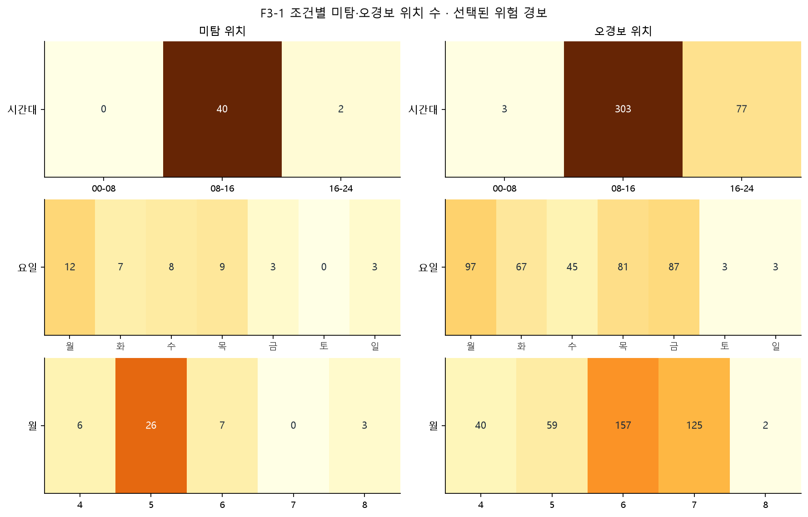
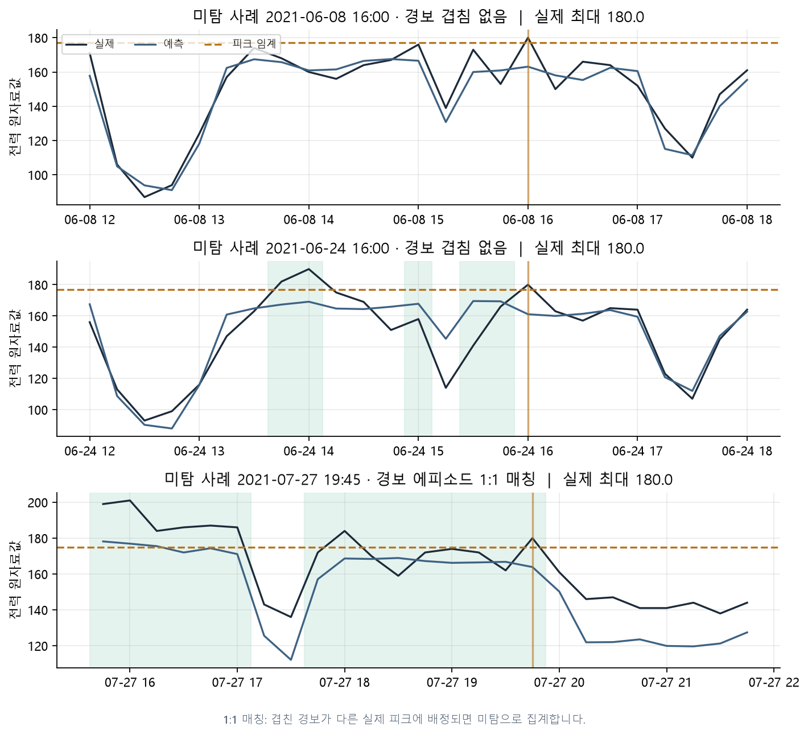
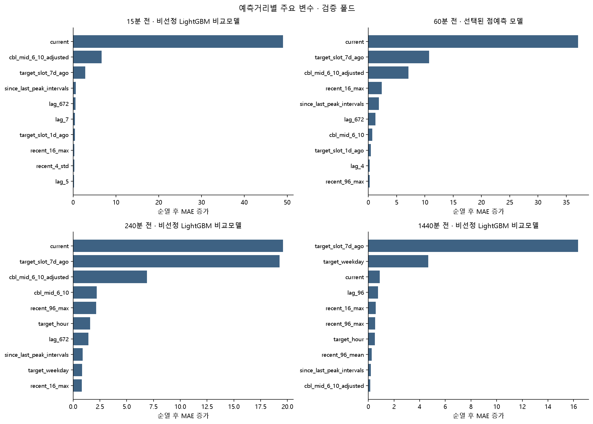
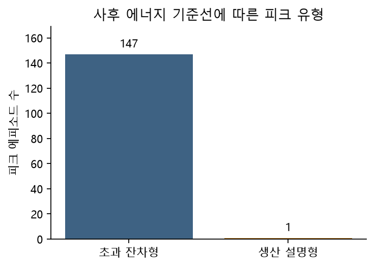

# 3 영향요인 및 오류분석

이 초안의 새 모델 수치는 **개발 교차검증** 결과다. 2026-10-01 18:00 KST 전에는 최종 테스트를 실행하지 않는다. 사전 검증에서 고정 설정으로 테스트를 한 번 본 이력이 있으며 verification/의 성능은 신규 모델의 성능으로 재사용하지 않는다.

이 장의 FN·FP는 선택된 분위수 모델의 보정된 초과확률 경보를 사용한다. 2장 점예측 모델의 경보 임계값과 구분하며, 연속 확인·준비시간을 적용한 운영 경보는 4장에 따로 제시한다. 위치 재현율과 일대일 매칭 에피소드 재현율도 다르다. 긴 경보 하나가 여러 실제 에피소드를 덮어도 하나만 적중으로 센다. 시간대3구간은 대리 교대이며 실제 교대 라벨이 아니다. 동시간 생산·기상은 사후 기준선 설명에만 쓴다. 생산 연관형과 잔차 초과형은 통계적 분해이며 설비 원인이나 과다 사용의 인과 판정이 아니다. 조건 탐색은 다중 비교 조정 없이 제시한다.

### applicability_distance

[전체 표](../outputs/tables/applicability_distance.csv)

| origin | nearest_train_distance | beyond_training_p95 |
| --- | --- | --- |
| 2021-04-14 15:00:00 | 0.2017 | True |
| 2021-04-14 15:15:00 | 0.1517 | False |
| 2021-04-14 15:30:00 | 0.1484 | False |
| 2021-04-14 15:45:00 | 0.1916 | True |
| 2021-04-14 16:00:00 | 0.1368 | False |
| 2021-04-14 16:15:00 | 0.1582 | False |
| 2021-04-14 16:30:00 | 0.1360 | False |
| 2021-04-14 16:45:00 | 0.1346 | False |
| 2021-04-14 17:00:00 | 0.2669 | True |
| 2021-04-14 17:15:00 | 0.2034 | True |
| 2021-04-14 17:30:00 | 0.3015 | True |
| 2021-04-14 17:45:00 | 0.2754 | True |
| 2021-04-14 18:00:00 | 0.1227 | False |
| 2021-04-14 18:15:00 | 0.1251 | False |
| 2021-04-14 18:30:00 | 0.1206 | False |

### energy_intensity_proxy

[전체 표](../outputs/tables/energy_intensity_proxy.csv)

| hour | production | power_sum | sec_proxy |
| --- | --- | --- | --- |
| 2021-01-04 08:00:00 | 165 | 625.0000 | 3.7879 |
| 2021-01-04 09:00:00 | 313 | 641.0000 | 2.0479 |
| 2021-01-04 10:00:00 | 2757 | 626.0000 | 0.2271 |
| 2021-01-04 11:00:00 | 983 | 595.0000 | 0.6053 |
| 2021-01-04 12:00:00 | 96 | 357.0000 | 3.7188 |
| 2021-01-04 13:00:00 | 791 | 621.0000 | 0.7851 |
| 2021-01-04 14:00:00 | 2485 | 608.0000 | 0.2447 |
| 2021-01-04 15:00:00 | 2313 | 560.0000 | 0.2421 |
| 2021-01-04 16:00:00 | 1906 | 566.0000 | 0.2970 |
| 2021-01-04 17:00:00 | 1725 | 489.0000 | 0.2835 |
| 2021-01-04 20:00:00 | 46 | 403.0000 | 8.7609 |
| 2021-01-04 21:00:00 | 40 | 433.0000 | 10.8250 |
| 2021-01-04 23:00:00 | 52 | 388.0000 | 7.4615 |
| 2021-01-07 01:00:00 | 34 | 92.0000 | 2.7059 |
| 2021-01-07 03:00:00 | 56 | 89.0000 | 1.5893 |

### error_conditions

[전체 표](../outputs/tables/error_conditions.csv)

| factor | value | n | mae | peak_n | tp | fn | fp | peak_recall | false_alert_rate |
| --- | --- | --- | --- | --- | --- | --- | --- | --- | --- |
| time_block | 00-08 | 2488 | 7.4159 | 0 | 0 | 0 | 3 | — | 0.0012 |
| time_block | 08-16 | 2503 | 10.4452 | 366 | 326 | 40 | 303 | 0.8907 | 0.1418 |
| time_block | 16-24 | 2560 | 6.7221 | 59 | 57 | 2 | 77 | 0.9661 | 0.0308 |
| weekday | Friday | 1151 | 9.2171 | 98 | 95 | 3 | 87 | 0.9694 | 0.0826 |
| weekday | Monday | 1083 | 11.1507 | 115 | 103 | 12 | 97 | 0.8957 | 0.1002 |
| weekday | Saturday | 1172 | 4.5312 | 0 | 0 | 0 | 3 | — | 0.0026 |
| weekday | Sunday | 1140 | 4.3502 | 3 | 0 | 3 | 3 | 0.0000 | 0.0026 |
| weekday | Thursday | 1070 | 9.5828 | 83 | 74 | 9 | 81 | 0.8916 | 0.0821 |
| weekday | Tuesday | 949 | 9.5992 | 63 | 56 | 7 | 67 | 0.8889 | 0.0756 |
| weekday | Wednesday | 986 | 9.6199 | 63 | 55 | 8 | 45 | 0.8730 | 0.0488 |
| month | 4 | 1568 | 10.8552 | 10 | 4 | 6 | 40 | 0.4000 | 0.0257 |
| month | 5 | 1492 | 9.2855 | 40 | 14 | 26 | 59 | 0.3500 | 0.0406 |
| month | 6 | 2432 | 6.2750 | 140 | 133 | 7 | 157 | 0.9500 | 0.0685 |
| month | 7 | 1252 | 8.5039 | 230 | 230 | 0 | 125 | 1.0000 | 0.1223 |
| month | 8 | 807 | 6.2216 | 5 | 2 | 3 | 2 | 0.4000 | 0.0025 |

### error_episodes

[전체 표](../outputs/tables/error_episodes.csv)

| status | start | end | actual_max | peak_time | alarm_start | duration_intervals | overlapping_alarm_count | missed_reason |
| --- | --- | --- | --- | --- | --- | --- | --- | --- |
| TP | 2021-04-15 09:00:00 | 2021-04-15 09:00:00 | 179.0000 | 2021-04-15 09:00:00 | 2021-04-15 08:45:00 | 1 | 1.0000 | — |
| TP | 2021-04-15 13:15:00 | 2021-04-15 13:45:00 | 182.0000 | 2021-04-15 13:15:00 | 2021-04-15 13:30:00 | 3 | 1.0000 | — |
| FN | 2021-04-15 15:45:00 | 2021-04-15 15:45:00 | 179.0000 | 2021-04-15 15:45:00 | — | 1 | 0.0000 | no_overlap |
| TP | 2021-04-16 09:00:00 | 2021-04-16 09:00:00 | 179.0000 | 2021-04-16 09:00:00 | 2021-04-16 08:45:00 | 1 | 1.0000 | — |
| FN | 2021-04-16 13:15:00 | 2021-04-16 13:45:00 | 182.0000 | 2021-04-16 13:15:00 | — | 3 | 0.0000 | no_overlap |
| TP | 2021-04-16 15:45:00 | 2021-04-16 15:45:00 | 179.0000 | 2021-04-16 15:45:00 | 2021-04-16 15:45:00 | 1 | 1.0000 | — |
| TP | 2021-05-03 08:30:00 | 2021-05-03 09:30:00 | 184.0000 | 2021-05-03 08:30:00 | 2021-05-03 09:15:00 | 5 | 1.0000 | — |
| TP | 2021-05-03 12:00:00 | 2021-05-03 12:00:00 | 179.0000 | 2021-05-03 12:00:00 | 2021-05-03 10:30:00 | 1 | 1.0000 | — |
| TP | 2021-05-03 13:15:00 | 2021-05-03 14:00:00 | 182.0000 | 2021-05-03 13:45:00 | 2021-05-03 13:30:00 | 4 | 1.0000 | — |
| FN | 2021-05-04 08:30:00 | 2021-05-04 08:30:00 | 181.0000 | 2021-05-04 08:30:00 | — | 1 | 0.0000 | no_overlap |
| TP | 2021-05-04 09:45:00 | 2021-05-04 09:45:00 | 177.0000 | 2021-05-04 09:45:00 | 2021-05-04 09:45:00 | 1 | 1.0000 | — |
| TP | 2021-05-04 11:15:00 | 2021-05-04 11:15:00 | 178.0000 | 2021-05-04 11:15:00 | 2021-05-04 10:30:00 | 1 | 1.0000 | — |
| FN | 2021-05-04 15:00:00 | 2021-05-04 15:00:00 | 180.0000 | 2021-05-04 15:00:00 | — | 1 | 0.0000 | no_overlap |
| FN | 2021-05-04 15:45:00 | 2021-05-04 15:45:00 | 177.0000 | 2021-05-04 15:45:00 | — | 1 | 0.0000 | no_overlap |
| TP | 2021-05-06 08:30:00 | 2021-05-06 10:00:00 | 199.0000 | 2021-05-06 09:00:00 | 2021-05-06 09:45:00 | 7 | 1.0000 | — |

### evening_episode_comparison

[전체 표](../outputs/tables/evening_episode_comparison.csv)

| status | episodes | power_trend_4h | production_change_4h | power_mean_4h |
| --- | --- | --- | --- | --- |
| FN | 7 | 10.0000 | 1016.0000 | 161.5625 |
| TP | 11 | -23.0000 | -256.0000 | 164.3125 |

### evening_episode_details

[전체 표](../outputs/tables/evening_episode_details.csv)

| status | start | actual_max | overlapping_alarm_count | missed_reason | weekday | lookback_n | power_trend_4h | power_mean_4h | production_change_4h |
| --- | --- | --- | --- | --- | --- | --- | --- | --- | --- |
| FN | 2021-06-08 16:00:00 | 180.0000 | 0.0000 | no_overlap | Tuesday | 16 | -18.0000 | 148.0625 | -846.0000 |
| TP | 2021-06-14 18:00:00 | 182.0000 | 1.0000 | — | Monday | 16 | -29.0000 | 168.5625 | -1422.0000 |
| TP | 2021-06-15 16:45:00 | 181.0000 | 1.0000 | — | Tuesday | 16 | 80.0000 | 162.3125 | 2940.0000 |
| FN | 2021-06-24 16:00:00 | 180.0000 | 0.0000 | no_overlap | Thursday | 16 | 10.0000 | 145.8125 | -21.0000 |
| TP | 2021-06-25 18:00:00 | 180.0000 | 1.0000 | — | Friday | 16 | -20.0000 | 164.3125 | -476.0000 |
| TP | 2021-07-08 16:00:00 | 186.0000 | 1.0000 | — | Thursday | 16 | -19.0000 | 162.7500 | -212.0000 |
| FN | 2021-07-12 16:45:00 | 177.0000 | 1.0000 | one_to_one_assignment | Monday | 16 | 57.0000 | 163.1250 | 1039.0000 |
| TP | 2021-07-23 18:00:00 | 178.0000 | 1.0000 | — | Friday | 16 | -34.0000 | 172.3125 | -424.0000 |
| FN | 2021-07-23 19:00:00 | 176.0000 | 1.0000 | one_to_one_assignment | Friday | 16 | -10.0000 | 169.7500 | 358.0000 |
| FN | 2021-07-26 16:45:00 | 177.0000 | 1.0000 | one_to_one_assignment | Monday | 16 | 58.0000 | 161.5625 | 1238.0000 |
| TP | 2021-07-26 18:15:00 | 186.0000 | 1.0000 | — | Monday | 16 | -7.0000 | 161.9375 | 5910.0000 |
| FN | 2021-07-26 19:30:00 | 177.0000 | 1.0000 | one_to_one_assignment | Monday | 16 | 33.0000 | 161.1875 | 1016.0000 |
| TP | 2021-07-27 18:00:00 | 184.0000 | 1.0000 | — | Tuesday | 16 | -26.0000 | 180.5625 | -256.0000 |
| FN | 2021-07-27 19:45:00 | 180.0000 | 1.0000 | one_to_one_assignment | Tuesday | 16 | -37.0000 | 174.1875 | 2168.0000 |
| TP | 2021-07-28 18:00:00 | 190.0000 | 1.0000 | — | Wednesday | 16 | -30.0000 | 170.0625 | -806.0000 |

### peak_episode_errors

[전체 표](../outputs/tables/peak_episode_errors.csv)

| timing_error_minutes | magnitude_error |
| --- | --- |
| 45.0000 | -10.0724 |
| 105.0000 | -5.3201 |
| 0.0000 | -3.7904 |
| 45.0000 | -9.6607 |
| 30.0000 | -12.4846 |
| -15.0000 | -10.0949 |
| 45.0000 | 13.2723 |
| -60.0000 | 3.3747 |
| 75.0000 | -1.2998 |
| 60.0000 | -8.7289 |
| -15.0000 | 2.5852 |
| 0.0000 | -13.4640 |
| 15.0000 | -9.2006 |
| 0.0000 | -1.8940 |
| 0.0000 | 6.4911 |

### peak_type_summary

[전체 표](../outputs/tables/peak_type_summary.csv)

| type | episodes | share | share_ci_low | share_ci_high | median_hour |
| --- | --- | --- | --- | --- | --- |
| excess_residual | 147 | 0.9932 | 0.9769 | 1.0000 | 12.0000 |
| production_explained | 1 | 0.0068 | 0.0000 | 0.0231 | 13.0000 |

### peak_types

[전체 표](../outputs/tables/peak_types.csv)

| start | end | peak_time | hour | type | actual_max | baseline_at_max | residual_at_max | tau |
| --- | --- | --- | --- | --- | --- | --- | --- | --- |
| 2021-04-15 09:00:00 | 2021-04-15 09:00:00 | 2021-04-15 09:00:00 | 9 | excess_residual | 179.0000 | 105.2450 | 73.7550 | 176.5000 |
| 2021-04-15 13:15:00 | 2021-04-15 13:45:00 | 2021-04-15 13:15:00 | 13 | excess_residual | 182.0000 | 113.4080 | 68.5920 | 176.5000 |
| 2021-04-15 15:45:00 | 2021-04-15 15:45:00 | 2021-04-15 15:45:00 | 15 | excess_residual | 179.0000 | 100.9186 | 78.0814 | 176.5000 |
| 2021-04-16 09:00:00 | 2021-04-16 09:00:00 | 2021-04-16 09:00:00 | 9 | excess_residual | 179.0000 | 98.2351 | 80.7649 | 176.5000 |
| 2021-04-16 13:15:00 | 2021-04-16 13:45:00 | 2021-04-16 13:15:00 | 13 | excess_residual | 182.0000 | 124.5473 | 57.4527 | 176.5000 |
| 2021-04-16 15:45:00 | 2021-04-16 15:45:00 | 2021-04-16 15:45:00 | 15 | excess_residual | 179.0000 | 88.4540 | 90.5460 | 176.5000 |
| 2021-05-03 08:30:00 | 2021-05-03 09:30:00 | 2021-05-03 08:30:00 | 8 | excess_residual | 184.0000 | 121.2188 | 62.7812 | 176.5000 |
| 2021-05-03 12:00:00 | 2021-05-03 12:00:00 | 2021-05-03 12:00:00 | 12 | excess_residual | 179.0000 | 134.0437 | 44.9563 | 176.5000 |
| 2021-05-03 13:15:00 | 2021-05-03 14:00:00 | 2021-05-03 13:45:00 | 13 | excess_residual | 182.0000 | 99.8230 | 82.1770 | 176.5000 |
| 2021-05-04 08:30:00 | 2021-05-04 08:30:00 | 2021-05-04 08:30:00 | 8 | excess_residual | 181.0000 | 109.9620 | 71.0380 | 176.5000 |
| 2021-05-04 09:45:00 | 2021-05-04 09:45:00 | 2021-05-04 09:45:00 | 9 | excess_residual | 177.0000 | 157.7193 | 19.2807 | 176.5000 |
| 2021-05-04 11:15:00 | 2021-05-04 11:15:00 | 2021-05-04 11:15:00 | 11 | excess_residual | 178.0000 | 117.5554 | 60.4446 | 176.5000 |
| 2021-05-04 15:00:00 | 2021-05-04 15:00:00 | 2021-05-04 15:00:00 | 15 | excess_residual | 180.0000 | 106.8248 | 73.1752 | 176.5000 |
| 2021-05-04 15:45:00 | 2021-05-04 15:45:00 | 2021-05-04 15:45:00 | 15 | excess_residual | 177.0000 | 117.1461 | 59.8539 | 176.5000 |
| 2021-05-06 08:30:00 | 2021-05-06 10:00:00 | 2021-05-06 09:00:00 | 9 | excess_residual | 199.0000 | 96.8793 | 102.1207 | 176.5000 |

### permutation_importance_detail

[전체 표](../outputs/tables/permutation_importance_detail.csv)

| horizon | fold | model | selected_model | attribution_role | feature | mae_increase | repeat_std | scored_rows |
| --- | --- | --- | --- | --- | --- | --- | --- | --- |
| 16 | 0 | lgbm_no_holiday | c3_holiday_hybrid | development_comparator_not_selected | current | 21.2650 | 0.2482 | 1500 |
| 16 | 0 | lgbm_no_holiday | c3_holiday_hybrid | development_comparator_not_selected | lag_1 | -0.0741 | 0.0092 | 1500 |
| 16 | 0 | lgbm_no_holiday | c3_holiday_hybrid | development_comparator_not_selected | lag_2 | 0.1221 | 0.0073 | 1500 |
| 16 | 0 | lgbm_no_holiday | c3_holiday_hybrid | development_comparator_not_selected | lag_3 | 0.0241 | 0.0072 | 1500 |
| 16 | 0 | lgbm_no_holiday | c3_holiday_hybrid | development_comparator_not_selected | lag_4 | -0.1061 | 0.0542 | 1500 |
| 16 | 0 | lgbm_no_holiday | c3_holiday_hybrid | development_comparator_not_selected | lag_5 | -0.0633 | 0.0199 | 1500 |
| 16 | 0 | lgbm_no_holiday | c3_holiday_hybrid | development_comparator_not_selected | lag_6 | -0.0131 | 0.0147 | 1500 |
| 16 | 0 | lgbm_no_holiday | c3_holiday_hybrid | development_comparator_not_selected | lag_7 | 0.0165 | 0.0112 | 1500 |
| 16 | 0 | lgbm_no_holiday | c3_holiday_hybrid | development_comparator_not_selected | lag_96 | 0.4162 | 0.0208 | 1500 |
| 16 | 0 | lgbm_no_holiday | c3_holiday_hybrid | development_comparator_not_selected | lag_672 | 1.4734 | 0.1572 | 1500 |
| 16 | 0 | lgbm_no_holiday | c3_holiday_hybrid | development_comparator_not_selected | target_slot_1d_ago | 0.9132 | 0.0902 | 1500 |
| 16 | 0 | lgbm_no_holiday | c3_holiday_hybrid | development_comparator_not_selected | target_slot_7d_ago | 19.0229 | 0.4112 | 1500 |
| 16 | 0 | lgbm_no_holiday | c3_holiday_hybrid | development_comparator_not_selected | recent_1_mean | 0.0000 | 0.0000 | 1500 |
| 16 | 0 | lgbm_no_holiday | c3_holiday_hybrid | development_comparator_not_selected | recent_1_max | 0.0000 | 0.0000 | 1500 |
| 16 | 0 | lgbm_no_holiday | c3_holiday_hybrid | development_comparator_not_selected | recent_1_std | 0.0000 | 0.0000 | 1500 |

### permutation_importance_top10

[전체 표](../outputs/tables/permutation_importance_top10.csv)

| horizon | model | selected_model | attribution_role | feature | mae_increase | rank |
| --- | --- | --- | --- | --- | --- | --- |
| 1 | lgbm_no_holiday | p1_latest | development_comparator_not_selected | current | 49.0046 | 1 |
| 1 | lgbm_no_holiday | p1_latest | development_comparator_not_selected | cbl_mid_6_10_adjusted | 6.6799 | 2 |
| 1 | lgbm_no_holiday | p1_latest | development_comparator_not_selected | target_slot_7d_ago | 2.8530 | 3 |
| 1 | lgbm_no_holiday | p1_latest | development_comparator_not_selected | since_last_peak_intervals | 0.6252 | 4 |
| 1 | lgbm_no_holiday | p1_latest | development_comparator_not_selected | lag_672 | 0.5239 | 5 |
| 1 | lgbm_no_holiday | p1_latest | development_comparator_not_selected | lag_7 | 0.3848 | 6 |
| 1 | lgbm_no_holiday | p1_latest | development_comparator_not_selected | target_slot_1d_ago | 0.3806 | 7 |
| 1 | lgbm_no_holiday | p1_latest | development_comparator_not_selected | recent_16_max | 0.3090 | 8 |
| 1 | lgbm_no_holiday | p1_latest | development_comparator_not_selected | recent_4_std | 0.2595 | 9 |
| 1 | lgbm_no_holiday | p1_latest | development_comparator_not_selected | lag_5 | 0.2419 | 10 |
| 4 | lgbm_no_holiday_weight_2 | lgbm_no_holiday_weight_2 | selected_point_model | current | 37.0899 | 1 |
| 4 | lgbm_no_holiday_weight_2 | lgbm_no_holiday_weight_2 | selected_point_model | target_slot_7d_ago | 10.7379 | 2 |
| 4 | lgbm_no_holiday_weight_2 | lgbm_no_holiday_weight_2 | selected_point_model | cbl_mid_6_10_adjusted | 7.0708 | 3 |
| 4 | lgbm_no_holiday_weight_2 | lgbm_no_holiday_weight_2 | selected_point_model | recent_16_max | 2.3487 | 4 |
| 4 | lgbm_no_holiday_weight_2 | lgbm_no_holiday_weight_2 | selected_point_model | since_last_peak_intervals | 1.8416 | 5 |

## 저녁 구간의 실제 개발 결과

16~24시 피크 위치 59개 중 적중은 57개, 누락은 2개로 위치 재현율은 0.9661다. 16시 이후 시작한 에피소드는 TP 11개, FN 7개다. 매칭 규칙의 영향을 포함해 해석한다. 사전 검증의 0.143은 다른 평가 구간·경보 정의의 역사적 수치로, 이번 수치와 직접 비교해 개선률을 계산하지 않는다. ‘저녁이 최대 약점’이라는 문장은 현재 결과로 별도 검증해야 하며 전제로 쓰지 않는다.

## 생성 그림

