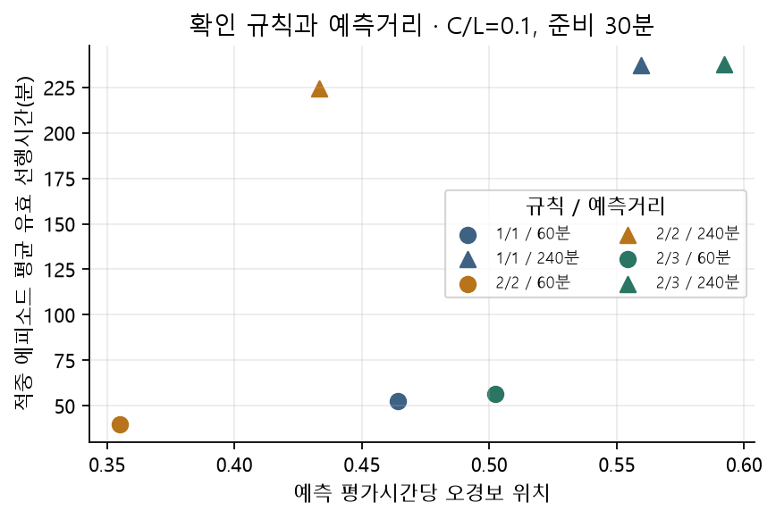
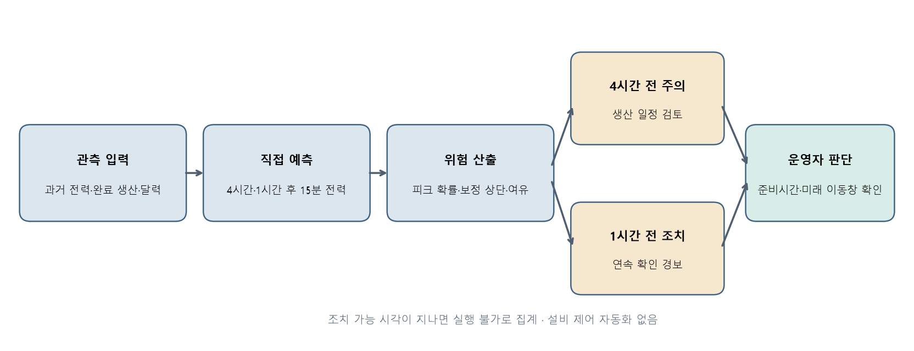
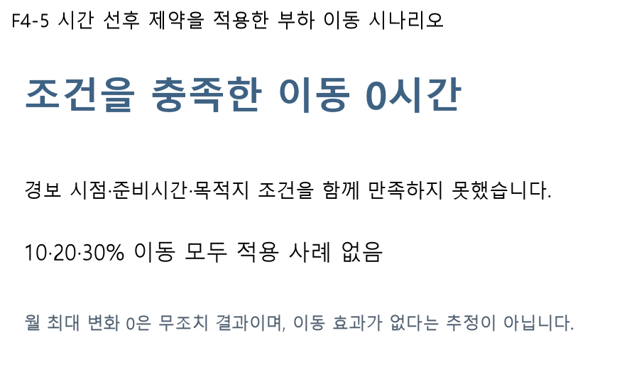
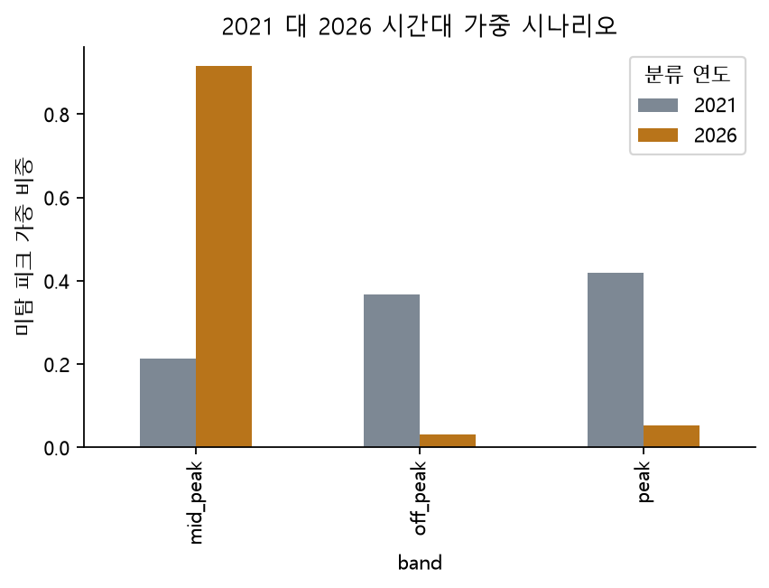

# 4 현장 활용방안

이 초안의 새 모델 수치는 **개발 교차검증** 결과다. 2026-10-01 18:00 KST 전에는 최종 테스트를 실행하지 않는다. 사전 검증에서 고정 설정으로 테스트를 한 번 본 이력이 있으며 verification/의 성능은 신규 모델의 성능으로 재사용하지 않는다.

경보는 p_exceed>C/L 또는 margin<0이다. h16은 생산 일정 검토, h4는 부하 이동 조치 검토다. 오경보율의 운전시간은 유효 예측 행 수×15분인 평가시간이며 실제 설비 가동시간은 미관측이다. 30분 준비시간은 검증된 현장 사실이 아닌 가정이며15·60분을 비교한다. 본 모델은 디맨드 컨트롤러의15분 이내 반응형 제어를 보완한다.

## 비용 해석과 실행 가능성

2021 관측에2026 정책을 적용하는 반사실 시간대 비교다. 미확인 계약 단가 대신1·2·3 순서가중을 쓴 결과는 실제 요금 또는 비용 비중이 아니다. 낮으로 이동하는 사후 안과 원점+준비시간 이후에만 이동하는 운영 안을 구분한다. 저녁 경보가 발생한 뒤 지난 낮으로 이동한 결과를 실행 가능한 절감액으로 세지 않는다. 적용 이동이0건이면 변화량0은 무조치 결과이며, 부하 이동 효과가 없다는 추정이 아니다. 생산 이동 계수는 학습 자료 상관관계일 뿐 인과 효과가 아니며 설비·납기 제약이 없어 현장 검증이 필요하다.

### alert_rules

[전체 표](../outputs/tables/alert_rules.csv)

| horizon | ratio | rule | prep_minutes | true_episodes | missed_episodes | false_episodes | episode_hit_rate | false_alarm_positions_per_operating_hour | actionable_alert_positions | nonactionable_alert_positions | actionable_tp_episodes | actionable_episode_hit_rate | mean_actionable_lead_minutes |
| --- | --- | --- | --- | --- | --- | --- | --- | --- | --- | --- | --- | --- | --- |
| 4 | 0.0100 | 1/1 | 15 | 9 | 139 | 3 | 0.0608 | 3.7749 | 7551 | 0 | 9 | 0.0608 | 7595.0000 |
| 4 | 0.0100 | 1/1 | 30 | 9 | 139 | 3 | 0.0608 | 3.7749 | 7551 | 0 | 9 | 0.0608 | 7580.0000 |
| 4 | 0.0100 | 1/1 | 60 | 9 | 139 | 3 | 0.0608 | 3.7749 | 7551 | 0 | 9 | 0.0608 | 7550.0000 |
| 4 | 0.0100 | 2/2 | 15 | 9 | 139 | 2 | 0.0608 | 3.7685 | 7539 | 0 | 9 | 0.0608 | 7580.0000 |
| 4 | 0.0100 | 2/2 | 30 | 9 | 139 | 2 | 0.0608 | 3.7685 | 7539 | 0 | 9 | 0.0608 | 7565.0000 |
| 4 | 0.0100 | 2/2 | 60 | 9 | 139 | 2 | 0.0608 | 3.7685 | 7539 | 0 | 9 | 0.0608 | 7535.0000 |
| 4 | 0.0100 | 2/3 | 15 | 9 | 139 | 2 | 0.0608 | 3.7627 | 7528 | 0 | 9 | 0.0608 | 7565.0000 |
| 4 | 0.0100 | 2/3 | 30 | 9 | 139 | 2 | 0.0608 | 3.7627 | 7528 | 0 | 9 | 0.0608 | 7550.0000 |
| 4 | 0.0100 | 2/3 | 60 | 9 | 139 | 2 | 0.0608 | 3.7627 | 7528 | 0 | 9 | 0.0608 | 7520.0000 |
| 4 | 0.0500 | 1/1 | 15 | 100 | 48 | 142 | 0.6757 | 0.4640 | 1293 | 0 | 100 | 0.6757 | 67.6500 |
| 4 | 0.0500 | 1/1 | 30 | 100 | 48 | 142 | 0.6757 | 0.4640 | 1293 | 0 | 100 | 0.6757 | 52.6500 |
| 4 | 0.0500 | 1/1 | 60 | 100 | 48 | 142 | 0.6757 | 0.4640 | 1293 | 0 | 97 | 0.6554 | 23.8144 |
| 4 | 0.0500 | 2/2 | 15 | 94 | 54 | 117 | 0.6351 | 0.3549 | 1051 | 0 | 94 | 0.6351 | 54.8936 |
| 4 | 0.0500 | 2/2 | 30 | 94 | 54 | 117 | 0.6351 | 0.3549 | 1051 | 0 | 94 | 0.6351 | 39.8936 |
| 4 | 0.0500 | 2/2 | 60 | 94 | 54 | 117 | 0.6351 | 0.3549 | 1051 | 0 | 66 | 0.4459 | 20.9091 |

### shift_actions

[전체 표](../outputs/tables/shift_actions.csv)

| origin | source_hour | destination_hour | status | production |
| --- | --- | --- | --- | --- |
| 2021-04-14 15:00:00 | 2021-04-14 15:00:00 | — | no_future_low_band_window | 960 |
| 2021-04-14 15:15:00 | 2021-04-14 16:00:00 | — | no_future_low_band_window | 2275 |
| 2021-04-15 07:15:00 | 2021-04-15 08:00:00 | — | no_future_low_band_window | 766 |
| 2021-04-15 08:15:00 | 2021-04-15 09:00:00 | — | no_future_low_band_window | 1672 |
| 2021-04-15 09:30:00 | 2021-04-15 10:00:00 | — | no_future_low_band_window | 492 |
| 2021-04-15 10:15:00 | 2021-04-15 11:00:00 | — | no_future_low_band_window | 1021 |
| 2021-04-15 12:15:00 | 2021-04-15 13:00:00 | — | no_future_low_band_window | 1022 |
| 2021-04-15 13:30:00 | 2021-04-15 14:00:00 | — | no_future_low_band_window | 1613 |
| 2021-04-15 14:30:00 | 2021-04-15 15:00:00 | — | no_future_low_band_window | 662 |
| 2021-04-15 15:15:00 | 2021-04-15 16:00:00 | — | no_future_low_band_window | 1543 |
| 2021-04-16 07:15:00 | 2021-04-16 08:00:00 | — | no_future_low_band_window | 459 |
| 2021-04-16 08:15:00 | 2021-04-16 09:00:00 | — | no_future_low_band_window | 780 |
| 2021-04-16 09:30:00 | 2021-04-16 10:00:00 | — | no_future_low_band_window | 961 |
| 2021-04-16 10:15:00 | 2021-04-16 11:00:00 | — | no_future_low_band_window | 3628 |
| 2021-04-16 12:15:00 | 2021-04-16 13:00:00 | — | no_future_low_band_window | 1657 |

### shift_summary

[전체 표](../outputs/tables/shift_summary.csv)

| fraction | month | applied_source_hours | max_before | max_after | max_change | new_peak_positions | peak_threshold_proxy | weight_basis | weighted_load_change |
| --- | --- | --- | --- | --- | --- | --- | --- | --- | --- |
| 0.1000 | 2021-01 | 0 | 222.0000 | 222.0000 | 0.0000 | — | — | illustrative_ordinal_scenario_with_official_discount | 0.0000 |
| 0.1000 | 2021-02 | 0 | 198.0000 | 198.0000 | 0.0000 | — | — | illustrative_ordinal_scenario_with_official_discount | 0.0000 |
| 0.1000 | 2021-03 | 0 | 222.0000 | 222.0000 | 0.0000 | — | — | illustrative_ordinal_scenario_with_official_discount | 0.0000 |
| 0.1000 | 2021-04 | 0 | 199.0000 | 199.0000 | 0.0000 | 0.0000 | 176.5000 | illustrative_ordinal_scenario_with_official_discount | 0.0000 |
| 0.1000 | 2021-05 | 0 | 199.0000 | 199.0000 | 0.0000 | 0.0000 | 176.5000 | illustrative_ordinal_scenario_with_official_discount | 0.0000 |
| 0.1000 | 2021-06 | 0 | 222.0000 | 222.0000 | 0.0000 | 0.0000 | 177.0000 | illustrative_ordinal_scenario_with_official_discount | 0.0000 |
| 0.1000 | 2021-07 | 0 | 222.0000 | 222.0000 | 0.0000 | 0.0000 | 175.0000 | illustrative_ordinal_scenario_with_official_discount | 0.0000 |
| 0.1000 | 2021-08 | 0 | 215.0000 | 215.0000 | 0.0000 | 0.0000 | 175.0000 | illustrative_ordinal_scenario_with_official_discount | 0.0000 |
| 0.2000 | 2021-01 | 0 | 222.0000 | 222.0000 | 0.0000 | — | — | illustrative_ordinal_scenario_with_official_discount | 0.0000 |
| 0.2000 | 2021-02 | 0 | 198.0000 | 198.0000 | 0.0000 | — | — | illustrative_ordinal_scenario_with_official_discount | 0.0000 |
| 0.2000 | 2021-03 | 0 | 222.0000 | 222.0000 | 0.0000 | — | — | illustrative_ordinal_scenario_with_official_discount | 0.0000 |
| 0.2000 | 2021-04 | 0 | 199.0000 | 199.0000 | 0.0000 | 0.0000 | 176.5000 | illustrative_ordinal_scenario_with_official_discount | 0.0000 |
| 0.2000 | 2021-05 | 0 | 199.0000 | 199.0000 | 0.0000 | 0.0000 | 176.5000 | illustrative_ordinal_scenario_with_official_discount | 0.0000 |
| 0.2000 | 2021-06 | 0 | 222.0000 | 222.0000 | 0.0000 | 0.0000 | 177.0000 | illustrative_ordinal_scenario_with_official_discount | 0.0000 |
| 0.2000 | 2021-07 | 0 | 222.0000 | 222.0000 | 0.0000 | 0.0000 | 175.0000 | illustrative_ordinal_scenario_with_official_discount | 0.0000 |

### tariff_counterfactual_detail

[전체 표](../outputs/tables/tariff_counterfactual_detail.csv)

| origin | target_time | horizon | fold | model | y | pred | tau | holiday_near | point_alert | alert_cutoff | q50_top_edge | conformal_method | q10 | q50 | q90 | q95 | q975 | q90_cal | q95_cal | q975_cal | p_exceed | exp_exceed | alert | risk_model | band_2021 | band_2026 | abs_error | missed_peak | missed_excess | evening_18_21 | band_provenance_2026 | discount_factor_2021 | effective_weight_2021 | discount_factor_2026 | effective_weight_2026 |
| --- | --- | --- | --- | --- | --- | --- | --- | --- | --- | --- | --- | --- | --- | --- | --- | --- | --- | --- | --- | --- | --- | --- | --- | --- | --- | --- | --- | --- | --- | --- | --- | --- | --- | --- | --- |
| 2021-04-14 15:00:00 | 2021-04-14 16:00:00 | 4 | 0 | lgbm_no_holiday_weight_2 | 170.0000 | 165.9429 | 176.5000 | False | True | 150.5167 | — | — | 148.6959 | 168.4132 | 174.7338 | 174.9066 | 177.5577 | 177.9174 | 179.6809 | 179.7690 | 0.1597 | 0.8528 | False | lgbm_quantile_b | peak | peak | 4.0571 | False | 0.0000 | False | verified_schedule | 1.0000 | 3.0000 | 1.0000 | 3.0000 |
| 2021-04-14 15:15:00 | 2021-04-14 16:15:00 | 4 | 0 | lgbm_no_holiday_weight_2 | 163.0000 | 155.4208 | 176.5000 | False | True | 150.5167 | — | — | 136.0564 | 159.2835 | 168.9216 | 170.6774 | 172.2799 | 173.9653 | 179.0193 | 181.4345 | 0.0749 | 0.2164 | False | lgbm_quantile_b | peak | peak | 7.5792 | False | 0.0000 | False | verified_schedule | 1.0000 | 3.0000 | 1.0000 | 3.0000 |
| 2021-04-14 15:30:00 | 2021-04-14 16:30:00 | 4 | 0 | lgbm_no_holiday_weight_2 | 156.0000 | 157.7115 | 176.5000 | False | True | 150.5167 | — | — | 146.6854 | 162.5270 | 170.0509 | 171.1186 | 174.3900 | 175.0946 | 179.4605 | 183.5446 | 0.0839 | 0.1458 | False | lgbm_quantile_b | peak | peak | 1.7115 | False | 0.0000 | False | verified_schedule | 1.0000 | 3.0000 | 1.0000 | 3.0000 |
| 2021-04-14 15:45:00 | 2021-04-14 16:45:00 | 4 | 0 | lgbm_no_holiday_weight_2 | 145.0000 | 159.3451 | 176.5000 | False | True | 150.5167 | — | — | 157.2661 | 163.0786 | 165.3597 | 169.1802 | 174.3781 | 170.4034 | 177.5220 | 183.5327 | 0.0572 | 0.0427 | False | lgbm_quantile_b | peak | peak | 14.3451 | False | 0.0000 | False | verified_schedule | 1.0000 | 3.0000 | 1.0000 | 3.0000 |
| 2021-04-14 16:00:00 | 2021-04-14 17:00:00 | 4 | 0 | lgbm_no_holiday_weight_2 | 150.0000 | 155.1074 | 176.5000 | False | True | 150.5167 | — | — | 150.9435 | 161.1878 | 164.0559 | 169.2518 | 173.5241 | 169.0996 | 177.5937 | 182.6788 | 0.0564 | 0.2564 | False | lgbm_quantile_b | peak | peak | 5.1074 | False | 0.0000 | False | verified_schedule | 1.0000 | 3.0000 | 1.0000 | 3.0000 |
| 2021-04-14 16:15:00 | 2021-04-14 17:15:00 | 4 | 0 | lgbm_no_holiday_weight_2 | 102.0000 | 118.7940 | 176.5000 | False | False | 150.5167 | — | — | 104.1564 | 117.0842 | 123.4478 | 128.8053 | 138.8140 | 128.4915 | 137.1472 | 147.9686 | 0.0250 | 0.1221 | False | lgbm_quantile_b | mid_peak | peak | 16.7940 | False | 0.0000 | False | verified_schedule | 1.0000 | 2.0000 | 1.0000 | 3.0000 |
| 2021-04-14 16:30:00 | 2021-04-14 17:30:00 | 4 | 0 | lgbm_no_holiday_weight_2 | 89.0000 | 105.1687 | 176.5000 | False | False | 150.5167 | — | — | 88.5626 | 100.8001 | 111.6870 | 122.1686 | 135.2333 | 116.7307 | 130.5104 | 144.3879 | 0.0250 | 0.0174 | False | lgbm_quantile_b | mid_peak | peak | 16.1687 | False | 0.0000 | False | verified_schedule | 1.0000 | 2.0000 | 1.0000 | 3.0000 |
| 2021-04-14 16:45:00 | 2021-04-14 17:45:00 | 4 | 0 | lgbm_no_holiday_weight_2 | 142.0000 | 141.1223 | 176.5000 | False | False | 150.5167 | — | — | 126.0939 | 146.5497 | 157.5252 | 160.2424 | 163.4611 | 162.5689 | 168.5842 | 172.6158 | 0.0250 | 0.0449 | False | lgbm_quantile_b | mid_peak | peak | 0.8777 | False | 0.0000 | False | verified_schedule | 1.0000 | 2.0000 | 1.0000 | 3.0000 |
| 2021-04-14 17:00:00 | 2021-04-14 18:00:00 | 4 | 0 | lgbm_no_holiday_weight_2 | 138.0000 | 143.5035 | 176.5000 | False | False | 150.5167 | — | — | 135.6579 | 153.9652 | 160.0534 | 162.2393 | 171.4439 | 165.0970 | 170.5811 | 180.5985 | 0.0352 | 0.1334 | False | lgbm_quantile_b | mid_peak | peak | 5.5035 | False | 0.0000 | True | verified_schedule | 1.0000 | 2.0000 | 1.0000 | 3.0000 |
| 2021-04-14 17:15:00 | 2021-04-14 18:15:00 | 4 | 0 | lgbm_no_holiday_weight_2 | 146.0000 | 134.8636 | 176.5000 | False | False | 150.5167 | — | — | 124.6188 | 146.1652 | 148.6012 | 151.9347 | 153.3184 | 153.6449 | 160.2765 | 162.4730 | 0.0250 | 0.0726 | False | lgbm_quantile_b | mid_peak | peak | 11.1364 | False | 0.0000 | True | verified_schedule | 1.0000 | 2.0000 | 1.0000 | 3.0000 |
| 2021-04-14 17:30:00 | 2021-04-14 18:30:00 | 4 | 0 | lgbm_no_holiday_weight_2 | 147.0000 | 133.8668 | 176.5000 | False | False | 150.5167 | — | — | 124.3125 | 139.2667 | 148.5797 | 150.4361 | 152.4599 | 153.6233 | 158.7779 | 161.6145 | 0.0250 | 0.1325 | False | lgbm_quantile_b | mid_peak | peak | 13.1332 | False | 0.0000 | True | verified_schedule | 1.0000 | 2.0000 | 1.0000 | 3.0000 |
| 2021-04-14 17:45:00 | 2021-04-14 18:45:00 | 4 | 0 | lgbm_no_holiday_weight_2 | 144.0000 | 139.9789 | 176.5000 | False | False | 150.5167 | — | — | 124.4692 | 140.7183 | 147.8436 | 151.3650 | 154.6973 | 152.8873 | 159.7068 | 163.8519 | 0.0250 | 0.0196 | False | lgbm_quantile_b | mid_peak | peak | 4.0211 | False | 0.0000 | True | verified_schedule | 1.0000 | 2.0000 | 1.0000 | 3.0000 |
| 2021-04-14 18:00:00 | 2021-04-14 19:00:00 | 4 | 0 | lgbm_no_holiday_weight_2 | 145.0000 | 133.8690 | 176.5000 | False | False | 150.5167 | — | — | 116.3153 | 130.8037 | 147.2317 | 152.6846 | 153.6142 | 152.2754 | 161.0264 | 162.7688 | 0.0250 | 0.0000 | False | lgbm_quantile_b | mid_peak | peak | 11.1310 | False | 0.0000 | True | verified_schedule | 1.0000 | 2.0000 | 1.0000 | 3.0000 |
| 2021-04-14 18:15:00 | 2021-04-14 19:15:00 | 4 | 0 | lgbm_no_holiday_weight_2 | 154.0000 | 138.3158 | 176.5000 | False | False | 150.5167 | — | — | 118.8799 | 137.2528 | 152.8808 | 164.5283 | 166.3717 | 157.9245 | 172.8702 | 175.5263 | 0.0250 | 0.0562 | False | lgbm_quantile_b | mid_peak | peak | 15.6842 | False | 0.0000 | True | verified_schedule | 1.0000 | 2.0000 | 1.0000 | 3.0000 |
| 2021-04-14 18:30:00 | 2021-04-14 19:30:00 | 4 | 0 | lgbm_no_holiday_weight_2 | 154.0000 | 122.9682 | 176.5000 | False | False | 150.5167 | — | — | 114.6370 | 126.9956 | 144.0372 | 151.3365 | 157.0887 | 149.0809 | 159.6784 | 166.2433 | 0.0250 | 0.0000 | False | lgbm_quantile_b | mid_peak | peak | 31.0318 | False | 0.0000 | True | verified_schedule | 1.0000 | 2.0000 | 1.0000 | 3.0000 |

### tariff_counterfactual_summary

[전체 표](../outputs/tables/tariff_counterfactual_summary.csv)

| tariff_year | band | basis | missed_weight_metric | n | mae | missed_peak_n | evening_18_21_n | unverified_winter_n | weighted_abs_error_share | weighted_missed_peak_share | evening_weighted_missed_share |
| --- | --- | --- | --- | --- | --- | --- | --- | --- | --- | --- | --- |
| 2021 | mid_peak | illustrative_ordinal_scenario | excess_above_tau_times_band_weight | 2420 | 7.3185 | 6 | 804 | 0 | 0.3416 | 0.2134 | 0.0000 |
| 2021 | off_peak | illustrative_ordinal_scenario | excess_above_tau_times_band_weight | 3854 | 8.3045 | 19 | 156 | 0 | 0.3087 | 0.3681 | 0.0000 |
| 2021 | peak | illustrative_ordinal_scenario | excess_above_tau_times_band_weight | 1277 | 9.4652 | 17 | 0 | 0 | 0.3497 | 0.4185 | 0.0000 |
| 2026 | mid_peak | illustrative_ordinal_scenario_with_official_discount | excess_above_tau_times_band_weight | 2382 | 9.2694 | 35 | 144 | 0 | 0.4046 | 0.9158 | 0.0000 |
| 2026 | off_peak | illustrative_ordinal_scenario_with_official_discount | excess_above_tau_times_band_weight | 3861 | 7.0305 | 3 | 156 | 0 | 0.2483 | 0.0319 | 0.0000 |
| 2026 | peak | illustrative_ordinal_scenario_with_official_discount | excess_above_tau_times_band_weight | 1308 | 9.6169 | 4 | 660 | 0 | 0.3471 | 0.0523 | 0.0000 |

조치 후 관측 피크가 사라지는 예방의 역설 때문에 CBL 준용 기준부하와 실제 차이를 추적하도록 제안한다. 독립 대조가 없으므로 그 차이만으로 인과 효과를 증명하지 않는다.

## 생성 그림

