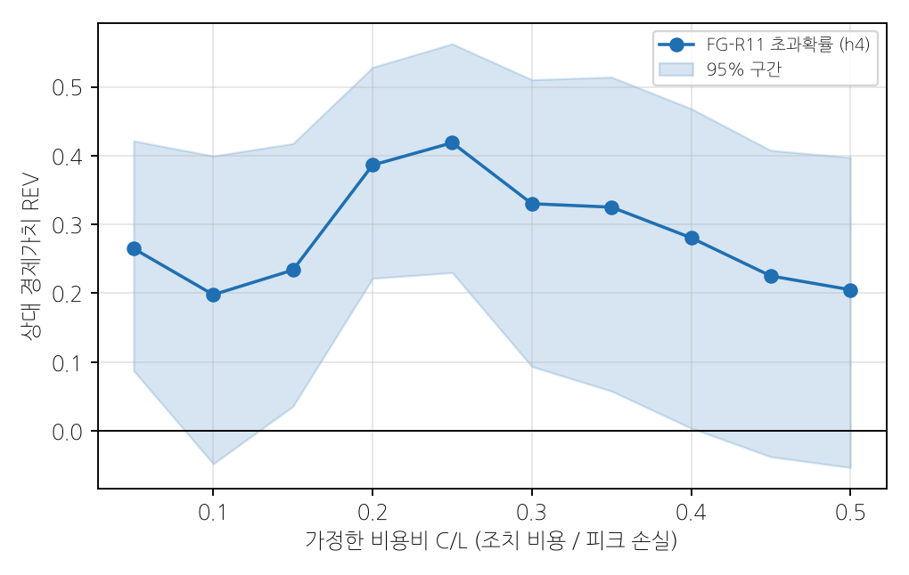
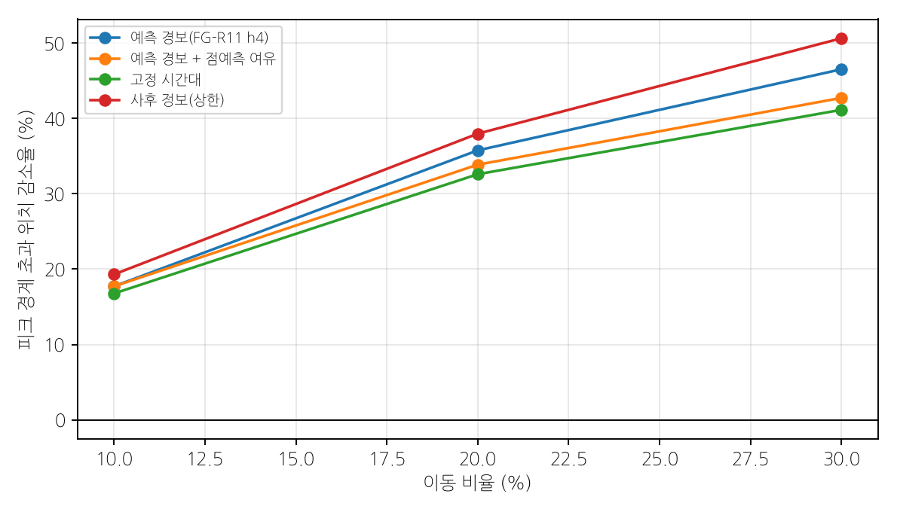

# 제6회 K-인공지능 제조데이터 분석 경진대회 결과 보고서 (초안 v1)

| 항목 | 내용 |
| :-- | :-- |
| 프로젝트명 | 사전학습 시계열 모델과 시간 계층 조정을 이용한 제조 전력 1~4시간 앞 피크 예측과 확률 경보 기반 저감 방안 |
| 팀명 | (팀명) |
| 과제 | ⑤ 제조 생산데이터 기반 전력사용량 예측 및 최대피크 위험조건 분석 |

## 내용요약

**배경.** 산업용 전기요금의 기본요금은 15분 평균전력의 최대값(최대수요전력)에 연동된다. 따라서 평균 예측 정확도보다 피크가 생길 15분 구간을 몇 시간 앞서 맞히고, 그 위험을 확률로 알리는 능력이 현장 가치를 결정한다.

**방법.** 대회 자료(2021-01-01~2021-09-14, 시간 행 6,168개 → 15분 관측 24,672개)를 시간순으로 나누어 마지막 15%(38일)를 테스트로 남겼다. 개발은 그 이전 16주의 주 단위 walk-forward(학습·조기종료·보정 구간 뒤 1주 평가)로 수행했다. 최종 모델 FG-R11은 네 단계로 구성된다. 첫째, 정확 복제 게이트(오늘 관측이 과거 어느 날과 5칸 이상 완전히 같으면 그날 값 사용). 둘째, 사전학습 시계열 모델 Chronos-2(문맥 2,048칸) 예측의 시간 계층 조정(15분~4시간, WLS-분산). 셋째, 실현 오차 피드백 보정(MOS)과 피크 상향 보정. 넷째, conformal 분위수 보정과 피크 초과확률 경보. 후보와 선정 규칙은 결과 확인 전에 문서로 고정했다.

**결과.** 테스트 1~4시간 앞(13개 예측거리) 평균 MAE는 6.638, 피크 MAE는 7.978이었다. 지속 예측(24.303 / 45.346) 대비 MAE를 17.67 [14.82, 20.14], 기존 LightGBM 기반 모델 FG-R6(10.569 / 20.379) 대비 3.93 [2.42, 5.75] 낮췄다. Chronos-2 단독 대비 MAE 차이는 0.014 [−0.179, 0.205]로 유의하지 않았고, 피크 MAE는 10.270 → 7.978로 22% 낮았다. 1시간 앞 확률 경보는 실제 피크 에피소드 135개 중 79개를 맞혔고(에피소드 F1 0.632), 하루 오경보 에피소드는 0.95건이었다. 90%·95% 예측구간의 실제 커버리지는 0.897·0.948로 명목값과 0.003 이내였다.

**한계와 공개.** 같은 테스트 구간을 사전 검증 이후 다섯 번 평가했다. 사전 고정 후 첫 평가(FG-R8)는 MAE 6.811 / 피크 8.032였고, FG-R11 수치는 네 번째 평가 결과다. 기준선 대비 우위는 첫 평가에서도 성립했다. 반면 Chronos-2 단독 대비 개선은 사후 개선이므로 낙관 편향 가능성을 함께 보고한다. 저녁(18–22시) 피크는 7개 위치 모두 놓쳤다. 전력 단위·15분 경계·설비·교대 정보는 확인되지 않았다.

**활용.** 4시간 앞 주의 경보와 1시간 앞 조치 경보를 두 단계로 운영하고, 조치 비용 대비 피크 손실 비(C/L)로 조치 임계를 정한다. C/L 0.05~0.50 전 구간에서 경보의 상대 경제가치는 0.20~0.42였다. 경보 시간의 생산량 20%를 같은 날 여유 시간으로 옮기는 가정 시나리오에서 피크 초과 위치는 35.8% 줄었으나, 최대 15분 전력의 감소는 1.7%에 그쳤다.

### 출제 요구와 이 보고서의 답

| 출제 요구 | 답 | 위치 |
| :-- | :-- | :-- |
| 향후 지정된 시간구간의 전력사용량 예측 | 1~4시간 앞 15분 전력(주: 1시간 앞), 익일 최대 15분 전력(보조) | 2장 |
| 예측오차가 크게 발생하는 생산조건 | 저녁 18–22시 미탐(7/7), 오후 14–18시가 미탐의 40%, 평일 근무시간 고생산 구간에 오경보 93% | 3장 |
| 최대전력 피크가 발생하는 주요 조건 | 평일 10–12시(피크율 15.1%), 7월(13.5%), 기온 상위 25%(9.7%), 생산량 상위 25%. 고온 × 고생산 결합 시 32.4% | 3장 |
| 생산일정·설비가동 조정을 통한 저감방안 | 2단계 확률 경보 → 비용비 기반 조치 → 경보 시간 생산 일부 이동 | 4장 |

### 이 보고서의 주장과 판정

| ID | 주장 | 판정 |
| :-- | :-- | :-- |
| C1 | 자료는 15분 피크 예측에 쓸 수 있으나, 개발 구간의 53%가 이전 날의 정확한 복제여서 개발 성능은 테스트 성능을 과대평가한다 | 지지 |
| C2 | FG-R11은 지속·계절·유사일·LightGBM 기반 모델보다 1~4시간 앞 오차를 크게 줄인다 | 지지 (1차 평가에서도 성립) |
| C3 | FG-R11의 Chronos-2 단독 대비 개선은 피크 오차에 한정되며 평균 오차 차이는 유의하지 않다 | 지지 (사후 개선, 낙관 편향 가능) |
| C4 | 오류는 저녁 시각대와 오후 고부하 구간에 집중되고, 오경보는 평일 근무시간 고생산 구간에 집중된다 | 지지 (탐색적) |
| C5 | 확률 경보는 넓은 비용비 범위에서 과거 빈도 기반 운영보다 가치가 있다 | 지지 |
| C6 | 경보 기반 생산량 이동은 피크 초과 빈도를 줄이지만 최대수요 감소폭은 작다 | 가정 기반 시나리오 |

# 제1장 데이터 이해 및 진단

> 이 장의 주장 (C1). 제공 자료는 공장 단위 15분 전력의 다지평 예측과 피크 분석에 쓸 수 있다. 다만 개발 구간에 이전 날을 그대로 복제한 날이 많아, 개발 성능을 테스트 성능의 추정치로 쓰면 안 된다.

## 1.1 생산 단위와 측정 구조

원자료 한 행은 한 시간이다. 각 행에는 15분 구간 전력 4개(15분·30분·45분·60분), 그 평균, 시간당 생산량, 기상 4개, 요금 구분, 달력, 공장 인원, 인건비가 있다. 전력 4열은 HH:15, HH:30, HH:45, (HH+1):00에 끝나는 연속 15분 구간으로 해석했다(가정 A4). 이렇게 전개하면 2021-01-01 00:15부터 2021-09-15 00:00까지 15분 관측 24,672개가 된다. 설비 ID가 없고 전력 열이 하나이므로 전력값은 공장 전체 부하의 합이다. 설비 동시 가동, 제품 전환, 교대는 직접 관측되지 않는다. 따라서 시각대·휴일·생산량을 대리변수로 쓴다(가정 A6).

`평균` 열은 모든 행에서 네 값의 평균과 일치했고 합계와는 0.3%만 일치했다. 전력 열이 에너지량보다 수요전력(평균 전력)에 가깝다는 단서이지만 kW로 확정할 근거는 아니다. 단위는 미확인으로 두고 모든 수치를 원자료 단위로 쓴다(가정 A3).

## 1.2 변수 정의와 가용 시점

| 변수 | 의미(추정) | 사용 |
| :-- | :-- | :-- |
| 15·30·45·60분 | 15분 구간 전력 | 예측 대상. 각 구간이 끝난 직후부터 입력으로 사용 |
| 평균 | 같은 시간 네 값의 평균 | 입력 제외 (목표 구간 정보 포함) |
| 생산량 | 시간당 생산 실적 | 그 시간이 끝난 뒤에만 입력 후보로 사용 (A8) |
| 기온·풍속·습도·강수량 | 기상 실측 | 사후 분석 전용 (미래 실측 기상은 예측 시점에 알 수 없음) |
| 공장인원·인건비·요금 구분 | 운영·요금 정보 | 사후 분석 전용 |
| 날짜·시간·요일 | 달력 | 목표 시각의 달력은 미리 알 수 있으므로 사용 |

최종 모델 FG-R11의 입력은 원점까지 관측된 전력 이력뿐이다. 달력 공변량과 완료 생산량을 Chronos-2에 추가한 후보는 개발 평가에서 개선이 없어 채택하지 않았다(3.2절).

## 1.3 품질 진단과 전처리

| 점검 | 결과 | 처리 |
| :-- | :-- | :-- |
| 전력 결측·음수 | 0개 · 0개 | — |
| 전력 0값 | 74개, 연속 구간 2개(최장 72칸 = 18시간), 토·일요일에 72개 | 비가동 가능성이 있으나 확인된 라벨이 아니므로 제거하지 않음 |
| IQR 1.5배 이상치 | 0개 | 피크는 이상치가 아니라 예측 대상 |
| 시간 열 오류 | 2021-07-13·15의 48행이 0~23 범위 밖 | 날짜별 24행 순서로 복원. 복원 구간 192칸과 이에 의존하는 특징·목표는 학습·평가에서 제외 |
| 기상·인원 결측 | 풍속 3, 강수량 1, 공장인원 17 (시간 행 기준) | 예측 입력이 아니므로 채우지 않음 |
| 완전 중복 행 | 0행 | — |
| **날짜 단위 정확 복제** | 개발 이력 217일 중 115일(53.0%)이 이전 어느 날과 96칸 모두 같음 (지연 151·59·31·28·120일 등) | 증강 데이터의 구조로 해석. 복제 게이트로 활용하되 테스트 성능 추정에는 쓰지 않음 |

그림 1-1. 15분 전력 시계열과 품질 플래그(0값, 시간 복원 제외 구간). 8월 초 1주의 저부하 구간은 휴무로 보인다.

날짜 단위 복제는 이 자료에서 가장 중요한 진단 결과다. 개발 구간에서는 오늘 관측의 앞부분이 과거 어느 날과 정확히 일치하는 행이 약 48%였다. 테스트 구간에서는 같은 기준(5칸 이상 일치)으로 0.09%에 불과했다. 복제일이 있으면 그날 값을 그대로 쓰는 게이트만으로 오차가 거의 0이 되므로, 개발 전체 행의 성능(FG-R11 MAE 3.512)은 테스트(6.638)를 크게 과대평가한다. 이후 모델 선정은 개발 구간의 **비복제(비게이트) 행**(FG-R11 MAE 6.312)으로 했다. 이 값은 테스트 성능과 가깝다.

## 1.4 불균형

피크는 개발 구간 정제 전력의 95백분위 τ = 178을 넘는 15분 위치로 정의했다(가정 A5, 계약전력 초과가 아닌 통계적 사건). 개발 이력의 피크 비율은 4.9%, 테스트는 9.1%였다. 하계 테스트 구간에서 피크가 약 두 배로 잦아지는 분포 이동이 있다. 재표집은 하지 않았다. 대신 피크 MAE, 에피소드 F1, PR-AUC·Brier를 따로 보고하고, 경보 임계는 별도 보정 구간에서 정했다.

## 1.5 계절 범위의 한계

자료는 1~9월만 있고 9월은 14일까지다. 12월이 없어 완전한 하계(7~9월)·동계(12~2월) 기간이 모두 없다. 테스트(8~9월)의 성능을 다른 계절로 외삽할 근거가 없고, 연간 요금적용전력을 직접 계산할 수 없다.

## 1.6 검증 전략

- **시간순 분할.** 마지막 15%(첫 원점 2021-08-09 09:45 ~ 마지막 목표 2021-09-15 00:00, 38일)를 테스트로 고정했다. 이 경계는 모델이 바뀌어도 옮기지 않았다.
- **개발 평가.** 테스트 이전 16주를 주 단위로 평가했다. 각 주마다 그 이전 자료를 학습(FIT)·조기종료(STOP)·보정(CAL) 구간으로 나누고 다음 1주를 점수 구간으로 쓴다. 짝수 주 8주(EXPLORE)는 탐색에, 홀수 주 8주(CONFIRM)는 확인에 썼다.
- **누수 차단.** 원점 t 이후의 관측은 입력에 쓰지 않는다. 원점 이후 값을 바꿔도 예측이 변하지 않는지 검사했다(미래 교란 검사, 차이 0). 피크 경계·보정량·경보 임계는 학습·보정 구간에서만 계산했다.
- **신뢰구간.** 테스트 날짜(38일) 단위 1,000회 복원추출이다. 모델 간 차이는 같은 날짜 표본으로 함께 재추출한 쌍별 구간으로 보고한다.
- **테스트 사용 이력.** 아래 표는 이 테스트 구간을 평가한 모든 기록이다. 마지막 15%는 과제 선택용 사전 검증에서 이미 한 번 열람되었다. 이후 사용자 결정에 따라 성능을 우선해 여러 차례 평가했다. 결과를 보고 다음 라운드를 설계했으므로 2차 이후 수치는 낙관 편향을 가질 수 있다.

| 순서 | 일시 (KST, 기록 기준) | 평가 대상 | 테스트 결과 (MAE / 피크 MAE) |
| :-- | :-- | :-- | :-- |
| 0 | 2026-09-23 | 사전 검증 LightGBM (1시간 앞만, 고정 설정) | 피크 위치 MAE 17.77 (지표 정의가 달라 아래와 비교 불가) |
| 1 | 2026-10-07 17:55 | FG-R8 (사전 고정 후 첫 평가) | 6.811 / 8.032 |
| 2 | 2026-10-08 00:02 | FG-R9 (게이트 기준 수정) | 6.781 / 8.032 |
| 3 | 2026-10-08 00:39 | FG-R10 (+ MOS) | 6.752 / 8.251 |
| 4 | 2026-10-08 01:54 | **FG-R11** (+ 시간 계층 조정) | **6.638 / 7.978** |
| 5 | 2026-10-08 02:27 | FG-R12 (세부 조절) | 6.641 / 7.996 |

## 1.7 판정

C1은 **지지**한다. 결측·이상치가 없고 시간 오류의 범위가 좁아 15분 예측에는 충분하다. 그러나 개발 구간의 절반이 복제일이고 테스트에는 거의 없으므로, 모델 선정은 비복제 행으로 했고 테스트 성능은 그 값으로만 추정한다. 단위·계절·설비 정보의 공백 때문에 결론은 이 공장의 1~9월로 한정된다.

# 제2장 AI 예측모델 개발 및 성능평가

> 이 장의 주장. C2: FG-R11은 지속·계절·유사일·LightGBM 기반 모델보다 1~4시간 앞 오차를 크게 줄인다. C3: Chronos-2 단독 대비 개선은 피크 오차에 한정되며 평균 오차 차이는 유의하지 않다.

## 2.1 예측 과제와 지표

원점 t에서 1~4시간 앞(h = 4, 5, …, 16칸) 각 15분 구간 전력을 예측한다. 주 과제(A1)는 1시간 앞(h4)이다. 보조 과제는 전날 23:45에 예측하는 다음 날 최대 15분 전력이다.

| 지표 | 정의 |
| :-- | :-- |
| MAE | 13개 예측거리를 모두 모은 평균 절대오차 |
| 피크 MAE | 실제값 > τ인 행의 MAE |
| h4·h16 MAE | 1시간·4시간 앞 MAE |
| 에피소드 F1 | 연속 초과 구간을 1사건으로 보고, 경보 에피소드와 시간 겹침으로 최대 1:1 매칭한 F1 |
| 위치 오경보 | 실제 피크가 아닌 15분 위치에서 경보가 난 수 |
| 커버리지 | 실제값이 q90·q95 예측 이하인 비율 (명목 0.90·0.95) |
| PR-AUC·Brier | 피크 초과확률의 순위·보정 품질 |

경보 임계는 모든 모델에 같은 규칙(최종 보정 구간 28일, 2021-07-12~08-09의 에피소드 F1 최대)을 적용했다.

## 2.2 비교 모델

| 모델 | 설명 |
| :-- | :-- |
| 지속 예측 | 원점의 최근 15분값 |
| 주간 계절 나이브 | 1주 전 같은 15분 위치 값 |
| 순수 유사일 | 오늘 관측 앞부분과 가장 가까운 과거 날의 값 |
| FG-R6 | 유사일 게이트 + 다지평 LightGBM(L1). 이전 단계 최선 모델 |
| Chronos-2 단독 | 사전학습 시계열 모델(amazon/chronos-2, 문맥 2,048칸)의 중앙값 예측 |
| 시간 계층 조정 | Chronos-2 예측을 15분·30분·1시간·2시간·4시간 합계 31개 노드로 묶어 WLS-분산 가중으로 조정 |
| 시간 계층 + MOS | 위 예측에 실현 오차 피드백 선형 보정 추가 |
| FG-R11 (피크 보정 전) | 위 + 정확 복제 게이트(5칸 이상) |
| **FG-R11 (최종)** | 위 + 피크 상향 보정(τ − 25 초과 예측에 +3) + CQR 분위수 보정 + 초과확률 경보 |

Chronos-2는 공개 사전학습 모델이며 이 자료로 다시 학습하지 않고 추론에만 썼다. 원 계획(딥러닝 미사용)과 다른 선택이며, 성능 우선 결정에 따라 채택했음을 공개한다. LoRA 미세조정은 시험했으나 모든 변형이 악화해 기각했다.

## 2.3 모델 개발 경로

| 단계 | 내용 | 결과 |
| :-- | :-- | :-- |
| 사전 검증 | LightGBM 1시간 앞, 고정 설정 | persistence 대비 피크 위치 MAE 35.9% 개선. 저녁 미탐, 95% 분위수 과소 커버리지 |
| 개발 파이프라인(P1~P6) | LightGBM·CBL·MSTL 결합, 확률 경보 | Chronos 후보는 당시 다중 비교 보정 후 비유의로 미채택 |
| FG-R1~R5 | 잔차·전환·유사일 탐색 | 다섯 개발 목표 미달, 불채택 |
| FG-R6~R7 | 정확 복제 게이트 + LightGBM | 개발 복제 구조를 활용. 비복제 피크 과소예측이 남음 |
| FG-R8 | 게이트 + Chronos-2 + 피크 보정 + CQR | 개발 16주 MAE 3.477 / 피크 5.244 → 테스트 1차 6.811 / 8.032 |
| FG-R9 | 파운데이션 모델 비교(TimesFM-3, TimesFM-2.5, TiRex, 앙상블) | 모두 Chronos-2 단독 이하. 게이트 최소 5칸으로 수정 |
| FG-R10 | 실현 오차 MOS | 개발 피크 0.162 [0.041, 0.304] 개선 |
| 피크 보정 라운드 | 시간대별·확률 비례 보정, LDS 가중, 분위수 매핑, 2단계 판별 | 사전 기준(MAE·피크 동시 개선) 통과 없음 |
| **FG-R11** | 시간 계층 조정(WLS-분산) | 개발 비복제 MAE 6.411 → 6.312, 피크 9.427 → 9.165 (사전 기준 통과) |
| FG-R12 | 30개 파라미터 단일 축 탐색 | 개발 −0.022 / −0.041, 테스트 개선 없음 → 포화 |

각 라운드의 후보와 선정 규칙은 결과 확인 전에 사전 고정 문서(`outputs/phase_f/goal_fm_ensemble_v1/PREREGISTRATION.md`)에 적었다. 부정적 결과도 같은 문서와 결과 파일에 남겼다.

## 2.4 결과: 같은 테스트 구간의 모델 비교

| 모델 | MAE | 피크 MAE | h4 MAE | h16 MAE | FG-R11 대비 MAE 차 [95% CI] |
| :-- | --: | --: | --: | --: | :-- |
| 지속 예측 | 24.303 | 45.346 | 18.842 | 30.379 | +17.666 [14.817, 20.139] |
| 주간 계절 나이브 | 24.172 | 61.226 | 24.391 | 23.979 | +17.534 [6.918, 29.547] |
| 순수 유사일 | 12.609 | 19.965 | 9.579 | 15.620 | +5.972 [4.639, 7.490] |
| FG-R6 (유사일 게이트 + LightGBM) | 10.569 | 20.379 | 9.026 | 11.983 | +3.931 [2.416, 5.746] |
| Chronos-2 단독 | 6.651 | 10.270 | 6.306 | 7.143 | +0.014 [−0.179, 0.205] |
| 시간 계층 조정 | **6.504** | 9.863 | **6.227** | **6.855** | −0.134 [−0.274, −0.007] |
| 시간 계층 + MOS | 6.519 | 9.618 | 6.231 | 6.891 | −0.119 [−0.216, −0.027] |
| FG-R11 (피크 보정 전) | 6.518 | 9.618 | 6.230 | 6.894 | −0.119 [−0.217, −0.027] |
| **FG-R11 (최종)** | 6.638 | **7.978** | 6.288 | 6.996 | — |

양수는 FG-R11이 더 좋다는 뜻이다. 테스트 44,668행(3,436개 원점 × 13지평), 38일.

그림 2-1. 같은 테스트 구간에서 모델별 전체 MAE와 피크 MAE.

세 가지를 읽는다. 첫째, 사전학습 모델 Chronos-2로 바꾼 효과가 가장 크다. LightGBM 기반 FG-R6보다 MAE를 3.9 낮췄다. 둘째, 시간 계층 조정은 평균 오차와 피크 오차를 함께 낮춘 유일한 구성요소다(6.651 → 6.504, 10.270 → 9.863). 셋째, 피크 상향 보정은 **교환**이다. 피크 MAE를 9.618 → 7.978로 낮추는 대가로 전체 MAE를 6.518 → 6.638로 0.12 올렸다. 피크 MAE는 실제값이 높은 행만 보는 조건부 지표이므로, 예측을 일괄적으로 올리기만 해도 낮아질 수 있다. 그래서 이 보고서는 피크 MAE를 전체 MAE·경보 지표와 함께만 해석한다.

그림 2-2. 예측거리(1~4시간)별 MAE. FG-R11과 Chronos 계열은 4시간 앞에서도 7 이하를 유지하고, 지속 예측은 예측거리가 길어질수록 빠르게 나빠진다.

## 2.5 경보와 불확실성

| 1시간 앞(h4) 경보 | 위치 F1 | 에피소드 F1 | 에피소드 TP / FP / FN | 위치 오경보 | 피크 MAE |
| :-- | --: | --: | :-- | --: | --: |
| 지속 예측 | 0.348 | 0.436 | 61 / 84 / 74 | 282 | 28.867 |
| 주간 계절 나이브 | 0.378 | 0.506 | 63 / 51 / 72 | 535 | 62.408 |
| 순수 유사일 | 0.549 | 0.583 | 79 / 57 / 56 | **162** | 13.744 |
| Chronos-2 단독 | **0.627** | 0.580 | 69 / 34 / 66 | 174 | 9.896 |
| FG-R6 | 0.600 | **0.669** | 85 / 34 / 50 | 349 | 16.983 |
| FG-R11 점예측 | 0.616 | 0.637 | 78 / 32 / 57 | 284 | **8.224** |
| FG-R11 확률 | 0.618 | 0.632 | 79 / 36 / 56 | 279 | 8.224 |

| 4시간 앞(h16) 경보 | 에피소드 F1 | 에피소드 TP / FP / FN | 위치 오경보 |
| :-- | --: | :-- | --: |
| Chronos-2 단독 | 0.642 | 79 / 34 / 54 | 325 |
| FG-R6 | 0.598 | 81 / 57 / 52 | 341 |
| FG-R11 확률 | **0.672** | 85 / 35 / 48 | 413 |

1시간 앞 경보에서 FG-R11은 모든 지표에서 최선은 아니다. 에피소드 F1은 FG-R6(0.669)가, 위치 오경보는 순수 유사일(162)·Chronos-2 단독(174)이 더 좋다. FG-R11의 강점은 피크 크기 오차(8.224)와 4시간 앞 에피소드 F1(0.672)이다. 2단계 경보(4장)에서 4시간 앞을 주의, 1시간 앞을 조치로 나눈 이유다.

| 불확실성 (테스트) | 값 |
| :-- | :-- |
| 90% / 95% 예측구간 커버리지 | 0.897 / 0.948 (사전 검증 LightGBM 95% 분위수 0.911) |
| 피크 초과확률 Brier / PR-AUC | 0.050 / 0.629 |
| 익일 최대 15분 전력 MAE (34일) | Chronos-2 8.68, 오늘 최대 지속 50.06, 지난주 최대 31.68 |

CQR 보정 후 커버리지 오차는 0.003 이하로, 사전 검증 LightGBM의 과소 커버리지(0.95 → 0.911)를 해소했다. 익일 최대 예측도 사전 검증에서는 기준선을 넘지 못했으나 Chronos-2는 MAE 8.68로 두 기준선보다 크게 낮았다.

그림 2-3. 테스트 첫 주의 실제값, FG-R11 1시간 전 예측, 90% 예측구간과 경보. 8월 14~16일은 휴일·주말로 부하가 기저 수준이다.

## 2.6 테스트 재사용 점검: 개발 개선은 테스트로 전이되었는가

같은 테스트를 여러 번 평가하면, 테스트에 맞춘 선택이 쌓여 수치가 실제보다 좋아질 수 있다. 이 위험은 머신러닝 벤치마크 연구에서 "적응적 과적합"으로 다뤄진다(Recht et al., 2019). 이를 점검하려고 각 라운드에서 **개발에서 먼저 측정한 개선량**과 **이후 테스트에서 나타난 개선량**을 나란히 놓았다. 적응적 과적합이 강하다면 개발 개선과 무관한 테스트 개선이 나타나거나, 개발 개선이 테스트에서 체계적으로 부풀려져야 한다.

| 변경 | 개발 MAE 개선 | 테스트 MAE 개선 | 개발 피크 개선 | 테스트 피크 개선 | 전이 |
| :-- | --: | --: | --: | --: | :-- |
| MOS (Chronos 대비) | 0.025 | 0.002 | 0.385 | 0.348 | 피크 개선 전이 |
| 시간 계층 (Chronos 대비, 조정만) | 0.038 | 0.147 | 0.041 | 0.407 | 전이 (테스트에서 더 큼) |
| FG-R10 (FG-R9 규칙 대비) | 0.020 | 0.029 | 0.162 | −0.219 | 피크 전이 실패 |
| FG-R11 (FG-R10 대비) | 0.099 | 0.114 | 0.262 | 0.273 | 전이 |
| FG-R12 (FG-R11 대비) | 0.022 | −0.003 | 0.041 | −0.018 | 전이 실패 → 채택 안 함 |

그림 2-4. 개발 16주 개선량과 테스트 개선량. 점선은 같은 크기로 전이되는 선이다.

구조적 근거가 있는 변경(시간 계층 조정, MOS)은 개발에서 본 개선이 테스트에서도 같은 방향으로 나타났다. 반면 파라미터 세부 조절(FG-R12)과 보정량 변경(FG-R10의 피크)은 전이되지 않았다. FG-R12처럼 개발에서 좋아졌어도 테스트에서 재현되지 않은 변경은 채택하지 않았다. 이 점검은 테스트 재사용의 편향을 없애지 못한다. 다만 FG-R11의 핵심 구성요소가 테스트에 맞춘 우연의 산물일 가능성은 낮춘다.

## 2.7 대안 설명 점검

| 결과를 다르게 설명할 수 있는 원인 | 확인 | 결과 |
| :-- | :-- | :-- |
| 테스트 재사용으로 부풀려졌다 | 1차 평가(FG-R8) 수치와 비교 | 기준선 대비 우위는 1차에서도 성립(지속 대비 17.49 [14.59, 19.94], FG-R6 대비 3.76 [2.24, 5.57]). Chronos 대비 개선은 1차에 없었음(FG-R8이 0.16 [0.04, 0.28] 나빴음) → 이 부분만 사후 개선 |
| 복제일 덕분이다 | 테스트 게이트 작동률 | 0.09% (44,668행 중 39행). 테스트 성능은 복제와 무관 |
| 피크 MAE는 상향 보정의 산물이다 | 보정 전 수치와 전체 MAE 병기 | 보정 전에도 Chronos 대비 10.270 → 9.618. 보정은 MAE +0.12의 교환으로 공개 |
| 정보 누수 | 원점 이후 값 교란 검사 | 모든 후보에서 예측 차이 0 |
| 사전학습 모델이 이 자료를 이미 보았다 | 확인 불가 | 공개 범용 말뭉치로 학습된 모델이며 이 대회 자료의 포함 여부를 확인할 수 없다. 타당성 위협으로 기록 |
| 피크 경계 τ 선택에 의존한다 | 경계 민감도 | 최종 모델로는 미수행 (사전 검증에서는 상위 2.5·5·10%를 계획) |

## 2.8 최종 모델 선정 근거

1. **개발 사전 기준.** FG-R11은 "개발 16주 비복제 행에서 MAE와 피크 MAE가 모두 현행보다 낮을 것"이라는 기준을 테스트 4차 평가 전에 통과한 유일한 후보였다(6.312 / 9.165 vs 6.411 / 9.427).
2. **같은 테스트에서 강한 기준선 대비 우위.** 지속·계절·유사일·FG-R6 대비 MAE 개선 구간이 모두 0을 넘는다.
3. **피크 크기 오차.** 비교 모델 중 피크 MAE가 가장 낮다(7.978). 기본요금이 최대 15분 전력에 연동되므로 이 지표를 우선했다.
4. **불확실성 품질.** 90%·95% 커버리지 오차 0.003 이하.
5. **단순성.** FG-R12는 개발에서 소폭 좋았으나 테스트에서 차이가 없어(6.641 / 7.996) 더 단순한 FG-R11을 택했다. 이 마지막 선택은 테스트 결과를 본 뒤의 결정임을 공개한다.

## 2.9 판정

- **C2: 지지.** 기준선·FG-R6 대비 MAE 개선의 구간이 모두 0을 넘고, 1차 평가에서도 같은 결론이다.
- **C3: 지지.** Chronos-2 단독 대비 MAE 차이는 0.014 [−0.179, 0.205]로 유의하지 않다. 피크 MAE 개선(10.270 → 7.978)의 일부는 상향 보정의 교환이다. 시간 계층 조정 단독(6.504)이 평균 오차는 가장 낮다.

# 제3장 영향요인 및 오류분석

> 이 장의 주장 (C4). FG-R11의 미탐은 저녁(18–22시)과 오후 고부하(14–18시)에, 오경보는 평일 근무시간 고생산 구간에 집중된다. 모든 조건 분석은 탐색적이며 다중 비교 보정이 없다. 시각대·휴일·생산량은 교대·가동의 대리변수이며 인과 효과를 주장하지 않는다.

## 3.1 분석 설계

1시간 앞 테스트 예측(3,442행)과 확률 경보(임계 0.35)를 조건별로 다시 집계했다. 조건은 목표 시각대, 평일·휴일, 목표 시간의 사후 관측 생산량 구간이다. 생산량 구간은 개발 이력 분위 기준으로 0–50%, 50–75%, 75–100%로 나눈다. 재현율·오경보율의 구간은 날짜 블록 부트스트랩 95%다. 피크 발생 조건은 테스트를 쓰지 않고 개발 이력(20,966개 15분 위치)의 실측으로 계산했다. 분석 코드는 `scripts/submission_report/analysis.py`다.

## 3.2 주요 영향변수와 상호작용

**전력 이력이 지배적이다.** 세 가지 독립된 근거가 같은 방향을 가리킨다.

| 근거 | 결과 |
| :-- | :-- |
| Chronos-2 공변량 추가 (개발 16주 비복제 행) | 단독 6.456 / 10.889, + 달력 6.447 / 11.340, + 달력·완료 생산량 6.559 / 11.238. 공변량은 MAE를 거의 바꾸지 않았고 피크 MAE는 악화 |
| 제조 도메인 특징 피크 판별기 | 근무 시간대·휴일·램프업·오늘 최대·전일/전주 같은 시각 특징의 PR-AUC 0.814 < Chronos 자체 초과확률 0.829 |
| 이전 LightGBM의 permutation importance (개발, 1시간 앞) | 원점 전력 37.1, 1주 전 같은 시각 10.7, CBL 기준부하 7.1, 최근 4시간 최대 2.3, 직전 피크 경과 1.8 (MAE 증가량). 생산량 특징은 상위 5위 밖 |

시간당 생산량은 그 시간이 끝나야 확정되므로 1시간 앞 예측에 쓸 수 있는 정보가 이미 전력에 반영된 뒤다. 생산량은 예측 입력으로는 추가 정보가 없었다. 반면 피크가 언제 생기는가를 설명하는 조건으로는 중요하다(3.6절).

**상호작용: 기온 × 생산량.** 개발 이력의 평일 근무시간(06–18시)에서 피크율은 생산량과 기온이 함께 높을 때 크게 오른다.

| 평일 06–18시 피크율 | 기온 ≤ 8.4°C | 8.4~15.0°C | 15.0~21.9°C | > 21.9°C |
| :-- | --: | --: | --: | --: |
| 생산량 31~602 | 0.100 | 0.094 | 0.029 | 0.163 |
| 생산량 602~1,467 | 0.137 | 0.174 | 0.105 | **0.324** |
| 생산량 > 1,467 | 0.084 | 0.104 | 0.077 | 0.280 |

고온(상위 25%)에서는 같은 생산량 구간의 피크율이 다른 기온 구간의 약 2~3배 이상이다. 냉방 부하가 생산 부하에 더해지는 구조와 맞지만, 기온은 월(7월)과 강하게 얽혀 있어 계절 효과와 분리할 수 없다. 기온은 예측 시점에 미래 실측을 알 수 없으므로 입력으로 쓰지 않았다.

## 3.3 잘 작동하는 조건과 실패하는 조건

| 조건 (목표 시각) | 실제 피크 위치 | 재현율 [95% CI] | 비피크 오경보율 [95% CI] | 피크 과소예측 폭 | MAE |
| :-- | --: | :-- | :-- | --: | --: |
| 06–10시 | 76 | 0.921 [0.842, 0.987] | 0.147 [0.101, 0.192] | 3.9 | 6.90 |
| 10–12시 | 89 | 0.888 [0.797, 0.964] | **0.377 [0.246, 0.513]** | 3.1 | 7.47 |
| 12–14시 | 40 | 0.825 [0.667, 0.964] | 0.113 [0.077, 0.154] | 6.3 | 7.57 |
| 14–18시 | 104 | 0.808 [0.670, 0.911] | 0.195 [0.134, 0.262] | 8.2 | 6.99 |
| **18–22시** | 7 | **0.000** | 0.016 [0.000, 0.038] | **18.1** | 7.58 |
| 00–06·22–24시 | 0 | — | 0.000 | — | 4.10~4.96 |
| 평일 | 310 | 0.839 [0.755, 0.899] | 0.125 [0.108, 0.142] | 5.9 | 7.31 |
| 휴일·주말 | 6 | 1.000 | 0.011 [0.000, 0.036] | — | 3.75 |
| 생산량 30~595 | 45 | 0.844 [0.679, 0.961] | 0.023 [0.012, 0.037] | 4.1 | 6.50 |
| 생산량 > 595 | 271 | 0.841 [0.759, 0.898] | **0.293 [0.247, 0.338]** | 6.0 | 8.79 |

피크 과소예측 폭 = 실제 피크 위치의 평균(실제 − 예측). 위치 단위 TP 266, FN 50, FP 279.

그림 3-1. 시각대별 피크 재현율(왼쪽, n은 실제 피크 위치 수)과 비피크 오경보율(오른쪽).

**잘 되는 조건.** 오전(06–12시) 피크는 재현율 0.89~0.92로 잘 잡는다. 야간·휴일에는 피크가 없고 오경보도 거의 없으며 MAE도 낮다(3.75~4.96).

**실패하는 조건.** 첫째, 저녁 18–22시 피크 7개 위치를 모두 놓쳤고 평균 18.1만큼 낮게 예측했다. 둘째, 오후 14–18시는 실제 피크 104개 중 20개를 놓쳐 전체 미탐 50개의 40%를 차지한다. 과소예측 폭(8.2)도 오전의 두 배다. 셋째, 오경보 279개의 93%가 평일 06–18시에 있고, 생산량 상위 구간의 비피크 오경보율(0.293)은 중간 구간(0.023)의 13배다. 경계 근처에서 오르내리는 고부하 시간에 경보가 반복적으로 켜지는 것이 원인으로 보인다.

## 3.4 핵심 실패 사례: 저녁 피크

저녁 피크 미탐은 사전 검증의 LightGBM(16–24시 재현율 0.388)에서도 나타났고, 전력 이력만 쓰는 FG-R11에서도 남았다. 모델 계열이 바뀌어도 남는 실패다. 개발 이력에서 18–22시 피크율은 1.2%로 드물다(3.6절). 그래서 어느 모델이든 "저녁에는 부하가 내려간다"는 패턴을 학습한다. 생산이 저녁까지 이어진 날의 피크를 전력 이력만으로 1시간 앞서 알기는 어렵다. 교대·연장 근무 계획이 입력으로 들어와야 해결될 문제로 판단한다. 다만 교대 기록이 없으므로 "연장 운전"은 확인된 사실이 아니라 대리변수에서 나온 해석이다.

**개선된 실패: 장기 휴무 후 첫 가동일.** 사전 검증 LightGBM은 8월 첫 주 휴무 직후 첫 가동일(2021-08-09)의 피크 15개 위치를 모두 놓쳤다. 1주 전·1일 전 같은 시각의 값이 휴무 상태였기 때문이다. FG-R11은 같은 날 피크 13개 위치를 모두 경보했다(평균 오차 −1.7). 문맥 2,048칸(약 21일)이 휴무 이전의 가동 패턴까지 보기 때문으로 해석하나, 해당 사례가 하루뿐이라 일반화하지 않는다.

## 3.5 개발–테스트 성능 차이의 원인

개발 전체 행 MAE(3.512)와 테스트(6.638)의 차이는 복제일 비율(개발 약 48%, 테스트 0.09%)로 설명된다. 개발 비복제 행만 보면 6.312로 테스트와 가깝다. FG-R6·R7 단계에서 개발 성능이 좋았던 이유도 대부분 복제 구조였다. 이 사실을 확인한 뒤 모델 선정 기준을 비복제 행으로 바꿨다.

## 3.6 최대전력 피크가 발생하는 주요 조건 (출제 요구 3)

개발 이력(2021-01-01 ~ 2021-08-09 테스트 이전, 피크 1,021개 위치, 전체 피크율 4.9%)의 실측으로 계산했다.

| 조건 | 피크율 [95% CI] | 배수(lift) | 전체 피크 중 비중 |
| :-- | :-- | --: | --: |
| 평일 | 0.065 [0.052, 0.077] | 1.33 | 90.0% |
| 휴일·주말 | 0.015 [0.006, 0.026] | 0.31 | 10.0% |
| 06–10시 | 0.088 [0.071, 0.106] | 1.81 | 30.2% |
| **10–12시** | **0.151 [0.118, 0.189]** | **3.11** | 25.9% |
| 12–14시 (점심) | 0.075 [0.057, 0.091] | 1.53 | 12.7% |
| 14–18시 | 0.079 [0.062, 0.098] | 1.63 | 27.0% |
| 18–22시 | 0.012 [0.007, 0.018] | 0.25 | 4.2% |
| 00–06·22–24시 | 0.000 | 0 | 0% |
| **7월** | **0.135 [0.096, 0.176]** | **2.77** | 36.7% |
| 4~5월 | 0.013~0.016 | 0.26~0.33 | 8.2% |
| 기온 > 21.9°C | 0.097 [0.067, 0.125] | 1.99 | 49.1% |
| 생산량 602~1,467 | 0.161 [0.128, 0.191] | 3.30 | 49.5% |
| 생산량 > 1,467 | 0.114 [0.085, 0.147] | 2.35 | 23.4% |
| 생산량 ≤ 31 | 0.010 [0.004, 0.017] | 0.21 | 10.6% |

그림 3-2. 개발 이력 평일의 월 × 목표 시각 피크 발생률. 7월과 오전 10~12시에 집중된다.

**요약.** 피크는 (1) 평일 근무시간, 특히 오전 10–12시, (2) 하계(7월)·고온, (3) 생산량 상위 구간에서 발생하며, (2)와 (3)이 겹칠 때 가장 잦다(3.2절, 32.4%). 점심시간(12–14시)에 한 번 낮아졌다가 오후에 다시 오르는 두 봉우리 구조다. 테스트 구간에서도 피크 위치의 85.8%가 생산량 상위 25% 시간에 있었다. 최고 생산량 구간(> 1,467)의 피크율이 그 아래 구간보다 낮은 점은, 생산량만으로 부하를 설명할 수 없고 설비 구성·제품 차이가 있을 수 있음을 시사하나 이 자료로는 확인할 수 없다.

## 3.7 대안 설명 점검

| 대안 설명 | 확인 | 결과 |
| :-- | :-- | :-- |
| 저녁 피크가 적어서 생긴 우연 | 표본 수 | 7개 위치로 작다. 그러나 사전 검증(다른 모델, 49개 위치)에서도 같은 방향 |
| 경계 근처 사건이라 놓친 것 | 과소예측 폭 | 저녁 18.1 vs 오전 3~4. 경계 효과만으로 설명되지 않음 |
| 오경보는 τ가 낮아서 생긴 것 | 고생산 구간 집중 | 오경보율이 생산량 상위 구간에 집중(0.293) → 경계 근처를 오르내리는 고부하 시간의 특성 |
| 기온 효과는 계절 효과다 | 월별 분해 | 분리 불가. 기온과 7월이 얽혀 있음을 한계로 기록 |

## 3.8 판정

**C4: 지지(탐색적).** 미탐은 저녁(7/7)과 오후 고부하(미탐의 40%)에, 오경보는 평일 근무시간(93%)·고생산 구간에 집중된다. 저녁 미탐은 모델 계열과 무관하게 남는 구조적 실패이며, 장기 휴무 후 첫 가동일 실패는 긴 문맥으로 해소되었다.

# 제4장 현장 활용방안

> 이 장의 주장. C5: 확률 경보는 넓은 비용비 범위에서 과거 빈도 기반 운영보다 가치가 있다. C6: 경보 기반 생산량 이동은 피크 초과 빈도를 줄이지만 최대수요 감소폭은 작다(가정 기반 시나리오, 인과 효과 아님).

## 4.1 운영 흐름

그림 4-0. 예측 → 2단계 경보 → 운영자 판단 흐름. FG-R11은 입력으로 전력 이력만 사용한다.

1. 15분마다 원점까지의 전력으로 1~4시간 앞 예측과 분위수, 피크 초과확률을 낸다.
2. **주의(4시간 앞, h16).** 초과확률 ≥ 0.154면 다음 반나절의 고부하 작업 일정을 검토한다(에피소드 F1 0.672).
3. **조치(1시간 앞, h4).** 초과확률 ≥ 0.35면 이동 가능한 작업을 실행한다(에피소드 F1 0.632, 하루 오경보 에피소드 0.95건, 경보 위치 하루 14.3개).
4. **기록.** 실제 최대 15분 전력, 경보·조치 여부, 옮긴 생산량을 남겨 월별로 점검한다.

**보완 규칙(제안, 미검증).** 3장의 실패 조건에 맞춰, 18시 이후에도 생산이 계획된 날은 모델 출력과 관계없이 "주의"를 유지한다. 이 규칙은 테스트 분석에서 나왔으므로 성능을 주장하지 않으며 다음 운영 기간 자료로 검증해야 한다.

## 4.2 조치 임계값: 비용-손실 모형

조치(생산 일부 이동, 기동 지연)에는 비용 C가, 조치하지 않은 피크에는 손실 L이 생긴다. 초과확률 p일 때 기대 비용을 최소화하는 규칙은 **p > C/L이면 조치**다. 모델의 가치를 "개발 이력에서 같은 요일·15분 위치의 피크 빈도(기후평균)로 조치하는 운영"과 비교한다.

  REV = (기후평균 비용 − 모델 비용) / (기후평균 비용 − 완전예측 비용)

| C/L | 0.05 | 0.10 | 0.15 | 0.20 | **0.25** | 0.30 | 0.35 | 0.40 | 0.45 | 0.50 |
| :-- | --: | --: | --: | --: | --: | --: | --: | --: | --: | --: |
| REV | 0.265 | 0.198 | 0.234 | 0.386 | **0.419** | 0.330 | 0.325 | 0.281 | 0.225 | 0.205 |
| 95% 하한 | 0.087 | −0.048 | 0.036 | 0.222 | 0.230 | 0.094 | 0.058 | 0.004 | −0.038 | −0.053 |
| 95% 상한 | 0.421 | 0.399 | 0.417 | 0.528 | 0.562 | 0.510 | 0.514 | 0.468 | 0.408 | 0.397 |

그림 4-1. 비용비에 따른 FG-R11 1시간 앞 초과확률의 상대 경제가치와 95% 구간.

REV 점추정은 모든 비용비에서 양수이고, C/L 0.05와 0.15~0.40에서는 구간 하한도 0보다 크다. 조치 비용이 피크 손실의 1/4 정도인 현장에서 가치가 가장 크다(0.419). 사전 검증 LightGBM 분류기의 같은 지표(C/L 0.25에서 0.188)보다 두 배 이상 높다. 현장이 C/L을 정하면 조치 확률 임계가 바로 정해진다. 2장의 F1 최대 임계(0.35)는 비용을 모를 때의 기본값이다.

## 4.3 손실 L의 근거: 최대수요전력과 기본요금

산업용 전기요금의 기본요금은 요금적용전력에 단가를 곱해 정한다. 최대수요전력계가 있는 고객의 요금적용전력은 검침 당월을 포함한 직전 12개월 중 12·1·2·7·8·9월과 당월의 최대수요전력 가운데 가장 큰 값이다. 최대수요전력은 15분 평균전력의 최대값이다(한국전력 기본공급약관 시행세칙; 제출 전 원문 대조 필요). 하계 15분 피크 하나가 이후 최대 12개월 기본요금의 기준이 될 수 있다. 피크 한 번의 손실 L이 같은 15분의 전력량 요금보다 훨씬 클 수 있는 이유다. 단위·계약전력·요금표가 없어 금액은 계산하지 않고 비율로만 제시한다.

## 4.4 피크 저감 시나리오: 생산량 시간대 이동

**절차.** (1) 개발 이력의 시간 단위 자료로 전력 = a + b·생산량 + 시각·요일 고정효과를 추정했다. b = 0.0234 [0.0186, 0.0291](생산량 1단위당 전력, 같은 시각·요일 안의 연관). (2) 이동 대상 시간의 생산량 10·20·30%를 같은 날 다른 가동 시간으로 옮긴다. 받는 시간은 계획 전력이 τ의 95%를 넘지 않는 여유만큼만 받는다. (3) 테스트 구간 실측 전력에 b × Δ생산량을 더해 이동 전후를 비교한다.

| 이동 대상 시간 | 10% 이동 | 20% 이동 | 30% 이동 |
| :-- | --: | --: | --: |
| FG-R11 1시간 앞 경보 (받는 시간 여유는 95% 분위수로 판단) | −17.7% | −35.8% | −46.5% |
| FG-R11 경보 (여유는 점예측으로 판단) | −17.7% | −33.9% | −42.7% |
| 고정 시간대 (개발 이력 피크율 상위 시각, 예측 없음) | −16.8% | −32.6% | −41.1% |
| 사후 정보 (실제 피크 시간, 효과 상한) | −19.3% | −38.0% | −50.6% |

값은 피크 경계 초과 15분 위치 수(이동 전 316개)의 감소율이다. 20% 이동에서 b의 95% 구간을 반영하면 경보 기반 감소율은 27.5~40.5%다. 테스트 구간 최대 15분 전력은 218에서 216.2 / 214.3 / 212.5로 0.8~2.5% 낮아졌다. 받는 시간의 일 최대가 오른 날은 없었다.

그림 4-2. 이동 비율별 피크 초과 위치 감소율.

**해석.** 경보 기반 이동은 사후 정보 상한의 약 94%(20% 이동, 35.8 / 38.0)를 얻었고, 예측 없는 고정 일정보다 3.2%p 더 줄였다. 받는 시간의 여유를 95% 분위수로 보수적으로 판단한 쪽이 점예측보다 나았다. 그러나 **최대 15분 전력의 감소는 1~2%에 그친다.** 피크 위치 대부분은 경계를 조금 넘는 수준이라 작은 이동으로도 경계 아래로 내려가지만, 기본요금을 정하는 최대값 자체는 생산량 이동만으로 크게 줄지 않는다. b가 작기 때문이다(생산량 1,000 이동 시 전력 약 23). 생산량과 무관한 부하(설비 기저부하, 냉방)를 다루지 않으면 최대수요 저감은 제한적이다.

**한계.** b는 관측 연관이며 인과 효과가 아니다. 설비별 부하, 공정 순서, 납기, 인력 제약을 모르므로 실제로 옮길 수 있는 생산의 비율을 알 수 없다. 10~30%는 민감도 분석을 위한 가정이다.

## 4.5 현장 KPI

| KPI | 정의 | 목적 |
| :-- | :-- | :-- |
| 에피소드 재현율 | 경보와 1:1 매칭된 실제 피크 에피소드 / 전체 | 놓친 피크 관리 |
| 가동일당 오경보 에피소드 | 매칭되지 않은 경보 에피소드 / 가동일 | 경보 피로 관리 |
| 월 최대 15분 전력 | 월별 최대값과 발생 시각 | 기본요금 기준 관리 |
| 조치 기록 | 조치 횟수, 옮긴 생산량, 조치 후 실제 전력 | b와 이동 가능 비율의 현장 검증 |

조치 후 피크가 사라지면 경보가 맞았는지 알 수 없는 "예방의 역설"이 생긴다. 조치한 날의 예측과 실제 차이, 조치하지 않은 비교일을 함께 기록해야 효과를 관측으로 추정할 수 있다.

## 4.6 판정

- **C5: 지지.** REV 점추정은 C/L 0.05~0.50 전 구간에서 양수이고, 0.05와 0.15~0.40에서 구간 하한 > 0.
- **C6: 가정 기반.** 경보 기반 20% 이동으로 피크 초과 위치 35.8% 감소, 최대 15분 전력 1.7% 감소. 인과 효과로 쓰지 않는다.

# 제5장 창의성 및 차별성

> 이 장의 원칙. 기법을 나열하지 않고, 각 기법이 2·3장의 어떤 수치를 얼마나 바꿨는지로만 쓴다. 기여를 측정하지 못한 것은 설계 원칙으로 따로 적는다.

## 5.1 기법별 기여 (같은 테스트, 단계별 추가)

| 기법 | 바뀐 수치 | 개발에서도 같은 방향? |
| :-- | :-- | :-- |
| 사전학습 시계열 모델 Chronos-2 | LightGBM 기반 FG-R6 대비 MAE 10.569 → 6.651, 피크 20.379 → 10.270 | 예 |
| 시간 계층 조정 (WLS-분산, 31노드) | MAE 6.651 → 6.504, 피크 10.270 → 9.863. 평균·피크를 함께 낮춘 유일한 단계 | 예 (개발 0.038 / 0.041) |
| 실현 오차 피드백 MOS | 피크 9.863 → 9.618, MAE 6.504 → 6.519 | 예 (개발 피크 0.385) |
| 피크 상향 보정 (+3) | 피크 9.618 → 7.978, MAE 6.518 → 6.638 (교환) | 예 |
| CQR 분위수 보정 | 커버리지 0.897 / 0.948 (오차 ≤ 0.003). 사전 검증 LightGBM 95% 분위수 0.911에서 개선 | 예 |
| 정밀도 기준 복제 게이트 (5칸) | 테스트 우연 일치 손실 제거: FG-R8 보정 전 6.681 → FG-R9 6.651 | 예 (개발 정밀도 0.966) |
| 확률 경보 + 비용-손실 | REV 0.20~0.42 (사전 검증 LightGBM 0.19 at C/L 0.25) | — |

## 5.2 방법론적 차별점

**결과보다 먼저 고정한 판정 절차.** 각 라운드의 후보·선정 규칙·판정 기준을 결과 확인 전에 사전 고정 문서에 적었다. 사전 검증 단계에서는 판정 기준을 Git 커밋으로 결과보다 먼저 고정했다(K5-a~d). 기준에 불리한 결과(완전한 하계·동계 부재 K5-a 해당, 피크 라운드 통과 후보 없음, FG-R12 전이 실패)도 그대로 보고했다.

**테스트 재사용의 공개와 전이 점검.** 같은 테스트를 여러 번 평가한 사실을 숨기지 않고 평가 이력 전체를 공개했다(1.6절). 개발 개선이 테스트로 전이되었는지를 라운드별로 대조했다(2.6절). 구조적 근거가 있는 변경만 채택했고, 전이되지 않은 세부 조절은 기각했다.

**부정적 결과의 기록.** 다음은 모두 개선에 실패해 기각했다. TimesFM-3·TimesFM-2.5·TiRex와 튜닝 없는 앙상블, Chronos LoRA 미세조정 3종, 문맥 1,024·4,096·8,192, 공변량(달력·생산량), LightGBM 잔차, LDS 역밀도 가중, 분위수 매핑, 2단계 피크 판별, 시간대별·확률 비례 보정, 피크 가중 MOS. 공개 벤치마크 순위와 달리 이 자료에서는 Chronos-2 단독이 가장 좋았다는 사실도 결과로 남겼다.

**데이터 구조의 발견.** 개발 구간 53%의 날짜 단위 정확 복제를 찾아내, 개발 성능이 테스트를 과대평가하는 원인을 설명했다. 선정 기준을 비복제 행으로 바꾼 근거가 되었다.

## 5.3 설계 원칙 (수치 기여를 따로 측정하지 않은 것)

- 원점 가용성: 원점 이후 관측을 쓰지 않으며, 미래 교란 검사로 모든 후보를 확인했다.
- 제조 지식: 생산량은 시간 종료 후 확정, `평균` 열은 목표 구간 포함 → 입력 제외. 요금 구조(15분 최대수요)에서 출발해 피크 MAE·에피소드 단위 평가를 정했다.

# 제6장 코드 구성 및 재현성

> 이 장의 주장. 평가자는 제출 자료로 예측 파일 검사와 보고서 수치 생성을 다시 실행할 수 있고, 저장된 결과와 같은 값을 얻는다. Chronos-2 예측 캐시를 다시 만드는 단계에는 GPU가 필요하다.

## 6.1 실행 방법

    python -m pip install -r requirements.txt
    python -m venv outputs/phase_f/env
    outputs/phase_f/env/Scripts/python -m pip install -r requirements-chronos.txt --extra-index-url https://download.pytorch.org/whl/cu126
    python run_all.py --fg-r11
    python scripts/submission_report/analysis.py

`run_all.py --fg-r11`은 다음 순서로 실행한다.

1. Chronos·시간 계층 예측 캐시의 SHA-256을 잠금 파일과 대조한다.
2. 이미 평가된 경우 저장 결과를 덮어쓰지 않고, 임시 폴더에서 재계산해 일치 여부만 확인한다.
3. 예측결과 CSV를 검사한다.
4. 보고서 블록을 갱신한다.

`--refresh-caches`를 붙이면 GPU로 캐시를 다시 만들고 잠금 해시와 대조한다. `analysis.py`는 CPU만으로 약 20초에 3·4장의 조건 분석·시나리오 표와 그림을 만든다.

## 6.2 재현 결과

| 점검 | 결과 |
| :-- | :-- |
| 저장 결과와 재계산 지표의 최대 차이 | 0.0 |
| 예측결과 CSV 3개 | 바이트 동일, 검사 통과 (44,668행 / h4 3,442행 / 익일 최대 34일) |
| 소요 시간 | 86초 (캐시 사용) |
| 모델·설정 잠금 | `outputs/phase_f/final_fg_r11/FINAL_LOCK.json` (소스·캐시 SHA-256, MOS 계수, 시간 계층 투영행렬, 보정값, Chronos-2 리비전 고정) |
| 난수 | seed 42 |

## 6.3 테스트데이터 예측결과 파일

주최측 테스트 파일이 없어(가정 A7) 마지막 15% 구간의 예측을 제출한다.

| 파일 | 내용 |
| :-- | :-- |
| `outputs/predictions/final_test_fg_r11.csv` | 전 지평(h4~h16) 예측, 분위수(q05·q10·q90·q95), 초과확률, 게이트 여부, 경보 |
| `outputs/predictions/final_test_fg_r11_h4.csv` | 1시간 앞 예측 (주 과제) |
| `outputs/predictions/final_test_next_day_max.csv` | 익일 최대 15분 전력 (보조 과제) |

## 6.4 판정

**지지.** 저장 결과의 재현과 예측 파일의 바이트 동일성을 확인했다. Chronos-2 캐시 재생성은 GPU와 모델 다운로드가 필요하다.

# 결론, 한계, 향후 과제

## 결론

1. **사전학습 모델과 시간 계층 조정.** 1~4시간 앞 15분 전력 예측에서 MAE 6.638, 피크 MAE 7.978을 얻었다. 지속 예측보다 17.7 [14.8, 20.1], 기존 LightGBM 기반 모델보다 3.9 [2.4, 5.7] 낮다. 기준선 대비 우위는 사전 고정 후 첫 테스트 평가에서도 같았다.
2. **피크 개선의 정체.** Chronos-2 단독 대비 평균 오차 차이는 유의하지 않다. 피크 개선은 시간 계층 조정·MOS의 실제 개선과 상향 보정의 교환이 섞인 결과다.
3. **실패 조건.** 저녁(18–22시) 피크는 모델 계열과 무관하게 놓친다. 오경보는 평일 근무시간 고생산 구간에 집중된다.
4. **현장 가치.** 확률 경보는 C/L 0.05~0.50에서 기후평균보다 가치가 있다(REV 0.20~0.42). 생산량 이동은 피크 빈도를 크게 줄이지만 최대수요 감소는 1~2%에 그친다.

## 한계

| 한계 | 영향 |
| :-- | :-- |
| 테스트 구간 다회 평가 | FG-R9 이후 수치의 낙관 편향 가능. 1차 평가(FG-R8) 수치를 함께 제시 |
| 전력 단위·15분 경계 미확인 | 금액 환산 불가 |
| 완전한 하계·동계 부재 | 다른 계절·연간 최대수요로 외삽 불가 |
| 설비·제품·교대 정보 부재 | 조건 분석이 대리변수에 의존, 이동 가능 생산 비율 미상 |
| 증강 데이터의 날짜 복제 | 개발 성능 과대평가, 실제 공장 일정 반복의 증거로 쓸 수 없음 |
| 사전학습 모델의 학습 자료 | 이 자료의 포함 여부 확인 불가 |
| 원 계획과 다른 딥러닝 사전학습 모델 사용 | 성능 우선 결정에 따른 변경 |

## 향후 과제

1. 교대·연장 근무 계획을 입력으로 받아 저녁 피크를 다룬다.
2. 새 기간의 자료로 FG-R11을 단 한 번 평가해 테스트 재사용 편향 없는 성능을 얻는다.
3. 조치 기록을 쌓아 생산량 이동의 실제 효과와 b를 현장에서 추정한다.
4. 생산량과 무관한 기저·냉방 부하의 저감 수단을 시나리오에 넣는다.

## 참고문헌

1. Ansari, A. F. et al. (2024). Chronos: Learning the Language of Time Series. Transactions on Machine Learning Research. 〔Chronos-2 기술보고서 서지 확인 필요〕
2. Athanasopoulos, G., Hyndman, R. J., Kourentzes, N., Petropoulos, F. (2017). Forecasting with temporal hierarchies. European Journal of Operational Research, 262(1), 60–74.
3. Romano, Y., Patterson, E., Candès, E. (2019). Conformalized Quantile Regression. NeurIPS 2019.
4. Glahn, H. R., Lowry, D. A. (1972). The Use of Model Output Statistics (MOS) in Objective Weather Forecasting. Journal of Applied Meteorology, 11(8), 1203–1211.
5. Richardson, D. S. (2000). Skill and relative economic value of the ECMWF ensemble prediction system. Quarterly Journal of the Royal Meteorological Society, 126, 649–667.
6. Recht, B., Roelofs, R., Schmidt, L., Shankar, V. (2019). Do ImageNet Classifiers Generalize to ImageNet? ICML 2019, PMLR 97.
7. Ke, G. et al. (2017). LightGBM: A Highly Efficient Gradient Boosting Decision Tree. NeurIPS 2017.
8. 한국전력공사. 기본공급약관 및 시행세칙 (요금적용전력, 최대수요전력). 〔원문 대조 필요〕

## 경진대회 만족도 조사 완료 화면 (필수)

〔캡처 이미지 삽입〕
