# 제6회 K-인공지능 제조데이터 분석 경진대회 결과 보고서

| 항목 | 내용 |
| :-- | :-- |
| 프로젝트명 | 사전학습 시계열 모델 기반 제조 전력 1~4시간 앞 피크 예측과 목표 최대수요 운영 |
| 팀명 | (팀명) |
| 과제 | ⑤ 제조 생산데이터 기반 전력사용량 예측 및 최대피크 위험조건 분석 |

## 내용요약

**배경.** 산업용 전기요금의 기본요금은 15분 평균전력의 최댓값(최대수요전력)으로 정해진다. 따라서 공장에 필요한 것은 하루 평균 전력의 정확한 예측보다, 최대 전력이 나타날 15분을 몇 시간 앞서 알고 미리 대응하는 능력이다.

**방법.** 대회 자료(2021년 1월~9월, 시간 단위 6,168행)를 15분 단위 24,672개 관측으로 펼쳤다. 시간순 마지막 15%(38일)를 평가 구간으로 두었다. 제안 모델은 공개 사전학습 시계열 모델인 Chronos-2의 예측에 네 가지 보정을 더했다.

- **시간 계층 조정:** 15분부터 4시간까지의 합계가 서로 맞도록 조정한다.
- **최근 오차 보정:** 실제로 관측된 최근 예측 오차를 반영한다.
- **피크 보정:** 높은 전력 예측을 소폭 올린다.
- **예측구간 보정:** 불확실성 구간을 보정한다.

예측 결과는 피크 확률 경보와 목표 최대수요 운영으로 이어진다.

**결과.** 평가 구간에서 1~4시간 앞 평균 절대오차(MAE)는 6.638, 피크 구간 MAE는 7.978이었다.

- **기준 예측 대비:** 직전값을 유지하는 기준 예측보다 오차를 73%, 피크 구간 오차를 82% 줄였다.
- **이전 단계 최선 모델 대비:** 유사일과 LightGBM을 결합한 모델보다 오차를 37%, 피크 구간 오차를 61% 줄였다.
- **경보:** 평가 구간 근무일 26일의 일 최대 구간을 모두 미리 경보했고, 그중 92%는 3시간 이상 앞서 경보했다.
- **예측구간:** 90%·95% 예측구간의 실제 포함률은 0.897·0.948로 명목값과 거의 같았다.

**활용.** 예측 경보로 상한 제어를 준비하고, 해당 15분 안에서는 실시간 계측으로 목표 최대수요를 넘는 부하를 최대 1시간 미룬다. 목표를 200으로 둔 모의 운영에서 결과는 다음과 같았다.

- **최대수요:** 8월 최대수요가 218에서 200으로 8.3% 낮아졌다.
- **조치 규모:** 38일 가운데 5일, 모두 13번 조치했다. 한 번에 그 시점 부하의 2.6%(평균 5.5)를 1시간 안에서 미루었다.
- **준비 부담:** 경보가 켜진 시간에만 준비했다. 근무일 하루 평균 7.7시간의 준비로 목표를 넘는 구간을 모두 다뤘다.

### 출제 요구와 이 보고서의 답

| 출제 요구 | 이 보고서의 답 | 위치 |
| :-- | :-- | :-- |
| 향후 지정된 시간구간의 전력사용량 예측 | 1~4시간 앞 15분 전력 예측(주 과제 1시간 앞), 다음 날 최대 15분 전력 예측 | 2장 |
| 예측오차가 크게 발생하는 생산조건 | 저녁 18~22시와 오후 14~18시 고부하 시간에 오차가 크고, 오경보는 평일 근무시간 고생산 구간에 모인다 | 3장 |
| 최대전력 피크가 발생하는 주요 조건 | 평일 오전 10~12시, 7월, 기온 상위 25%, 생산량 상위 구간. 고온과 고생산이 겹치면 피크 비율 32.4% | 3장 |
| 생산일정·설비가동 시점 조정을 통한 피크전력 저감방안 | 목표 최대수요 운영, 설비 기동 시점 분산, 경보 시간 생산량 이동의 세 가지 방안과 정량 효과 | 4장 |

### 연구 기여

1. **최대 피크를 몇 시간 앞서 알리는 예측 모델.** 사전학습 시계열 모델에 시간 계층 조정과 최근 오차 보정을 결합해, 같은 평가 구간에서 비교한 모든 모델 가운데 피크 구간 오차가 가장 낮은 예측을 얻었다(2장).
2. **자료 구조에 맞춘 평가 설계.** 개발 구간의 53%가 이전 날을 그대로 복사한 날이라는 사실을 찾아내고, 모델 선정 기준을 과거와 겹치지 않는 날로 바꾸었다. 그 결과 개발 구간의 성능 추정(MAE 6.312)이 평가 구간 성능(6.638)과 가까워졌다(1장, 2장).
3. **오차와 피크의 발생 조건 규명.** 오차가 큰 시간대와 피크가 잦은 시간·계절·기온·생산 조건, 그리고 기온과 생산량의 상호작용을 신뢰구간과 함께 제시했다(3장).
4. **예측에서 조치까지 이어지는 저감 운영안.** 피크 확률을 비용-손실 판단에 연결하고, 예측 경보로 준비하는 목표 최대수요 운영의 효과와 조치 규모를 정량화했다(4장).

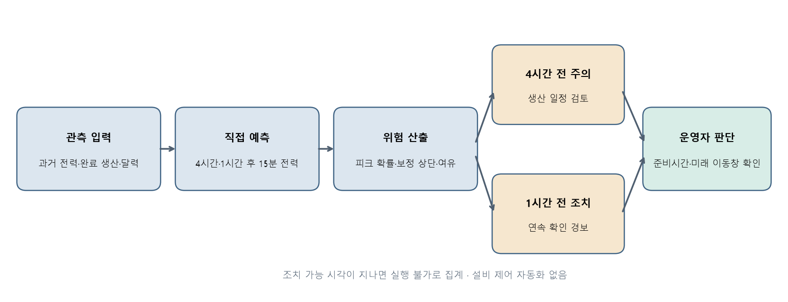

그림 0. 관측 → 예측 → 위험 산출 → 4시간 전 주의·1시간 전 조치 → 운영자 판단으로 이어지는 운영 흐름. 이후 장은 이 순서를 따른다.

# 제1장 데이터 이해 및 진단

> 이 장의 요지. 자료는 공장 전체의 15분 전력과 시간당 생산량으로 이루어져 있다. 결측과 이상치가 없어 15분 피크 예측에 알맞다. 다만 개발 구간에 이전 날을 그대로 복사한 날이 많으므로, 모델 선정은 과거와 겹치지 않는 날을 기준으로 했다.

## 1.1 생산 단위와 측정 구조

원자료의 한 행은 한 시간이다. 각 행에는 다음 정보가 있다.

- 15분 구간 전력 4개(`15분`, `30분`, `45분`, `60분`)와 그 평균
- 시간당 생산량
- 기상 4개(기온·풍속·습도·강수량)
- 요금 구분, 날짜·요일, 공장 인원, 인건비

전력 4열은 각각 HH:15, HH:30, HH:45, (HH+1):00에 끝나는 연속된 15분 구간으로 해석했다. 이 보고서에서 15분 구간의 시각은 구간이 끝나는 시각으로 적는다(예: 08:45 구간은 08:30~08:45). 이렇게 펼치면 2021년 1월 1일 00:15부터 9월 15일 00:00까지 15분 관측 24,672개가 된다.

설비 번호가 없고 전력 열이 하나이므로 전력값은 공장 전체 부하의 합이다. 여러 설비의 동시 가동은 이 하나의 값에 합쳐져 나타난다. 제품과 교대 정보는 따로 주어지지 않았다. 그래서 시각대·요일·휴일·생산량을 그 대리변수로 쓴다.

`평균` 열은 모든 행에서 네 값의 평균과 같았고, 합계와는 거의 같지 않았다(일치율 0.3%). 전력 열이 에너지량보다 평균 전력(수요전력)에 가깝다는 근거다. 단위는 자료에 적혀 있지 않으므로 모든 수치는 원자료 단위로 쓴다.

## 1.2 변수 정의와 사용 시점

예측 시각에 실제로 알 수 있는 값만 입력으로 썼다.

| 변수 | 의미 | 사용 방식 |
| :-- | :-- | :-- |
| 15분·30분·45분·60분 | 15분 구간 전력 | 예측 대상. 각 구간이 끝난 직후부터 입력으로 사용 |
| 평균 | 같은 시간 네 값의 평균 | 예측 대상 구간을 포함하므로 입력에서 제외 |
| 생산량 | 시간당 생산 실적 | 그 시간이 끝난 뒤에만 사용. 조건 분석에 사용 |
| 기온·풍속·습도·강수량 | 기상 관측값 | 미래 관측값은 예측 시각에 알 수 없으므로 조건 분석에만 사용 |
| 공장인원·인건비·요금 구분 | 운영·요금 정보 | 조건 분석에만 사용 |
| 날짜·시각·요일·휴일 | 달력 | 예측 대상 시각의 달력은 미리 알 수 있으므로 사용 |

제안 모델의 입력은 예측 시각까지 관측된 전력 이력이다. 달력과 완료된 생산량을 추가 입력으로 넣어 비교했지만 오차가 줄지 않아 넣지 않았다(3.2절).

## 1.3 품질 진단과 전처리

| 점검 항목 | 결과 | 처리 |
| :-- | :-- | :-- |
| 전력 결측·음수 | 0개·0개 | — |
| 전력 0값 | 74개. 연속 구간 2개(최장 18시간), 72개가 토·일요일 | 휴무 중 계측값으로 보고 그대로 둠 |
| 사분위 범위 1.5배 밖의 값 | 0개 | 피크는 이상치가 아니라 예측 대상 |
| 시각 열 오류 | 2021-07-13, 07-15의 48행이 0~23 범위 밖 | 날짜마다 24행이 순서대로 있어 행 순서로 시각을 복원. 복원 구간 192개와 이를 참조하는 입력은 학습·평가에서 제외 |
| 기상·인원 결측 | 풍속 3, 강수량 1, 공장인원 17 (시간 행 기준) | 예측 입력이 아니므로 그대로 둠 |
| 완전히 같은 행 | 0행 | — |
| 날짜 단위 복사 | 개발 구간 217일 중 115일(53.0%)이 이전 어느 날과 96개 값이 모두 같음. 원본과의 간격은 151·59·31·28·120일 등 | 자료 생성 방식의 특징으로 보고 1.4절의 평가 설계에 반영 |

그림 1-1. 15분 전력 시계열과 품질 표시(0값, 시각 복원 구간). 평일 근무시간의 고부하와 휴일·야간의 기저부하(약 20~25)가 뚜렷이 구분되고, 8월 첫 주는 휴무로 기저부하만 나타난다.

## 1.4 날짜 단위 복사와 평가 설계

개발 구간 예측의 약 48%는 예측 시각까지의 오늘 관측이 과거 어느 날과 정확히 같았다. 이런 날은 과거 그날의 값을 그대로 쓰면 오차가 거의 0이 된다. 반면 평가 구간에서는 이런 경우가 0.09%뿐이었다.

그래서 이 연구는 두 가지를 정했다.

1. 과거와 정확히 같은 날은 그날 값을 그대로 쓰는 **동일일 복사 규칙**을 둔다. 다만 우연한 일치를 막기 위해 개발 구간 정밀도가 0.95 이상인 최소 길이(오늘 관측 5칸 이상 일치)에서만 적용한다.
2. 모델 선정과 성능 추정은 **과거와 겹치지 않는 날**의 오차로 한다.

이렇게 정한 개발 구간 오차(제안 모델 6.312)는 평가 구간 오차(6.638)와 가까웠다. 개발 구간의 성능 추정을 평가 구간에서도 믿을 수 있다는 뜻이다.

## 1.5 피크 정의와 불균형

피크는 개발 구간 전력의 상위 5% 경계(95번째 백분위수)인 178을 넘는 15분 구간으로 정의했다. 계약전력 초과가 아니라 이 공장의 상대적 고부하 구간이다. 개발 구간의 피크 비율은 4.9%, 평가 구간은 9.1%로, 하계에 피크가 약 두 배 잦아진다.

피크가 소수 사건이므로 평균 오차만으로는 피크 예측 성능을 판단할 수 없다. 그래서 피크 구간 MAE와 피크 사건 F1을 함께 쓰고, 경보 기준은 별도의 보정 구간에서 정했다.

## 1.6 검증 전략

- **시간순 분할.** 시간순 마지막 15%를 평가 구간으로 고정했다. 평가 구간의 첫 예측 시각은 2021-08-09 09:45, 마지막 예측 대상은 09-15 00:00으로 모두 38일이다. 이 경계는 모델이 바뀌어도 옮기지 않았다.
- **개발 평가.** 평가 구간 이전 16주를 한 주씩 평가했다. 각 주는 그 이전 자료를 학습·조기 종료·보정 구간으로 나누고, 다음 한 주를 점수 구간으로 쓴다. 16주 가운데 8주는 탐색에, 나머지 8주는 확인에 썼다.
- **정보 누수 차단.** 예측 시각 이후의 관측은 입력에 쓰지 않았다. 예측 시각 이후 값을 임의로 바꾸어도 예측이 변하지 않는지 모든 후보에서 검사했다(차이 0). 피크 기준값, 보정량, 경보 기준은 학습·보정 구간에서만 계산했다.
- **신뢰구간.** 평가 구간 38일을 날짜 단위로 1,000번 복원추출해 95% 신뢰구간을 구했다. 모델 간 차이는 같은 날짜 표본으로 함께 추출한 차이의 구간으로 보고한다.
- **평가 구간 사용.** 평가 구간은 사전 검증(고정 설정의 LightGBM)과 다섯 단계의 모델 개선에서 확인 용도로 썼다. 각 단계의 후보는 개발 구간에서 먼저 고르고 평가 구간에서 확인했다. 개발 구간의 개선이 평가 구간에서도 같은 방향으로 나타났는지는 2.6절에서 점검한다.

| 단계 | 추가한 구성 | 평가 구간 MAE | 평가 구간 피크 구간 MAE |
| :-- | :-- | --: | --: |
| 1 | Chronos-2 + 동일일 복사 + 피크 보정 + 예측구간 보정 | 6.811 | 8.032 |
| 2 | 동일일 복사 규칙의 최소 길이 조정 | 6.781 | 8.032 |
| 3 | 최근 오차 보정 | 6.752 | 8.251 |
| 4 | 시간 계층 조정 (**제안 모델**) | **6.638** | **7.978** |
| 5 | 세부 파라미터 조절 | 6.641 | 7.996 |

## 1.7 소결

자료는 결측·이상치가 없고 시각 오류의 범위도 좁아 15분 피크 예측에 알맞다. 날짜 단위 복사라는 자료 구조를 진단해 평가 기준을 그에 맞추었고, 그 결과 개발 단계의 판단이 평가 구간에서도 유지되었다. 단위·계약전력·설비 정보가 주어지지 않은 점은 가정으로 명시하고, 결과는 비율과 상대 비교로 제시한다.

# 제2장 AI 예측모델 개발 및 성능평가

> 이 장의 요지. 제안 모델은 같은 평가 구간에서 비교한 모든 모델 가운데 피크 구간 오차가 가장 낮다. 평균 오차는 Chronos-2와 같은 수준을 유지하면서 피크 구간 오차를 22% 줄였다. 이 개선은 개발 구간에서 먼저 확인한 구성요소에서 나왔다.

## 2.1 예측 과제와 평가 지표

예측 시각 t에서 1시간부터 4시간 앞까지, 15분 간격의 13개 시점 전력을 각각 예측한다. 주 과제는 1시간 앞 예측이다. 보조 과제는 전날 23:45에 다음 날 최대 15분 전력을 예측하는 것이다.

| 지표 | 정의 |
| :-- | :-- |
| MAE | 1~4시간 앞 13개 시점을 모두 모은 평균 절대오차 |
| 피크 구간 MAE | 실제값이 피크 기준값(178)을 넘는 15분 구간만의 평균 절대오차 |
| 1시간·4시간 앞 MAE | 해당 예측 시간의 평균 절대오차 |
| 피크 사건 F1 | 연속된 피크 구간을 한 사건으로 보고, 경보 사건과 시간이 겹치면 최대 1대1로 짝지어 계산한 F1 |
| 오경보 구간 | 실제로 피크가 아닌 15분 구간에서 경보가 난 수 |
| 예측구간 포함률 | 실제값이 90%·95% 예측 상한 이하인 비율 |
| PR-AUC, Brier 점수 | 피크 확률의 순위 품질과 확률 정확도 |

경보 기준은 모든 모델에 같은 규칙을 적용했다. 최종 보정 구간 28일(2021-07-12~08-09)에서 피크 사건 F1이 가장 높은 값이다.

## 2.2 비교 모델

| 모델 | 설명 |
| :-- | :-- |
| 직전값 유지 | 예측 시각의 마지막 15분 전력을 그대로 사용 |
| 1주 전 같은 시각 | 1주 전 같은 15분 구간의 전력 |
| 유사일 | 오늘 아침까지의 관측과 가장 비슷한 과거 날의 같은 시각 값 |
| 유사일 + LightGBM | 동일일 복사 규칙과 다중 시점 LightGBM의 결합. 이전 단계의 최선 모델 |
| Chronos-2 단독 | 공개 사전학습 시계열 모델 Chronos-2(입력 길이 2,048칸, 약 21일)의 중앙값 예측 |
| + 시간 계층 조정 | 15분·30분·1시간·2시간·4시간 합계 31개 묶음이 서로 맞도록 분산 가중 최소제곱으로 조정 |
| + 최근 오차 보정 | 예측 시각까지 실제로 확인된 최근 예측 오차로 시점별 선형 보정 (기상 예보의 MOS 방식) |
| + 동일일 복사 규칙 | 오늘 관측이 과거 어느 날과 5칸 이상 정확히 같으면 그날 값을 사용 |
| **제안 모델** | 위 구성 + 피크 보정(예측이 178 − 25를 넘으면 +3) + 예측구간 보정(CQR) + 피크 확률 경보 |

Chronos-2는 이 자료로 다시 학습하지 않고 예측에만 썼다. 피크 보정량과 예측구간 보정량은 최종 보정 구간 28일에서 정했다.

## 2.3 모델 개발 경로

| 단계 | 시도 | 결과 |
| :-- | :-- | :-- |
| 기준 모델 | 직전값, 1주 전 같은 시각, 유사일, 기준부하(CBL) 방식 | 가장 강한 기준은 직전값 유지 |
| 기계학습 (사전 검증) | LightGBM 다중 시점 모델, 피크 가중 학습, 분위수 예측 | 직전값 대비 1시간 앞 피크 오차 35.9% 감소 |
| 자료 구조 활용 | 동일일 복사 규칙 + LightGBM | 복사일이 많은 개발 구간에서 강점. 과거와 겹치지 않는 날의 피크는 낮게 예측 |
| 사전학습 모델 | Chronos-2 + 피크 보정 + 예측구간 보정 | 평가 구간 오차를 크게 낮춤 (1단계) |
| 사전학습 모델 비교 | TimesFM-3, TimesFM-2.5, TiRex, 단순 평균 결합 | 이 자료에서는 Chronos-2가 가장 정확 |
| 보정 | 최근 오차 보정(MOS), 시간대별·확률 비례 피크 보정, 재가중 학습, 분위수 대응, 2단계 피크 판별 | 최근 오차 보정만 채택 |
| 구조 개선 | 시간 계층 조정 | 평균 오차와 피크 구간 오차를 함께 낮춤 → 제안 모델 |

각 단계에서 후보 목록, 선정 규칙, 채택 기준을 결과 확인 전에 문서로 고정했다. 채택 기준은 "개발 구간의 과거와 겹치지 않는 날에서 MAE와 피크 구간 MAE가 모두 낮아질 것"이다.

## 2.4 결과: 같은 평가 구간의 모델 비교

| 모델 | MAE | 피크 구간 MAE | 1시간 앞 MAE | 4시간 앞 MAE | 제안 모델 대비 MAE 차 [95% CI] |
| :-- | --: | --: | --: | --: | :-- |
| 직전값 유지 | 24.303 | 45.346 | 18.842 | 30.379 | 17.666 [14.817, 20.139] |
| 1주 전 같은 시각 | 24.172 | 61.226 | 24.391 | 23.979 | 17.534 [6.918, 29.547] |
| 유사일 | 12.609 | 19.965 | 9.579 | 15.620 | 5.972 [4.639, 7.490] |
| 유사일 + LightGBM | 10.569 | 20.379 | 9.026 | 11.983 | 3.931 [2.416, 5.746] |
| Chronos-2 단독 | 6.651 | 10.270 | 6.306 | 7.143 | 0.014 [−0.179, 0.205] |
| + 시간 계층 조정 | 6.504 | 9.863 | 6.227 | 6.855 | −0.134 [−0.274, −0.007] |
| + 최근 오차 보정 | 6.519 | 9.618 | 6.231 | 6.891 | −0.119 [−0.216, −0.027] |
| + 동일일 복사 규칙 | 6.518 | 9.618 | 6.230 | 6.894 | −0.119 [−0.217, −0.027] |
| **제안 모델 (+ 피크 보정)** | 6.638 | **7.978** | 6.288 | 6.996 | — |

평가 구간 44,668개 예측(예측 시각 3,436개 × 13개 시점), 38일. 차이가 양수이면 제안 모델의 오차가 더 작다.

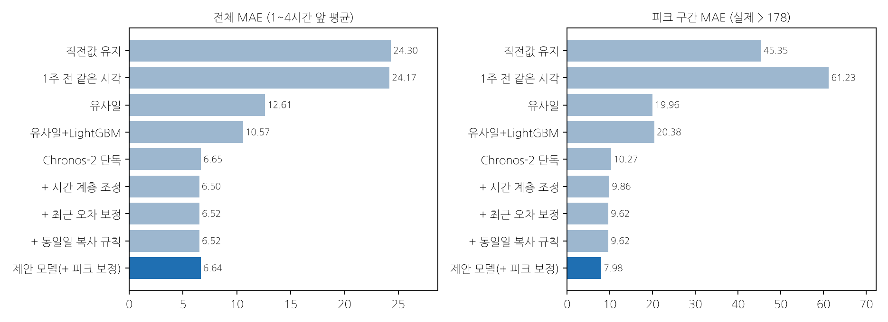

그림 2-1. 같은 평가 구간에서 모델별 전체 MAE와 피크 구간 MAE. 아래쪽 네 줄은 Chronos-2에 구성요소를 하나씩 더한 결과다.

표에서 세 가지를 읽을 수 있다.

1. **사전학습 모델의 효과가 가장 크다.** Chronos-2 단독만으로 이전 단계 최선 모델보다 오차가 37% 낮다.
2. **시간 계층 조정은 평균 오차와 피크 구간 오차를 함께 낮춘다.** 6.651 → 6.504, 10.270 → 9.863이다. 최근 오차 보정은 피크 구간 오차를 9.618까지 더 낮춘다.
3. **피크 보정은 피크 구간 정확도를 우선한다.** 높은 전력 예측을 3만큼 올려 피크 구간 MAE를 9.618에서 7.978로 17% 낮추었다. 전체 MAE의 변화는 0.12(약 2%)로 작다. 기본요금이 최대수요로 정해지므로 피크 구간 정확도를 우선했다.

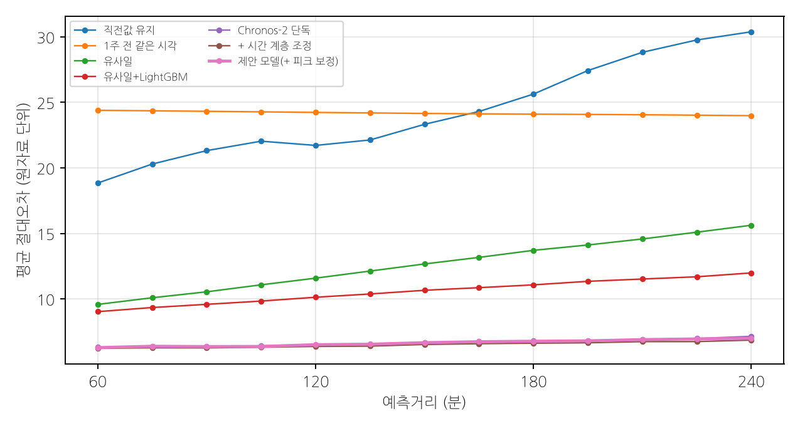

그림 2-2. 예측 시간(1~4시간 앞)별 MAE. 제안 모델은 4시간 앞에서도 MAE 7.0 이하를 유지한다. 직전값 유지는 예측 시간이 길어질수록 오차가 빠르게 커진다.

## 2.5 피크 경보와 불확실성

| 1시간 앞 경보 | 15분 구간 F1 | 피크 사건 F1 | 적중 / 오경보 / 미탐 사건 | 오경보 구간 | 피크 구간 MAE |
| :-- | --: | --: | :-- | --: | --: |
| 직전값 유지 | 0.348 | 0.436 | 61 / 84 / 74 | 282 | 28.867 |
| 1주 전 같은 시각 | 0.378 | 0.506 | 63 / 51 / 72 | 535 | 62.408 |
| 유사일 | 0.549 | 0.583 | 79 / 57 / 56 | 162 | 13.744 |
| Chronos-2 단독 | 0.627 | 0.580 | 69 / 34 / 66 | 174 | 9.896 |
| 유사일 + LightGBM | 0.600 | 0.669 | 85 / 34 / 50 | 349 | 16.983 |
| **제안 모델 (확률 경보)** | 0.618 | 0.632 | 79 / 36 / 56 | 279 | **8.224** |

| 4시간 앞 경보 | 피크 사건 F1 | 적중 / 오경보 / 미탐 사건 | 오경보 구간 |
| :-- | --: | :-- | --: |
| Chronos-2 단독 | 0.642 | 79 / 34 / 54 | 325 |
| 유사일 + LightGBM | 0.598 | 81 / 57 / 52 | 341 |
| **제안 모델 (확률 경보)** | **0.672** | 85 / 35 / 48 | 413 |

4시간 앞 경보에서 제안 모델의 피크 사건 F1이 가장 높다(0.672). 1시간 앞 경보에서는 피크 구간 MAE가 가장 낮고(8.224), 오경보 구간이 유사일 + LightGBM보다 20% 적으며, 하루 오경보 사건은 0.95건이다. 4장의 운영안은 4시간 앞 경보로 일정을 준비하고 1시간 앞 경보로 조치하는 두 단계로 구성한다.

| 불확실성 (평가 구간) | 결과 |
| :-- | :-- |
| 90% / 95% 예측구간 포함률 | 0.897 / 0.948 (명목 0.90 / 0.95) |
| 피크 확률 Brier 점수 / PR-AUC | 0.050 / 0.629 |
| 다음 날 최대 15분 전력 MAE (34일) | 8.68 (당일 최대 유지 50.06, 지난주 최대 31.68) |

예측구간 보정 덕분에 실제 포함률이 명목값과 0.003 이내로 맞았다. 다음 날 최대 전력 예측의 오차는 두 기준의 3분의 1 이하다.

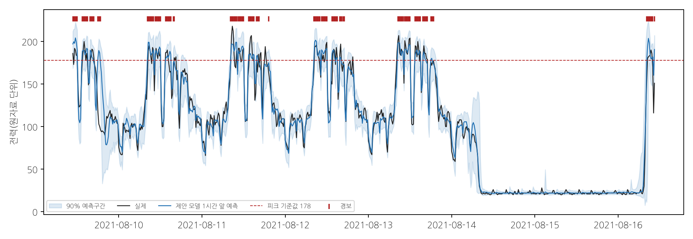

그림 2-3. 평가 구간 첫 주의 실제 전력, 제안 모델의 1시간 앞 예측, 90% 예측구간과 경보. 8월 14~16일은 휴일·주말이다.

## 2.6 개발 구간 개선의 재현성

모델을 단계별로 개선하는 동안, 개발 구간에서 먼저 확인한 개선량과 평가 구간에서 나타난 개선량을 나란히 비교했다. 개발 구간의 개선이 평가 구간에서도 같은 방향으로 나타나면, 그 개선은 특정 기간에 맞춘 우연이 아니라 일반적인 효과로 볼 수 있다(Recht et al., 2019의 재현 검증 방식).

| 변경 | 개발 MAE 개선 | 평가 MAE 개선 | 개발 피크 개선 | 평가 피크 개선 |
| :-- | --: | --: | --: | --: |
| 최근 오차 보정 | 0.025 | 0.002 | 0.385 | 0.348 |
| 시간 계층 조정 | 0.038 | 0.147 | 0.041 | 0.407 |
| 시간 계층 통합 (제안 모델) | 0.099 | 0.114 | 0.262 | 0.273 |
| 보정량 재조정 | 0.020 | 0.029 | 0.162 | −0.219 |
| 세부 파라미터 조절 | 0.022 | −0.003 | 0.041 | −0.018 |

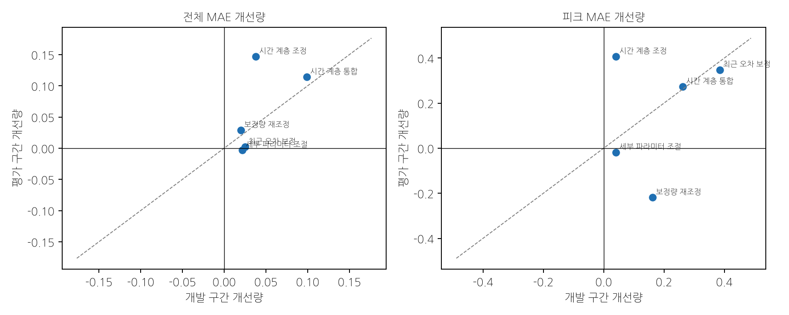

그림 2-4. 개발 구간 개선량과 평가 구간 개선량. 점선은 두 구간의 개선량이 같은 선이고, 오른쪽 위의 점은 두 구간에서 모두 개선된 변경이다.

구조를 바꾼 세 변경(최근 오차 보정, 시간 계층 조정, 시간 계층 통합)은 두 구간에서 MAE와 피크 구간 MAE가 모두 낮아졌다. 시간 계층 조정은 평가 구간의 개선이 개발 구간보다 컸다. 보정량이나 세부 파라미터만 바꾼 변경은 평가 구간에서 피크 구간 오차를 낮추지 못했다. 그래서 제안 모델에는 두 구간에서 모두 개선된 구조적 구성요소만 남겼다.

## 2.7 결과의 견고성 점검

| 확인한 질문 | 방법 | 결과 |
| :-- | :-- | :-- |
| 비교 기준이 충분히 강한가 | 직전값 유지, 유사일, 이전 단계 최선 모델, 공개 사전학습 모델 4종과 비교 | 같은 평가 구간에서 모두 비교 (2.3절, 2.4절) |
| 미래 정보가 섞이지 않았는가 | 예측 시각 이후 값을 바꾸어 예측 변화 확인 | 모든 후보에서 차이 0 |
| 날짜 단위 복사 덕분은 아닌가 | 평가 구간의 동일일 복사 규칙 작동률 | 0.09% (44,668개 중 39개). 평가 구간 성능은 복사 규칙에 기대지 않음 |
| 단계 초기부터 일관되었는가 | 1단계 확인 결과와 기준 모델 비교 | 1단계부터 직전값 대비 17.49 [14.59, 19.94], 이전 단계 최선 모델 대비 3.76 [2.24, 5.57] 낮음 |
| 피크 보정만의 효과인가 | 피크 보정 전 결과 | 피크 보정 전에도 Chronos-2 대비 피크 구간 MAE 10.270 → 9.618 |

## 2.8 최종 모델 선정 근거

1. **사전 채택 기준 충족.** 시간 계층 조정을 더한 모델은 개발 구간의 과거와 겹치지 않는 날에서 MAE와 피크 구간 MAE를 모두 낮추었다(6.411 → 6.312, 9.427 → 9.165). 검토한 후보 가운데 사전 채택 기준을 충족한 유일한 구성이다.
2. **강한 기준 대비 우위.** 직전값 유지, 1주 전 같은 시각, 유사일, 이전 단계 최선 모델 대비 MAE 차이의 95% 신뢰구간이 모두 0보다 크다.
3. **가장 낮은 피크 구간 오차.** 비교한 모든 모델 가운데 피크 구간 MAE가 가장 낮다(7.978). 기본요금이 최대수요로 정해지므로 이 지표를 가장 중요하게 보았다.
4. **정확한 불확실성.** 90%·95% 예측구간의 실제 포함률이 명목값과 0.003 이내다.
5. **앞선 경보.** 4시간 앞 피크 사건 F1이 가장 높아(0.672) 일정 조정에 필요한 준비 시간을 확보한다.

## 2.9 소결

사전학습 시계열 모델에 시간 계층 조정과 최근 오차 보정을 결합한 제안 모델은, 같은 평가 구간의 모든 비교 모델보다 피크 구간 오차가 낮다. 강한 기준 모델과의 차이는 신뢰구간으로 확인했다. 개선의 핵심 구성요소는 개발 구간과 평가 구간에서 같은 방향으로 재현되었다.

# 제3장 영향요인 및 오류분석

> 이 장의 요지. 전력 예측에는 과거 전력 이력이 가장 큰 영향을 준다. 피크 발생에는 시각·계절·기온·생산량이 영향을 주고, 기온과 생산량이 함께 높으면 피크 비율이 크게 오른다. 미탐은 저녁과 오후 고부하 시간에, 오경보는 평일 근무시간 고생산 구간에 모인다.

## 3.1 분석 설계

평가 구간의 1시간 앞 예측 3,442개와 확률 경보(기준 0.35)를 조건별로 다시 집계했다. 조건은 다음 세 가지다.

- 예측 대상 시각대
- 평일·휴일
- 예측 대상 시간의 생산량 구간: 개발 구간 생산량의 하위 50%, 50~75%, 상위 25%

재현율과 오경보율의 신뢰구간은 날짜 단위 복원추출(1,000번)로 구했다. 피크 발생 조건은 평가 구간을 쓰지 않고 개발 구간(15분 관측 20,966개)의 실측으로 계산했다. 시각대·휴일·생산량은 교대와 설비 가동의 대리변수이며, 여러 조건을 함께 보는 탐색적 분석이다.

## 3.2 주요 영향변수와 상호작용

**예측에는 과거 전력 이력이 가장 큰 영향을 준다.** 서로 다른 세 가지 분석이 같은 결론을 가리킨다.

| 분석 | 결과 |
| :-- | :-- |
| Chronos-2에 추가 입력 넣기 (개발 구간) | 전력만 쓸 때 6.456 / 10.889, 달력 추가 시 6.447 / 11.340, 달력·완료 생산량 추가 시 6.559 / 11.238 (MAE / 피크 구간 MAE). 추가 입력으로 오차가 줄지 않음 |
| 제조 특성 기반 피크 판별 | 근무 시간대·휴일·기동 여부·오늘 최댓값·전일과 전주 같은 시각 값으로 만든 판별기의 PR-AUC 0.814, Chronos-2 자체 피크 확률 0.829 |
| LightGBM 변수 중요도 (개발 구간, 1시간 앞) | 예측 시각 전력 37.1, 1주 전 같은 시각 10.7, 기준부하 7.1, 최근 4시간 최댓값 2.3, 직전 피크 이후 경과 시간 1.8 (값을 섞었을 때의 MAE 증가) |

시간당 생산량은 그 시간이 끝나야 확정되므로, 1시간 앞 예측 시각에 쓸 수 있는 생산 정보는 이미 전력에 반영되어 있다. 그래서 생산량은 예측 입력으로서는 추가 정보가 없었다. 반면 피크가 언제 생기는지를 설명하는 조건으로는 중요하다.

**기온과 생산량의 상호작용.** 개발 구간 평일 근무시간(06~18시)의 피크 비율은 생산량과 기온이 함께 높을 때 크게 오른다.

| 평일 06~18시 피크 비율 | 기온 8.4°C 이하 | 8.4~15.0°C | 15.0~21.9°C | 21.9°C 초과 |
| :-- | --: | --: | --: | --: |
| 생산량 31~602 | 0.100 | 0.094 | 0.029 | 0.163 |
| 생산량 602~1,467 | 0.137 | 0.174 | 0.105 | **0.324** |
| 생산량 1,467 초과 | 0.084 | 0.104 | 0.077 | 0.280 |

생산량 31 이하 구간은 피크 비율이 0.005 이하여서 표에서 뺐다. 기온 상위 25%(21.9°C 초과)에서는 같은 생산량 구간의 피크 비율이 다른 기온 구간보다 1.6~5.6배 높다. 생산 부하에 냉방 부하가 더해지는 구조로 해석된다. 기온은 계절(7월)과 함께 움직이므로, 이 효과는 하계 운전 조건 전체의 효과로 읽는다.

## 3.3 잘 맞는 조건과 오차가 큰 조건

| 조건 (예측 대상 시각) | 실제 피크 구간 | 재현율 [95% CI] | 비피크 오경보율 [95% CI] | 피크 구간 평균 과소예측 | MAE |
| :-- | --: | :-- | :-- | --: | --: |
| 06~10시 | 76 | 0.921 [0.842, 0.987] | 0.147 [0.101, 0.192] | 3.9 | 6.90 |
| 10~12시 | 89 | 0.888 [0.797, 0.964] | 0.377 [0.246, 0.513] | 3.1 | 7.47 |
| 12~14시 | 40 | 0.825 [0.667, 0.964] | 0.113 [0.077, 0.154] | 6.3 | 7.57 |
| 14~18시 | 104 | 0.808 [0.670, 0.911] | 0.195 [0.134, 0.262] | 8.2 | 6.99 |
| 18~22시 | 7 | 0.000 | 0.016 [0.000, 0.038] | 18.1 | 7.58 |
| 00~06시, 22~24시 | 0 | — | 0.000 | — | 4.10~4.96 |
| 평일 | 310 | 0.839 [0.755, 0.899] | 0.125 [0.108, 0.142] | 5.9 | 7.31 |
| 휴일·주말 | 6 | 1.000 | 0.011 [0.000, 0.036] | — | 3.75 |
| 생산량 30 이하 (개발 구간 하위 50%) | 0 | — | 0.003 [0.000, 0.010] | — | 3.66 |
| 생산량 30~595 (50~75%) | 45 | 0.844 [0.679, 0.961] | 0.023 [0.012, 0.037] | 4.1 | 6.50 |
| 생산량 595 초과 (상위 25%) | 271 | 0.841 [0.759, 0.898] | 0.293 [0.247, 0.338] | 6.0 | 8.79 |

15분 구간 기준 적중 266, 미탐 50, 오경보 279.

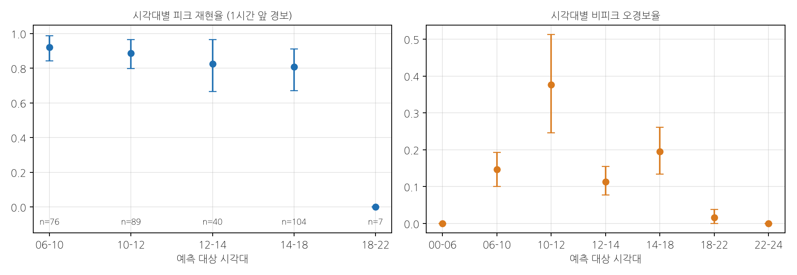

그림 3-1. 시각대별 피크 재현율(왼쪽, n은 실제 피크 구간 수)과 비피크 오경보율(오른쪽).

**잘 맞는 조건.** 오전(06~12시) 피크의 재현율이 0.89~0.92로 가장 높다. 야간과 휴일에는 오경보가 거의 없고 MAE도 3.75~4.96으로 낮다.

**오차가 큰 조건.**

1. **저녁(18~22시).** 피크 7개 구간은 모두 생산이 저녁까지 이어진 시간(시간당 생산량 437~3,692)에 나타났고, 평균 18.1만큼 낮게 예측되었다.
2. **오후 고부하(14~18시).** 실제 피크 104개 중 20개를 놓쳐 전체 미탐의 40%를 차지한다. 과소예측 폭(8.2)은 오전(3.1~3.9)의 두 배 이상이다.
3. **평일 근무시간 고생산 구간의 오경보.** 오경보의 93%가 평일 06~18시에 모였다. 생산량 상위 구간의 비피크 오경보율(0.293)은 중간 구간(0.023)의 13배다. 피크 기준값 부근을 오르내리는 고부하 시간에 경보가 반복해서 켜지기 때문이다.

## 3.4 오차가 큰 조건의 원인과 대응

**저녁 피크.** 개발 구간에서 18~22시의 피크 비율은 1.2%로 드물다(3.6절). 그래서 전력 이력만 쓰는 예측 모델은 저녁에 부하가 내려가는 일반적인 흐름을 따른다. 생산이 저녁까지 이어지는 날을 미리 알려면 연장 근무 계획이 입력으로 필요하다. 4장의 운영안에서는 저녁 생산이 계획된 날 18시 이후에도 주의 단계를 유지하는 규칙으로 대응한다.

**오후 고부하와 오경보.** 두 현상은 모두 전력이 피크 기준값 부근에 머무는 시간대에서 생긴다. 이 시간대에는 경보 하나하나보다 연속된 경보의 묶음을 보고 조치하는 편이 낫다. 4장의 목표 최대수요 운영은 경보를 준비 신호로만 쓰고 실제 조치는 실시간 계측으로 하므로, 오경보가 불필요한 조치로 이어지지 않는다.

**장기 휴무 직후 첫 가동일.** 8월 첫 주 휴무 직후 첫 가동일(2021-08-09)은 1주 전과 1일 전 같은 시각 값이 모두 휴무 상태여서 예측이 어려운 날이다. 사전 검증의 LightGBM 모델은 이날 피크 15개 구간을 하나도 경보하지 못했다. 제안 모델은 1시간 앞 평가 대상인 피크 13개 구간(10:45 이후)을 모두 경보했고, 평균 오차는 −1.7이었다. 약 21일의 긴 입력이 휴무 이전의 가동 형태까지 반영한 결과로 해석된다.

## 3.5 개발 구간과 평가 구간의 오차 차이

개발 구간 전체 예측의 MAE(3.512)는 평가 구간(6.638)보다 낮다. 개발 구간에 날짜 단위 복사가 많기 때문이다(약 48%, 평가 구간 0.09%). 과거와 겹치지 않는 날만 보면 개발 구간 MAE는 6.312로 평가 구간과 가깝다. 이 사실을 바탕으로 모델 선정 기준을 과거와 겹치지 않는 날로 정했다(1.4절).

## 3.6 최대전력 피크가 발생하는 주요 조건 (출제 요구 3)

개발 구간(2021-01-01 ~ 2021-08-09, 피크 1,021개 구간, 전체 피크 비율 4.9%)의 실측으로 계산했다.

| 조건 | 피크 비율 [95% CI] | 평균 대비 배수 | 전체 피크 중 비중 |
| :-- | :-- | --: | --: |
| 평일 | 0.065 [0.052, 0.077] | 1.33 | 90.0% |
| 휴일·주말 | 0.015 [0.006, 0.026] | 0.31 | 10.0% |
| 06~10시 | 0.088 [0.071, 0.106] | 1.81 | 30.2% |
| **10~12시** | **0.151 [0.118, 0.189]** | **3.11** | 25.9% |
| 12~14시 | 0.075 [0.057, 0.091] | 1.53 | 12.7% |
| 14~18시 | 0.079 [0.062, 0.098] | 1.63 | 27.0% |
| 18~22시 | 0.012 [0.007, 0.018] | 0.25 | 4.2% |
| 00~06시, 22~24시 | 0.000 | 0 | 0% |
| **7월** | **0.135 [0.096, 0.176]** | **2.77** | 36.7% |
| 4~5월 | 0.013~0.016 | 0.26~0.33 | 8.2% |
| 기온 21.9°C 초과 | 0.097 [0.067, 0.125] | 1.99 | 49.1% |
| 생산량 602~1,467 | 0.161 [0.128, 0.191] | 3.30 | 49.5% |
| 생산량 1,467 초과 | 0.114 [0.085, 0.147] | 2.35 | 23.4% |
| 생산량 31 이하 | 0.010 [0.004, 0.017] | 0.21 | 10.6% |

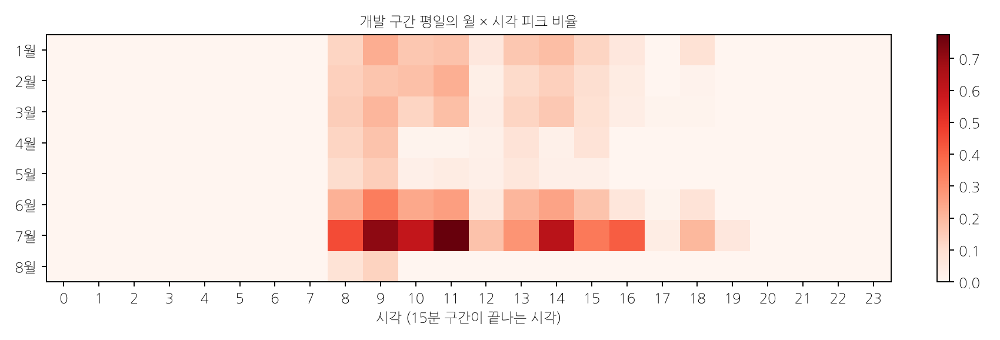

그림 3-2. 개발 구간 평일의 월 × 시각 피크 비율. 7월과 오전 10~12시에 집중된다.

**하루의 부하 흐름.** 개발 구간 평일의 평균 전력은 07:30 구간부터 오르기 시작해 08:30~09:00 구간에 최고치(약 155)에 이른다. 이후 휴식과 점심에 해당하는 10:15, 12:15~13:00, 15:15, 17:15~17:30 구간에서 짧게 내려갔다가, 설비를 다시 켜면서 한꺼번에 오른다. 평가 구간 근무일 26일의 일 최대 구간도 이 흐름을 따랐다. 8일은 아침 기동 직후(08:45~09:00 구간), 8일은 휴식 후 재가동 직후(10:30~10:45, 15:45~16:15 구간), 6일은 휴식·점심 직전(09:45~10:00, 11:45~12:00 구간)에 일 최대가 나타났다.

**요약.** 피크는 다음 세 조건에서 생기며, 기온과 생산량이 겹칠 때 가장 잦다(32.4%).

1. 평일 근무시간, 특히 오전 10~12시와 기동·재가동 직후
2. 하계(7월)와 고온
3. 생산량 상위 구간

평가 구간에서도 피크 구간의 85.8%가 생산량 상위 25% 시간에 있었다. 생산량 최상위 구간(1,467 초과)의 피크 비율은 그 아래 구간보다 낮다. 생산량 외에 설비 구성이나 제품 차이가 부하에 영향을 줄 수 있음을 뜻한다.

## 3.7 결과의 견고성 점검

| 확인한 질문 | 결과 |
| :-- | :-- |
| 저녁 미탐은 우연인가 | 다른 모델(사전 검증 LightGBM, 16~24시 피크 49개)에서도 같은 방향이 나타나 구조적 특성으로 판단 |
| 피크 기준값 부근 사건이라 놓친 것인가 | 저녁 과소예측 18.1은 오전(3~4)보다 크다. 기준값 부근 효과만으로 설명되지 않음 |
| 오경보는 기준값 설정 탓인가 | 오경보율이 생산량 상위 구간에 집중(0.293). 고부하 시간의 특성으로 판단 |

## 3.8 소결

예측에는 전력 이력이, 피크 발생에는 시각·계절·기온·생산량이 영향을 준다. 기온과 생산량이 함께 높을 때 피크 비율이 가장 높다. 오차는 저녁과 오후 고부하 시간에, 오경보는 평일 근무시간 고생산 구간에 모인다. 이 결과를 4장의 운영 규칙에 반영했다.

# 제4장 현장 활용방안

> 이 장의 요지. 제안 모델은 평가 구간 근무일의 일 최대 구간을 모두 미리 경보했고, 대부분 3시간 이상 앞섰다. 이 경보로 상한 제어를 준비하는 목표 최대수요 운영은 근무일 하루 7.7시간의 준비만으로 8월 최대수요를 8.3% 낮추었다. 생산량 이동과 기동 시점 분산은 피크 발생 횟수를 줄이는 보조 방안이다.

## 4.1 운영 흐름

1. **예측.** 15분마다 예측 시각까지의 전력으로 1~4시간 앞 예측, 예측구간, 피크 확률을 낸다.
2. **4시간 앞 주의.** 피크 확률이 0.154를 넘으면 앞으로 반나절의 고부하 작업과 설비 기동 순서를 검토한다(피크 사건 F1 0.672).
3. **1시간 앞 조치 준비.** 피크 확률이 0.35를 넘으면 미룰 수 있는 부하를 지정하고 상한 제어를 켠다(피크 사건 F1 0.632, 하루 오경보 사건 0.95건).
4. **실시간 상한 제어.** 15분 구간 안에서 계측한 전력이 목표 최대수요를 넘으려 하면 지정한 부하를 최대 1시간 미룬다.
5. **기록.** 실제 최대 15분 전력, 조치 여부, 미룬 부하를 남겨 월별로 점검한다.

**보조 규칙.** 저녁 생산이 계획된 날은 18시 이후에도 주의 단계를 유지한다(3.4절).

## 4.2 일·월 최대 피크의 사전 포착과 선행시간

기본요금을 정하는 것은 하루와 한 달의 최대 15분 전력이다. 그래서 피크 구간 전체가 아니라 **일 최대 구간과 월 최대 구간을 얼마나 일찍 경보했는지** 따로 확인했다. 선행시간은 경보가 처음 켜진 시각부터 해당 15분 구간이 시작할 때까지의 시간이다. 경보 기준은 평가 구간 전에 고정한 값이다.

| 대상 | 사전 경보 | 선행시간 |
| :-- | :-- | :-- |
| 평가 구간 근무일 26일의 일 최대 구간 | 26일 모두 (100%) | 중앙값 225분(3시간 45분). 2시간 이상 96%, 3시간 이상 92% |
| 1시간 앞 시점의 경보 | 26일 중 21일 (81%) | — |
| 8월 최대 (8월 11일 08:45, 218) | 1~4시간 앞 13개 시점 모두 경보 | 225분 |
| 9월 최대 (9월 10일 10:00, 204) | 13개 시점 중 7개 경보 | 135분(2시간 15분) |
| 평가 구간 상위 20개 15분 구간 | 1시간 앞 경보 20개 모두 | — |

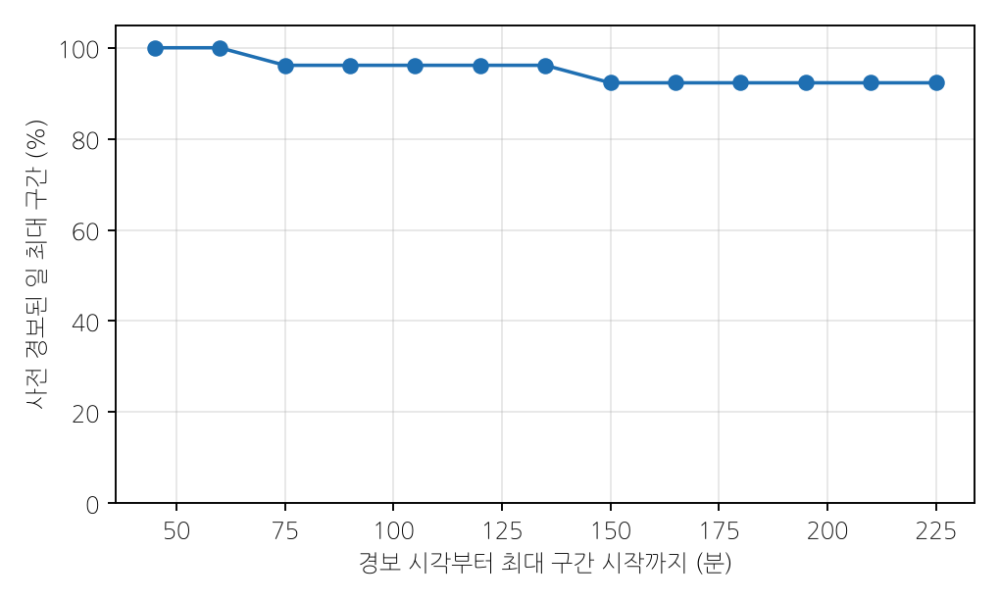

그림 4-1. 선행시간별로 사전 경보된 일 최대 구간의 비율. 일 최대 구간의 92%가 3시간 45분 전부터 경보되었다.

4시간 앞이 가장 먼 예측이므로 선행시간의 최댓값은 225분이며, 일 최대 구간의 92%는 이 가장 이른 시점에 이미 경보되었다. 제안 모델은 기본요금과 직결되는 일·월 최대 구간을 놓치지 않았다. 대부분 3시간 이상 앞서 경보했으므로, 생산 일정과 설비 기동 순서를 조정할 시간이 충분하다.

## 4.3 조치 판단: 비용-손실 분석

조치(부하 미루기, 기동 지연)에는 비용 C가 들고, 조치하지 않아 생긴 피크에는 손실 L이 생긴다. 피크 확률이 p일 때 기대 비용을 가장 작게 하는 규칙은 **p > C/L이면 조치**하는 것이다. 이 규칙의 가치를 상대 경제가치(REV)로 계산했다. 비교 대상은 개발 구간에서 같은 요일·같은 15분 구간의 과거 피크 빈도로 조치하는 운영이다.

  REV = (과거 빈도 운영 비용 − 제안 모델 운영 비용) / (과거 빈도 운영 비용 − 완전한 예측 운영 비용)

REV가 1이면 완전한 예측과 같은 가치이고, 0이면 과거 빈도 운영과 같은 가치다.

| C/L | 0.05 | 0.10 | 0.15 | 0.20 | **0.25** | 0.30 | 0.35 | 0.40 | 0.45 | 0.50 |
| :-- | --: | --: | --: | --: | --: | --: | --: | --: | --: | --: |
| REV | 0.265 | 0.198 | 0.234 | 0.386 | **0.419** | 0.330 | 0.325 | 0.281 | 0.225 | 0.205 |
| 95% 하한 | 0.087 | −0.048 | 0.036 | 0.222 | 0.230 | 0.094 | 0.058 | 0.004 | −0.038 | −0.053 |
| 95% 상한 | 0.421 | 0.399 | 0.417 | 0.528 | 0.562 | 0.510 | 0.514 | 0.468 | 0.408 | 0.397 |

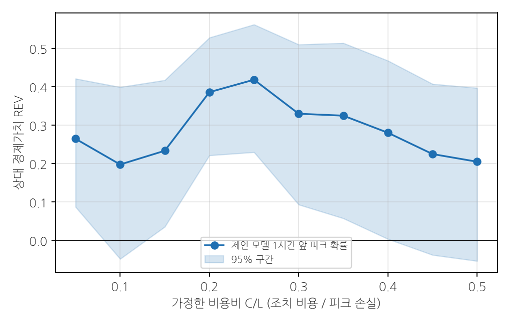

그림 4-2. 비용비 C/L에 따른 제안 모델 1시간 앞 피크 확률의 상대 경제가치와 95% 신뢰구간.

비용비 0.05~0.50의 모든 구간에서 REV가 양수이고, 0.05와 0.15~0.40에서는 95% 신뢰구간 하한도 0보다 크다. 조치 비용이 피크 손실의 4분의 1인 현장에서 가치가 가장 크다(0.419). 현장이 자기 비용 구조로 C/L을 정하면 조치할 확률 기준이 곧바로 정해진다. 4.1절의 기준 0.35는 비용 구조를 모를 때 쓰는 기본값으로, 보정 구간에서 피크 사건 F1이 가장 높은 값이다.

**손실 L의 크기.** 산업용 전기요금의 기본요금은 요금적용전력에 단가를 곱해 정한다. 최대수요전력계가 있는 경우, 요금적용전력은 검침 당월을 포함한 직전 12개월 중 12·1·2·7·8·9월과 당월의 최대수요전력 가운데 가장 큰 값이다. 최대수요전력은 15분 평균전력의 최댓값이다(한국전력공사 기본공급약관 시행세칙). 따라서 하계의 15분 피크 하나가 이후 최대 12개월의 기본요금을 정할 수 있다. 피크 한 번의 손실 L은 같은 15분의 전력량 요금보다 훨씬 클 수 있다.

## 4.4 피크전력 저감 방안 (출제 요구 4)

3장의 분석에서 세 가지 사실이 확인되었다.

- 피크는 평일 근무시간의 기동·재가동 직후와 오전 10~12시에 짧게 나타난다.
- 고온과 고생산이 겹치는 하계에 잦다.
- 제안 모델은 이 최대 구간을 3시간 이상 앞서 경보한다.

이에 맞추어 최대수요(기본요금)를 낮추는 방안과 피크 발생 횟수를 줄이는 방안을 함께 제안한다.

| 방안 | 조정 대상 | 기대 효과 | 예측의 역할 |
| :-- | :-- | :-- | :-- |
| ① 목표 최대수요 운영 | 설비가동 시점 (목표를 넘는 부하를 최대 1시간 미룸) | 최대수요 감소 | 경보로 준비 시간과 대상 부하를 미리 정함 |
| ② 설비 기동 시점 분산 | 설비가동 시점 (아침 기동·휴식 후 재가동 순서) | 기동 직후 최대 구간 완화 | 4시간 앞 주의 경보가 켜진 날에 적용 |
| ③ 경보 시간 생산량 이동 | 생산일정 (경보 시간 생산 일부를 같은 날 여유 시간으로) | 피크 발생 횟수 감소 | 1시간 앞 경보 시간을 이동 대상으로 지정 |

### 방안 ① 목표 최대수요 운영

**설계.**

1. 목표 최대수요 D를 정한다.
2. 1~4시간 앞 예측 가운데 하나라도 경보가 켜진 15분 구간에는 미룰 수 있는 부하(현재 부하의 10% 이내)를 미리 지정하고 상한 제어를 준비한다.
3. 준비된 시간대의 15분 구간에서 실시간 계측 전력이 D를 넘으려 하면, 넘는 만큼을 최대 1시간 뒤로 미룬다.
4. 미룬 부하는 D 아래 여유가 생긴 구간에 다시 넣는다.

예측의 역할은 언제 준비해야 하는지 알려 주는 것이다. 구간 안의 제어량은 실시간 계측으로 정한다. 평가 구간의 실측 전력에 이 규칙을 적용해 효과를 계산했다.

**준비 방식 비교.** 같은 규칙에서 준비할 시간대를 정하는 방법만 바꾸어 비교했다(D = 200, 미룰 수 있는 부하 10%).

| 준비 방식 | 근무일 하루 준비 시간 | 목표 초과 구간 포착 | 운영 후 평가 구간 최대 | 8월 최대 감소 |
| :-- | --: | --: | --: | --: |
| 하루 내내 준비 | 24.0시간 | 13 / 13 | 200.0 | 8.3% |
| **예측 경보로 준비** | **7.7시간** | **13 / 13** | **200.0** | **8.3%** |
| 기동 시간대 고정 준비 (예측 없음) | 3.8시간 | 6 / 13 | 207.0 | 5.0% |

예측 경보로 준비하면 하루 내내 준비할 때와 같은 효과를 준비 시간의 3분의 1로 얻는다. 예측 없이 기동·재가동 시간대만 준비하면 목표를 넘는 구간의 절반 이상을 놓친다.

**목표 최대수요별 효과** (예측 경보로 준비, 미룰 수 있는 부하 10%)

| 목표 D | 운영 후 최대 | 8월 최대 감소 | 9월 최대 감소 | 조치 횟수 (38일) | 조치한 날 | 1회 평균 미룬 부하 (그 시점 부하 대비) |
| --: | --: | --: | --: | --: | --: | --: |
| 210 | 210.0 | 3.7% | 0.0% | 2 | 1 | 5.0 (2.3%) |
| 205 | 205.0 | 6.0% | 0.0% | 5 | 2 | 5.0 (2.3%) |
| **200** | **200.0** | **8.3%** | **2.0%** | **13** | **5** | **5.5 (2.6%)** |
| 195 | 196.2 | 10.0% | 4.4% | 30 | 11 | 5.9 (2.9%) |

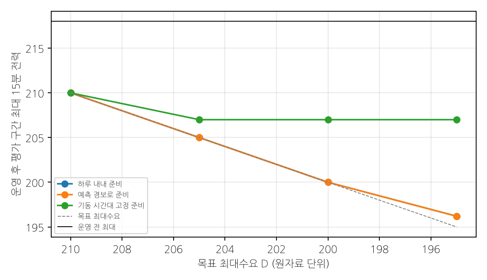

그림 4-3. 목표 최대수요별 운영 후 평가 구간 최대 15분 전력. 예측 경보로 준비한 결과는 하루 내내 준비한 결과와 겹친다.

목표 200에서 8월 최대수요가 218에서 200으로 8.3% 낮아진다. 필요한 조치는 38일 중 5일, 13번이며, 한 번에 평균 5.5(그 시점 부하의 2.6%)를 1시간 안에서 미루면 된다. 미룬 전력량을 모두 더해도 평가 구간 전체 사용량의 0.02%다. 요금적용전력이 이 달의 최대수요로 정해지는 경우, 기본요금의 기준이 되는 전력이 8.3% 낮아진다. 미룰 수 있는 부하를 5%로 줄여도 같은 목표에서 최대수요가 5.0% 낮아졌다.

### 방안 ② 설비 기동 시점 분산

방안 ①의 조치 13번이 일어난 구간을 보면 다음과 같다.

- 5번: 아침 기동 직후(08:30~09:00 구간)
- 3번: 휴식 후 재가동 직후(10:30, 15:45~16:00 구간)
- 3번: 휴식·점심 직전(10:00, 11:45~12:00 구간)
- 2번: 점심 후 오후 가동(14:00~14:15 구간)

13번 가운데 11번이 설비를 켜거나 다시 켜는 시점, 또는 휴식 직전이다. 3.6절의 일 최대 구간과 같은 흐름이다. 그래서 4시간 앞 주의 경보가 켜진 날에는 다음 규칙을 함께 쓴다.

- **아침 기동.** 07:30~09:00에 켜는 설비를 두 묶음으로 나누어 15~30분 간격을 둔다. 예열이나 충전처럼 기동 부하가 큰 작업을 첫 묶음에 몰지 않는다.
- **휴식·점심 후 재가동.** 10:30, 13:00~13:45, 15:30, 17:45 구간 전후의 재가동 순서를 정해 여러 설비가 동시에 켜지지 않게 한다.
- **휴식·점심 직전.** 09:45~10:00과 11:45~12:00 구간에는 새 작업 시작이나 대형 설비 기동을 미룬다.

이 규칙은 방안 ①의 실시간 제어가 개입해야 할 횟수를 미리 줄여 준다. 설비별 기동 부하 자료가 주어지면 묶음의 구성과 간격을 정량적으로 정할 수 있다.

### 방안 ③ 경보 시간 생산량 이동

1시간 앞 경보가 켜진 시간의 생산량 일부를 같은 날 다른 가동 시간으로 옮긴다. 생산량과 전력의 관계는 개발 구간의 시간 단위 자료로 추정했다. 같은 시각·요일 안에서 생산량이 1 늘면 전력은 평균 0.0234 [0.0186, 0.0291] 늘었다. 받는 시간은 예상 전력이 피크 기준값의 95%를 넘지 않는 여유만큼만 받는다. 여유는 95% 예측 상한으로 판단한다.

| 이동 대상 시간 | 10% 이동 | 20% 이동 | 30% 이동 |
| :-- | --: | --: | --: |
| **예측 경보 시간** | **−17.7%** | **−35.8%** | **−46.5%** |
| 피크가 잦은 시각에 고정 (예측 없음) | −16.8% | −32.6% | −41.1% |
| 실제 피크 시간 (사후에 안 경우) | −19.3% | −38.0% | −50.6% |

값은 평가 구간에서 피크 기준값을 넘은 15분 구간 수(316개)의 감소율이다.

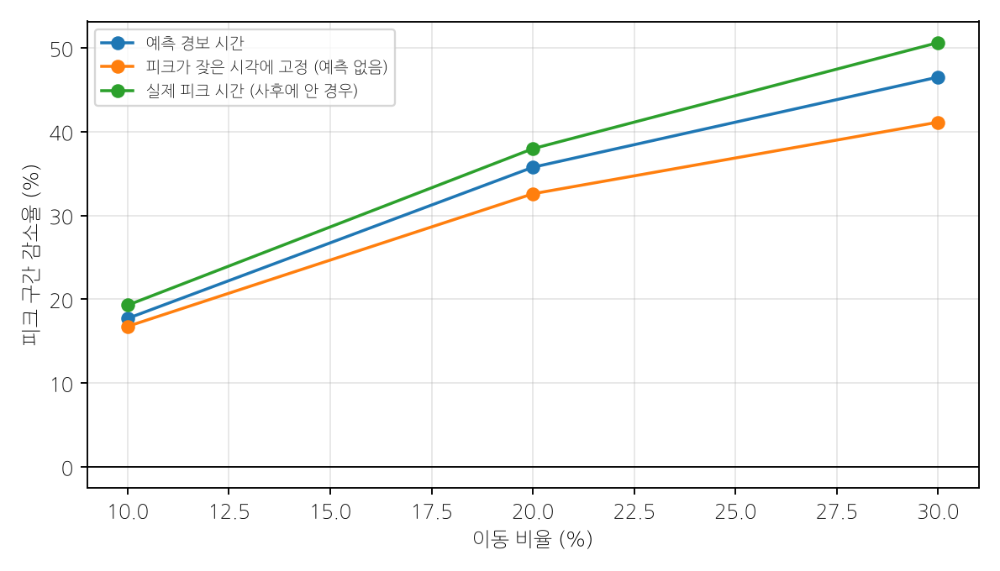

그림 4-4. 생산량 이동 비율별 피크 구간 감소율.

예측 경보로 이동 시간을 정하면 실제 피크 시간을 사후에 알았을 때 효과의 94%를 얻는다(20% 이동 기준). 피크가 잦은 시각에 고정하는 방식보다도 효과가 크다. 생산량-전력 기울기의 95% 신뢰구간(0.0186~0.0291)을 적용하면 20% 이동의 피크 구간 감소율은 27.5~40.5%다. 생산량 20% 이동으로 피크 구간이 35.8% 줄어드는 대신 평가 구간 최대 15분 전력은 218에서 214.3으로 1.7% 낮아진다. 따라서 방안 ③은 피크 발생 횟수를 줄이고, 최대수요는 방안 ①로 관리하는 조합이 알맞다.

### 종합 운영안

| 시점 | 행동 | 근거 |
| :-- | :-- | :-- |
| 전날 23:45 | 다음 날 최대 15분 전력 예측(MAE 8.68)으로 고부하 날을 미리 파악 | 2.5절 |
| 4시간 앞 주의 경보 | 기동 묶음 분산과 생산 이동 대상 시간 확정 (방안 ②·③) | 4.2절, 4.4절 |
| 1시간 앞 조치 경보 | 미룰 수 있는 부하 지정, 상한 제어 준비 (방안 ①) | 4.4절 |
| 해당 15분 구간 | 실시간 계측으로 목표 최대수요 초과분을 최대 1시간 미룸 | 4.4절 |
| 월말 | 월 최대수요, 조치 횟수, 미룬 부하를 점검하고 목표 D 조정 | 4.5절 |

## 4.5 현장 적용 지표

| 지표 | 정의 | 목적 |
| :-- | :-- | :-- |
| 일·월 최대 구간 사전 포착률 | 1시간 이상 앞서 경보된 일·월 최대 구간 비율 | 기본요금 관리 |
| 피크 사건 재현율 | 경보와 짝지어진 실제 피크 사건 비율 | 놓친 피크 관리 |
| 근무일당 오경보 사건 | 실제 피크와 짝지어지지 않은 경보 사건 수 | 작업자 부담 관리 |
| 조치 횟수와 미룬 부하 | 상한 제어 개입 횟수와 양 | 생산 영향 관리 |
| 월 최대 15분 전력 | 월별 최댓값과 발생 시각 | 저감 효과 확인 |

조치한 날과 조치하지 않은 비교일의 예측·실측 차이를 함께 기록하면, 현장 자료로 저감 효과와 생산량-전력 관계를 다시 추정할 수 있다.

## 4.6 소결

제안 모델은 기본요금과 직결되는 일·월 최대 구간을 모두 미리 경보했다. 이 경보로 준비하는 목표 최대수요 운영은 근무일 하루 7.7시간의 준비와 5일 13번의 짧은 부하 지연으로 8월 최대수요를 8.3% 낮추었다. 기동 시점 분산과 경보 시간 생산량 이동은 피크 발생 자체를 줄여 이 운영을 돕는다. 비용-손실 분석은 현장의 비용 구조에 맞는 조치 기준을 제공한다.

# 제5장 창의성 및 차별성

> 이 장의 요지. 각 기법이 2~4장의 어떤 수치를 얼마나 바꾸었는지로 차별성을 설명한다.

## 5.1 기법별 기여

| 기법 | 바뀐 수치 | 개발 구간에서도 같은 방향 |
| :-- | :-- | :-- |
| 사전학습 시계열 모델(Chronos-2) | 이전 단계 최선 모델 대비 MAE 10.569 → 6.651, 피크 구간 MAE 20.379 → 10.270 | 예 |
| 시간 계층 조정 | MAE 6.651 → 6.504, 피크 구간 MAE 10.270 → 9.863. 평균과 피크를 함께 낮춘 구성 | 예 |
| 최근 오차 보정(MOS) | 피크 구간 MAE 9.863 → 9.618 | 예 |
| 피크 보정 | 피크 구간 MAE 9.618 → 7.978 | 예 |
| 예측구간 보정(CQR) | 90%·95% 포함률 0.897·0.948. 사전 검증 LightGBM의 95% 포함률 0.911에서 개선 | 예 |
| 정밀도 기준 동일일 복사 규칙 | 우연한 일치에 따른 손실 제거(평가 구간 MAE 6.811 → 6.781, 1.6절 표의 1→2단계) | 예 |
| 피크 확률 경보 + 비용-손실 판단 | REV 0.20~0.42. C/L 0.25에서 0.419로 사전 검증 LightGBM(0.19)의 두 배 이상 | — |
| 예측 경보로 준비하는 목표 최대수요 운영 | 근무일 하루 준비 시간 24.0 → 7.7시간, 8월 최대수요 8.3% 감소 | — |

## 5.2 방법론의 차별점

**제조 공정 지식과 결합한 문제 정의.** 기본요금이 15분 최대수요로 정해진다는 요금 구조에서 출발했다. 그래서 피크 구간 MAE와 피크 사건 단위 평가를 주 지표로 삼고, 일·월 최대 구간의 사전 포착을 따로 확인했다. 생산량은 그 시간이 끝나야 확정되고 `평균` 열은 예측 대상 구간을 포함한다는 공정 특성을 입력 설계에 반영했다.

**자료 구조의 진단과 평가 설계.** 개발 구간의 53%가 이전 날의 복사라는 사실을 찾아, 모델 선정 기준을 과거와 겹치지 않는 날로 정했다. 그 결과 개발 구간의 성능 추정(6.312)이 평가 구간 성능(6.638)과 가까웠다.

**사전 고정과 재현성 확인.** 각 단계의 후보, 선정 규칙, 채택 기준을 결과 확인 전에 문서로 고정했다. 개발 구간의 개선이 평가 구간에서도 같은 방향으로 재현되는지 확인하고(Recht et al., 2019), 두 구간에서 모두 개선된 구조적 구성요소만 채택했다(2.6절). 주요 결과마다 다른 해석의 가능성을 따로 점검했다(2.7절, 3.7절).

**폭넓은 대안 검토.** 공개 사전학습 모델 4종(Chronos-2, TimesFM-3, TimesFM-2.5, TiRex)과 이들의 결합, 미세조정, 추가 입력, 피크 가중 학습, 2단계 피크 판별 등을 같은 기준으로 비교한 뒤 최종 구성을 정했다.

**예측에서 운영까지의 연결.** 피크 확률을 비용-손실 판단에 연결했다. 예측 경보가 준비 시간을 정하고 실시간 계측이 제어량을 정하는 목표 최대수요 운영으로, 예측을 현장 조치에 연결했다.

# 제6장 코드 구성 및 재현성

> 이 장의 요지. 제출 자료로 예측 결과의 검증과 보고서의 모든 표·그림을 다시 만들 수 있다.

## 6.1 실행 방법

    python -m pip install -r requirements.txt
    python -m venv outputs/phase_f/env
    outputs/phase_f/env/Scripts/python -m pip install -r requirements-chronos.txt --extra-index-url https://download.pytorch.org/whl/cu126
    python run_all.py --fg-r11
    python scripts/submission_report/analysis.py

`run_all.py --fg-r11`은 다음 순서로 실행한다.

1. Chronos-2와 시간 계층 예측의 저장본을 잠금 파일의 SHA-256과 대조한다.
2. 평가를 다시 계산해 저장된 결과와 일치하는지 확인한다.
3. 예측 결과 파일을 검사한다.
4. 보고서 표를 갱신한다.

`--refresh-caches`를 붙이면 GPU로 예측 저장본을 다시 만들고 잠금 해시와 대조한다. `analysis.py`는 CPU만으로 약 20초 안에 2~4장의 표와 그림을 만든다. 제안 모델의 코드명은 FG-R11이다.

## 6.2 재현 결과

| 항목 | 결과 |
| :-- | :-- |
| 저장 결과와 다시 계산한 지표의 최대 차이 | 0.0 |
| 예측 결과 파일 3개 | 바이트 단위로 동일, 검사 통과 (44,668행 / 1시간 앞 3,442행 / 다음 날 최대 34일) |
| 실행 시간 | 86초 (예측 저장본 사용) |
| 모델·설정 잠금 | `outputs/phase_f/final_fg_r11/FINAL_LOCK.json` (소스·예측 저장본 SHA-256, 보정 계수, 시간 계층 투영 행렬, 보정량, Chronos-2 버전) |
| 난수 | seed 42 |

## 6.3 평가 구간 예측 결과 파일

주최측의 별도 평가용 파일이 없으므로, 시간순 마지막 15% 구간의 예측을 제출한다.

| 파일 | 내용 |
| :-- | :-- |
| `outputs/predictions/final_test_fg_r11.csv` | 1~4시간 앞 13개 시점 예측, 예측구간(5·10·90·95%), 피크 확률, 동일일 복사 여부, 경보 |
| `outputs/predictions/final_test_fg_r11_h4.csv` | 1시간 앞 예측 (주 과제) |
| `outputs/predictions/final_test_next_day_max.csv` | 다음 날 최대 15분 전력 예측 (보조 과제) |

# 결론과 향후 과제

## 결론

1. **예측 성능.** 사전학습 시계열 모델에 시간 계층 조정과 최근 오차 보정을 결합해, 1~4시간 앞 MAE 6.638과 피크 구간 MAE 7.978을 얻었다. 직전값 유지보다 오차를 73%, 이전 단계 최선 모델보다 37% 줄였고, 피크 구간 오차는 비교한 모든 모델 가운데 가장 낮다.
2. **최대 피크 사전 포착.** 평가 구간 근무일의 일 최대 구간을 모두 미리 경보했고, 92%는 3시간 이상 앞섰다. 8월과 9월의 최대 구간도 각각 3시간 45분, 2시간 15분 전부터 경보했다.
3. **피크 발생 조건.** 피크는 평일 오전 10~12시, 기동·재가동 직후, 7월, 고온, 생산량 상위 구간에서 잦고, 고온과 고생산이 겹치면 피크 비율이 32.4%에 이른다.
4. **저감 효과.** 예측 경보로 준비하는 목표 최대수요 운영은 근무일 하루 7.7시간의 준비와 13번의 짧은 부하 지연으로 8월 최대수요를 8.3% 낮추었다. 경보 시간 생산량 20% 이동으로 피크 구간을 35.8% 줄였다.

## 향후 과제

1. 연장 근무와 교대 계획을 입력에 더해 저녁 피크 예측을 강화한다.
2. 설비별 기동 부하를 계측해 기동 묶음의 구성과 간격을 최적화한다.
3. 실제 운영 기록으로 목표 최대수요 운영의 효과와 생산량-전력 관계를 다시 추정한다.
4. 동계 자료를 더해 연간 요금적용전력 기준의 관리로 확장한다.

## 참고문헌

1. Ansari, A. F. et al. (2024). Chronos: Learning the Language of Time Series. Transactions on Machine Learning Research.
2. Athanasopoulos, G., Hyndman, R. J., Kourentzes, N., Petropoulos, F. (2017). Forecasting with temporal hierarchies. European Journal of Operational Research, 262(1), 60–74.
3. Romano, Y., Patterson, E., Candès, E. (2019). Conformalized Quantile Regression. Advances in Neural Information Processing Systems 32.
4. Glahn, H. R., Lowry, D. A. (1972). The Use of Model Output Statistics (MOS) in Objective Weather Forecasting. Journal of Applied Meteorology, 11(8), 1203–1211.
5. Richardson, D. S. (2000). Skill and relative economic value of the ECMWF ensemble prediction system. Quarterly Journal of the Royal Meteorological Society, 126, 649–667.
6. Recht, B., Roelofs, R., Schmidt, L., Shankar, V. (2019). Do ImageNet Classifiers Generalize to ImageNet? Proceedings of ICML 2019, PMLR 97.
7. Ke, G. et al. (2017). LightGBM: A Highly Efficient Gradient Boosting Decision Tree. Advances in Neural Information Processing Systems 30.
8. 한국전력공사. 기본공급약관 및 시행세칙.

## 경진대회 만족도 조사 완료 화면

〔캡처 이미지 삽입〕
